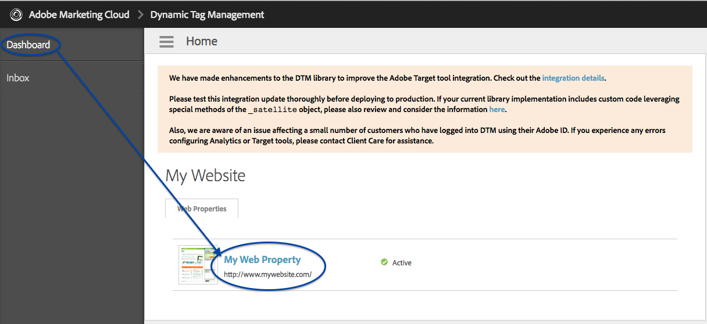

# Implémentation de RTP à l&#39;aide de Adobe Tag Manager {#implementing-rtp-using-adobe-tag-manager}

Pour mettre en oeuvre votre balise RTP, suivez les instructions d’installation ci-dessous :

1. Connectez-vous à votre compte RTP.
1. Accédez à **Paramètres du compte.**

   Si vous avez déjà reçu votre balise JavaScript de l’assistance - passez à l’étape 4.

   

1. Sous Domaine, recherchez le domaine approprié et cliquez sur **Générer la balise**.

   

1. Connectez-vous à votre compte Gestionnaire dynamique de balises ([https://dtm.adobe.com/sign_in](https://dtm.adobe.com/sign_in)).
1. Accédez au **Tableau de bord.** Cliquez sur la propriété web appropriée.

   

1. Accédez à **Règles,** cliquez sur **Créer une règle.**

1. Renseignez les champs suivants

   1. Nom : **Marketo RTP**
   1. Conditions (effondrement) : Déclencher la règle à - **Haut de la page**
   1. Javascript (effondrement) : cliquez sur **Ajouter un nouveau script**

   

1. Appelez la nouvelle balise : **Balise Marketo RTP**
1. Supprimez le code suivant de la balise RTP

   * ``

1. Collez la balise JavaScript RTP.

   

   >[!CAUTION]
   >
   >Veillez à supprimer toutes les balises et à ne laisser que le script lui-même (no `` ).

1. Cliquez sur **Enregistrer le code** dans l’éditeur de script et **Enregistrer la règle** dans l’éditeur de règles.

1. Dans le panneau Règles, recherchez la règle de chargement de page RTP de Marketo et dans la liste déroulante **Actions** sélectionnez **Activer les règles**.

   

1. **** Vérifiez qu’il s’affiche sur toutes les pages, y compris les landings page et sous-domaines.

   Vous pouvez le faire en cliquant avec le bouton droit sur les pages de votre site Web. Accédez à **Inspect Element**, cliquez sur **Network, **Search : **RTP**.
