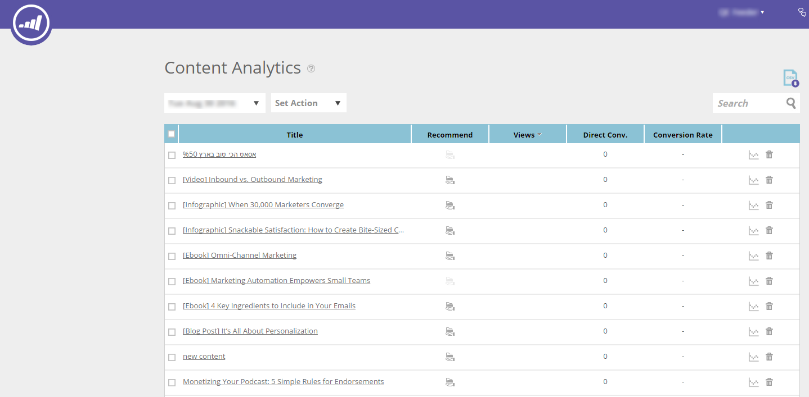
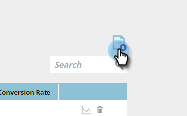

# Présentation de l’analyse de contenu {#understanding-content-analytics}

La page Analyse de contenu affiche le contenu existant que vous avez découvert (études de cas, publications de blog, vidéos, communiqués de presse, etc.) sur votre site Web. Il affiche également les performances de votre contenu et des personnes générées lorsque les visiteurs interagissent avec eux.

## Analyses de contenu de vue {#view-content-analytics}

Accédez à **Content Analytics**.

Sur la page Content Analytics, vous pouvez effectuer les opérations suivantes :

* Filtrage par période (jour, semaine et mois)
* Recherche par titre de contenu et URL de contenu
* Triez par ordre croissant ou décroissant en cliquant sur le titre de la colonne pour les Vues, les conversions directes et le Taux de conversion.

Vous pouvez également exporter un fichier au format CSV en cliquant sur l’icône .

Le tableau Analytics fournit les détails suivants :

<table> 
 <thead> 
  <tr> 
   <th colspan="1" rowspan="1">Nom</th> 
   <th colspan="1" rowspan="1">Description</th> 
  </tr> 
 </thead> 
 <tbody> 
  <tr> 
   <td colspan="1" rowspan="1"><strong>Titre</strong></td> 
   <td colspan="1" rowspan="1">Nom de la ressource de contenu numérique. Cliquez sur <strong>Titre</strong> pour ouvrir l’URL de contenu dans un nouvel onglet.</td> 
  </tr> 
  <tr> 
   <td colspan="1">
<strong>Icône </strong><strong>de recommandation</strong>

<strong></strong>
</td> 
   <td colspan="1">Indique si l’élément de contenu a été ajouté pour <a href="#">Content Recommendations</a>.</td> 
  </tr> 
  <tr> 
   <td colspan="1" rowspan="1">
<strong>Vues</strong>
</td> 
   <td colspan="1" rowspan="1">
Nombre de vues provenant de visiteurs Web sur la ressource de contenu. Nombre de fois où il a été affiché, ouvert, visionné ou téléchargé. Cliquez sur le nombre dans la colonne vues pour afficher une analyse détaillée et savoir qui a consulté le contenu.
</td> 
  </tr> 
  <tr> 
   <td colspan="1" rowspan="1"><strong>Conversions directes</strong></td> 
   <td colspan="1" rowspan="1">Visiteurs Web qui ont affiché le contenu et rempli un formulaire au cours de la même visite</td> 
  </tr> 
  <tr> 
   <td colspan="1">
<strong>Icône Analytics</strong>

<strong></strong>
</td> 
   <td colspan="1">Obtenir davantage d'analyses sur l'élément de contenu</td> 
  </tr> 
  <tr> 
   <td colspan="1">
<strong>Supprimer l'icône</strong>

</td> 
   <td colspan="1">Supprime le contenu d’Analytics de contenu</td> 
  </tr> 
 </tbody> 
</table>

## Vue Analyses de contenu supplémentaires {#view-additional-content-analytics}

Cliquez sur l’icône Analytics d’une pièce de contenu.

Une boîte de dialogue s’ouvre avec d’autres analyses de contenu pour cet élément de contenu spécifique.

Les analyses de contenu supplémentaires incluent :

**Analytics**

* **Vues**: Vues de cet élément de contenu pour la période sélectionnée
* **Conversions** directes : Visiteurs Web qui ont affiché le contenu et rempli un formulaire au cours de la même visite.
* **taux de conversion**** :** taux de conversion en pourcentage calculé par les conversions directes divisées par les clics

**Tendances**

* Graphique **Tendances** montrant les 30 derniers jours de vues de l’élément de contenu spécifique. Passez la souris sur le graphique linéaire pour afficher le nombre de vues de contenu d’un jour spécifique.

## Supprimer du contenu {#delete-content}

Dans la page Analyse de contenu, cliquez sur l’icône de suppression du contenu à supprimer. Un message s’affiche pour confirmer la suppression du contenu.

>[!MORELIKETHIS]
>
>* [Activation de la barre de recommandation de contenu](../../../product-docs/predictive-content/enabling-predictive-content/enable-the-content-recommendation-bar.md)
>* [Activer le contenu prédictif pour les médias enrichis en ligne](../../../product-docs/predictive-content/enabling-predictive-content/enable-predictive-content-for-web-rich-media.md)

