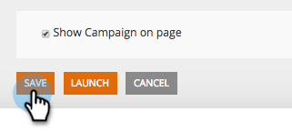

# Enregistrer votre campagne en tant que modèle {#save-your-campaign-as-a-template}

Avez-vous déjà passé du temps à créer la campagne web parfaite ? Vous pouvez maintenant l’enregistrer en tant que modèle pour une réutilisation facile à l’avenir.

1. Accédez à **[!UICONTROL Campagnes web]**.

   

1. Recherchez la campagne à enregistrer en tant que modèle.

   

1. Cliquez sur l’icône Modifier .

   

1. Cochez la case **[!UICONTROL Utiliser comme modèle]** et cliquez sur **[!UICONTROL Enregistrer]**.

      

1. Vous avez terminé. La prochaine fois que vous créez une campagne et sélectionnez un modèle, cochez la case [!UICONTROL Mes modèles] de la page Définir des campagnes pour afficher les modèles que vous avez enregistrés.

   
