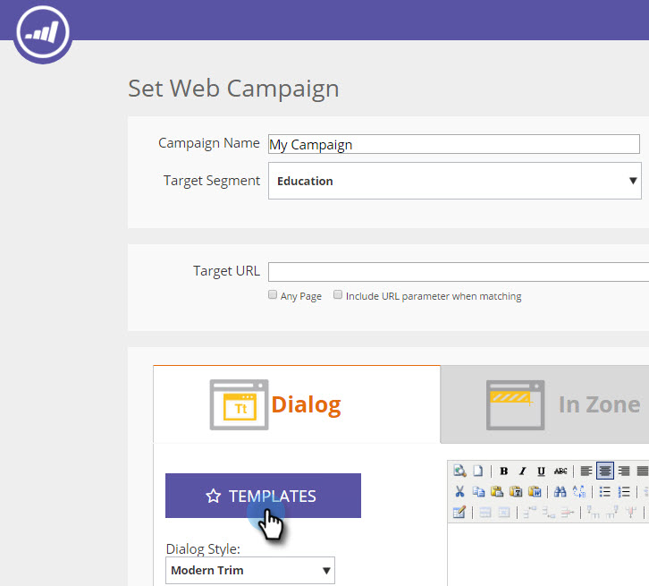
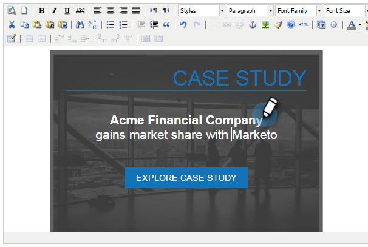

# Utilisation de modèles pour créer des campagnes web {#using-templates-to-create-web-campaigns}

Accélérez et simplifiez votre processus de création de campagnes web en utilisant nos modèles intégrés ou en [enregistrant les vôtres](save-your-campaign-as-a-template.md).

>[!NOTE]
>
>Les modèles sont optimisés pour tous les appareils et les expériences de navigation pour les ordinateurs de bureau et les appareils mobiles.

1. Accédez à **[!UICONTROL Campagnes web]**.

   

1. Cliquez sur **[!UICONTROL Créer une campagne web]**.

   

1. Nommez votre campagne.

   

1. Sélectionnez un [!UICONTROL segment cible].

   

1. Cliquez sur **[!UICONTROL Modèles]**.

   

1. Sélectionnez la zone appropriée pour que votre campagne affiche et sélectionnez un modèle qui fonctionne pour vous.

   >[!NOTE]
   >
   >Il existe de bons modèles parmi lesquels choisir, et nous en ajouterons d’autres à l’avenir.

   

   >[!TIP]
   >
   >Pour les campagnes mobiles, sélectionnez un modèle dans la section **mobile**.

1. Personnalisez le modèle.

   

1. Cliquez sur **[!UICONTROL Enregistrer]**

   

Bien joué ! Avez-vous vu combien de temps vous avez gagné en utilisant un modèle ?

>[!MORELIKETHIS]
>
>[Enregistrer une campagne en tant que modèle](/help/marketo/product-docs/web-personalization/using-templates/save-your-campaign-as-a-template.md)
