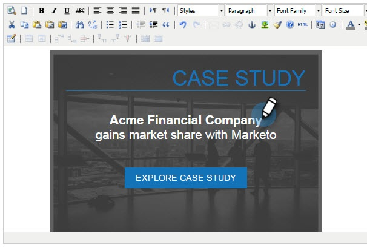

# Utilisation de modèles pour créer des campagnes Web {#using-templates-to-create-web-campaigns}

Accélérez et simplifiez votre processus de création de campagnes Web en utilisant nos modèles intégrés ou en [enregistrant vos propres ](save-your-campaign-as-a-template.md).

>[!NOTE]
>
>Les modèles sont optimisés pour tous les périphériques et les expériences de navigation sur les ordinateurs de bureau et les appareils mobiles.

1. Accédez à Campagnes Web.

   

1. Cliquez sur Créer une Campaign Web.

   

1. Nommez votre campagne.

   

1. Sélectionnez un segment de Cible.

   

1. Cliquez sur Modèles.

   

1. Sélectionnez la zone appropriée pour votre campagne pour afficher et sélectionner un modèle qui fonctionne pour vous.

   >[!NOTE]
   >
   >**Rappel**
   >
   >Il y a des modèles sympas à choisir, et nous en ajouterons d&#39;autres à l&#39;avenir.

   

   >[!TIP]
   >
   >Pour les campagnes mobiles, sélectionnez un modèle dans la section **mobile**.

1. Personnalisez le modèle.

   

1. Cliquez sur Enregistrer.

   

Bien joué ! Avez-vous vu combien de temps vous avez économisé en utilisant un modèle ?

>[!MORELIKETHIS]
>
>* [Enregistrer une Campaign en tant que modèle](save-your-campaign-as-a-template.md)

>

