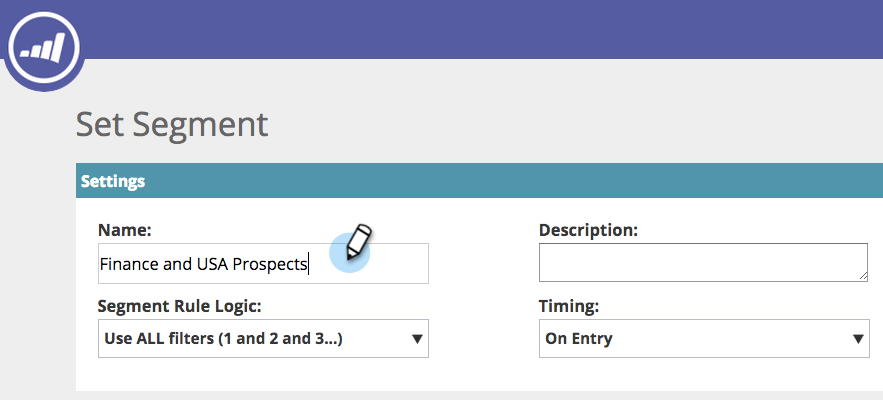
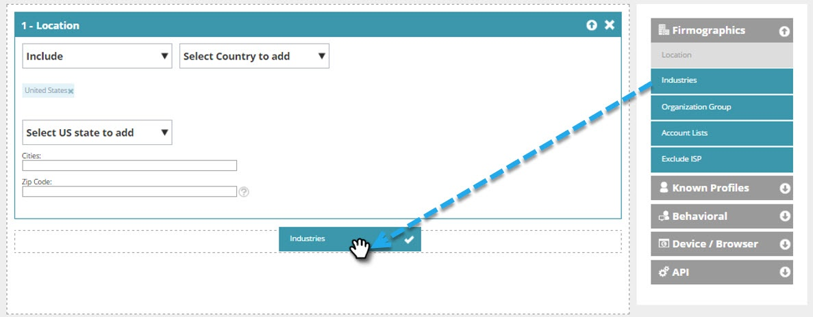

# Création d’un segment web de base {#create-a-basic-web-segment}

Créons un segment de base ciblant tous les visiteurs du Web en provenance des États-Unis et du secteur des services financiers.

1. Accédez à **Segments**.

   

1. Cliquez sur **Créer**.

   

1. Saisissez le nom du segment.

   

1. Faites glisser **Emplacement** depuis le menu de droite et déposez-le dans l’éditeur de segments.

   

1. Sélectionnez un pays à ajouter dans la liste déroulante. Sélectionnez les **États-Unis**.

   

   >[!NOTE]
   >
   >Le nombre de villes est limité à 300 par segment.

1. Faites glisser **Industries** depuis le menu de droite et déposez-le dans l’éditeur de segments.

   

1. Sélectionnez Industries à ajouter dans la liste déroulante. Sélectionnez le **secteur des services financiers**.

   

   Vous avez maintenant configuré un segment de base pour tous les prospects qui visitent votre site web en provenance des Etats-Unis et du secteur financier.

1. Cliquez sur **Enregistrer** pour enregistrer le segment ou sur **Enregistrer et définir la campagne** pour accéder à la page Campagnes.

   

Vous avez maintenant segmenté vos visiteurs en provenance des États-Unis et ajouté le secteur des services financiers.

>[!MORELIKETHIS]
>
>[Segments Web](/help/marketo/product-docs/web-personalization/using-web-segments/web-segments.md)
