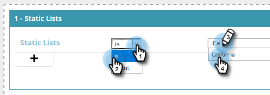
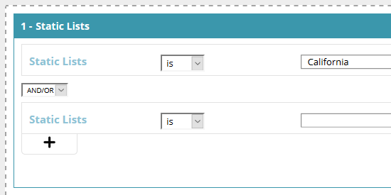

# Créer un segment à l’aide d’une liste statique {#create-a-segment-using-a-static-list}

Segmentez les visiteurs web connus lorsqu’ils visitent votre site web en fonction de leur présence ou non dans l’une de vos listes Marketo [statiques](/help/marketo/product-docs/core-marketo-concepts/smart-lists-and-static-lists/static-lists/understanding-static-lists.md).

1. Accédez à **[!UICONTROL Segments]**.

   

1. Cliquez sur **[!UICONTROL Créer]**.

   

1. Saisissez un Nom de segment.

   

1. Dans Prospects connus, faites glisser **[!UICONTROL Listes statiques]** sur la zone de travail.

   

1. Cliquez sur la liste déroulante pour sélectionner **[!UICONTROL est]** ou **[!UICONTROL n’est pas]** (selon ce que vous souhaitez), puis saisissez le nom de votre liste statique.

   

1. Si vous souhaitez ajouter plusieurs listes, vous devez créer une nouvelle ligne pour chacune d’elles en cliquant sur le signe **+**. Si vous ne souhaitez qu’une seule liste, passez à [étape 8](#eight).

   

1. Pour plusieurs listes (ou plusieurs listes « n’est pas »), répétez les étapes que vous avez apprises à l’[étape 5](#five).

   

   >[!NOTE]
   >
   >La liste déroulante et/ou n’est que cela. Cliquez dessus pour sélectionner **[!UICONTROL et]**, **[!UICONTROL ou]** ou **[!UICONTROL et/ou]**.

1. Cliquez sur **[!UICONTROL Enregistrer]** pour enregistrer le segment ou **[!UICONTROL Enregistrer et définir la campagne]** pour enregistrer et accéder à la page [!UICONTROL Campagnes].

   
