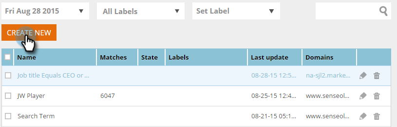

# Création d’un segment à l’aide de données de personne connue {#create-a-segment-using-known-person-data}

Voici comment créer un segment à l’aide des valeurs Données de personne connue.

>[!PREREQUISITES]
>
>[Gérer les données personnelles](manage-person-data.md)

1. Accédez à **Segments**.

   

1. Cliquez sur **Créer**.

   

1. Saisissez un nom de segment.

   

1. Dans Segmentation de Profil, faites glisser **Base de données **sur le canevas.

   

1. Sélectionnez un champ de données de personne dans la liste déroulante.

   

1. Saisissez une valeur pour les données personnelles.

   

   Il ne peut y avoir qu’une seule valeur pour chaque champ. Par exemple, si vous souhaitez ajouter plusieurs valeurs pour le champ de titre de la tâche, vous devez créer une nouvelle ligne avec le même nom de champ pour chaque valeur. Veillez à utiliser la valeur OU pour vous assurer que toute valeur capture une correspondance.

   

## Sélection de champs de données à plusieurs personnes {#selecting-multiple-person-data-fields}

1. Cliquez sur **+** pour ajouter un autre champ de données de personne.

   

1. Sélectionnez l’opérateur ET / OU. Sélectionnez le champ à ajouter. Sélectionnez un champ de données de personne. Saisissez la valeur des données personnelles.

   

1. Cliquez sur **Enregistrer** pour enregistrer le segment ou **Enregistrer et définir Campaign **pour enregistrer et accéder à la page Campagnes.

   

   Vous avez maintenant configuré un segment ciblant les données de personne connue.

