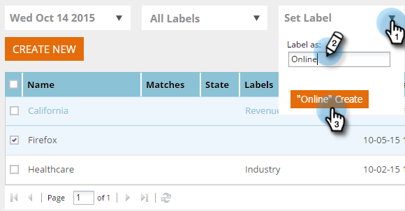

# Étiqueter votre segment {#label-your-segment}

Disposez-vous d’un si grand nombre de segments que le défilement devient difficile ? Utilisez des libellés pour baliser vos segments afin de les trouver rapidement.

## Balisage d’un segment {#tag-a-segment}

1. Connectez-vous à [!DNL Web Personalization] et accédez à **[!UICONTROL Segments]**.

   

1. Sélectionnez les segments que vous souhaitez baliser avec un libellé.

   

1. Pour utiliser un libellé existant, cliquez sur **[!UICONTROL Définir le libellé]**, cochez une case, puis cliquez sur **[!UICONTROL Appliquer]**.

   

1. Ou, pour créer une nouvelle étiquette, cliquez sur **[!UICONTROL Définir l’étiquette]**, saisissez le nom de la nouvelle étiquette, puis cliquez sur **Créer**.

   

   >[!NOTE]
   >
   >Le bouton Créer affiche le nom du nouveau libellé. Si le libellé est trop long, « Créer nouveau » peut ne pas y apparaître.

Cool ! Vous savez maintenant comment attribuer et créer des libellés pour les segments.
