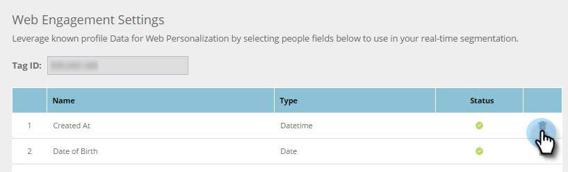

# Gérer les données personnelles {#manage-person-data}

Tirez parti des données personnelles du Personalization web en sélectionnant les champs de personne à utiliser dans votre segmentation.

1. Accédez à **Paramètres du compte**.

   

1. Accédez à **Base de données**.

   

## Ajout d’un champ Personne {#adding-a-new-person-field}

1. Sélectionnez **Champ à ajouter** dans la liste déroulante pour ajouter un champ de données de personne à la liste.

   

   >[!NOTE]
   >
   >Un nouveau champ est ajouté à l’état En attente et peut prendre jusqu’à 24 heures pour être activé.

## Suppression d’un champ de personne {#deleting-a-person-field}

1. Cliquez sur l’icône de suppression ( ) pour supprimer un champ de la liste. Cliquez sur **Oui** pour confirmer que vous souhaitez supprimer le champ.

   

   >[!NOTE]
   >
   >**Gestion des champs de données de personne**
   >
   >* Seuls les champs de données Personne peuvent être inclus
   >* Vous pouvez ajouter jusqu’à 30 champs de données de personne
   >* Ajouter de nouveaux champs peut prendre jusqu’à 24 heures pour s’activer
   >* La longueur maximale de chaînes de caractères est de 255 caractères.
   >* Les champs masqués seront automatiquement supprimés.

<table> 
 <tbody> 
  <tr> 
   <th>
REST API Nom
</th> 
   <th>
SOAP API Nom
</th> 
   <th>
Nom convivial
</th> 
  </tr> 
  <tr> 
   <td>
service
</td> 
   <td>
Service
</td> 
   <td>
Service
</td> 
  </tr> 
  <tr> 
   <td>
titre
</td> 
   <td>
Titre
</td> 
   <td>
Intitulé du poste
</td> 
  </tr> 
  <tr> 
   <td>
note
</td> 
   <td>
Classement
</td> 
   <td>
Classement
</td> 
  </tr> 
  <tr> 
   <td>
leadScore
</td> 
   <td>
LeadScore
</td> 
   <td>
Évaluation
</td> 
  </tr> 
  <tr> 
   <td>
leadStatus
</td> 
   <td>
LeadStatus
</td> 
   <td>
Statut
</td> 
  </tr> 
  <tr> 
   <td>
priorité
</td> 
   <td>
Priorité
</td> 
   <td>
Priorité
</td> 
  </tr> 
  <tr> 
   <td>
leadRole
</td> 
   <td>
LeadRole
</td> 
   <td>
Rôle
</td> 
  </tr> 
  <tr> 
   <td>
désabonné
</td> 
   <td>
Désabonné
</td> 
   <td>
Désabonné
</td> 
  </tr> 
 </tbody> 
</table>

Les champs de piste suivants sont fournis prêts à l’emploi pour les nouveaux comptes Web Personalization :

>[!MORELIKETHIS]
>
>[Créer un segment à l’aide de données de personne connues](/help/marketo/product-docs/web-personalization/using-web-segments/create-a-segment-using-known-person-data.md)
