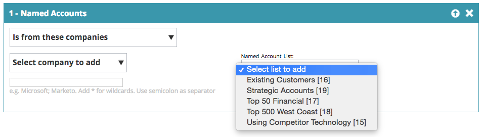

# Segments Web {#web-segments}

## Segment de vue {#view-segment}

L’onglet Segments affiche tous les segments personnalisés définis que vous configurez en fonction de divers attributs.  **Un segment est un ensemble de visiteurs qui répondent aux critères spécifiés définis dans la page Définir un segment.**  Un segment peut être visiteur d’un secteur d’activité, d’un emplacement ou en fonction de l’activité du visiteur sur le site.

Dans la personnalisation Web, un visiteur peut correspondre à plusieurs segments. Par exemple, s’il existe un segment pour les visiteurs américains et un segment pour les sociétés financières, un visiteur Web de Bank of America correspondrait **à la fois** au segment pour les visiteurs américains et au segment pour les sociétés financières.

**GRAPHIQUE :**  La page Segments affiche un graphique à barres des segments sélectionnés en fonction du nombre de visiteurs du segment (axe y) et du nom du segment (axe x).

<table> 
 <thead> 
  <tr> 
   <th colspan="1" rowspan="1">Nom</th> 
   <th colspan="1" rowspan="1">Description</th> 
  </tr> 
 </thead> 
 <tbody> 
  <tr> 
   <td colspan="1" rowspan="1"><strong>Nom</strong></td> 
   <td colspan="1" rowspan="1">Titre du segment</td> 
  </tr> 
  <tr> 
   <td colspan="1" rowspan="1">
<strong>Correspond à</strong>
</td> 
   <td colspan="1" rowspan="1">Nombre de visiteurs répondant aux critères définis et personnalisés du segment</td> 
  </tr> 
  <tr> 
   <td colspan="1" rowspan="1"><strong>Définir Campaign</strong></td> 
   <td colspan="1" rowspan="1">Permet de configurer une DEC Campaign associée au terme de recherche sélectionné.</td> 
  </tr> 
  <tr> 
   <td colspan="1"><strong>Visiteur</strong></td> 
   <td colspan="1">Prévisualisation du tableau visiteur associé au terme de recherche sélectionné</td> 
  </tr> 
  <tr> 
   <td colspan="1" rowspan="1"><strong>Clickstream</strong></td> 
   <td colspan="1" rowspan="1">Affiche un tableau de la activité et du chemin d'URL du visiteur sur le site et de la durée de visite de chaque page. </td> 
  </tr> 
 </tbody> 
</table>

Voir [comment créer et vue des étiquettes de segments](label-your-segment.md)

**Segments - Panneau de droite**

La sélection d’un segment dans le tableau permet d’afficher des informations supplémentaires sur le segment dans le panneau de droite.

Ces détails incluent :

* Nom du segment
* Date de création du segment
* Campagnes associées montrant les campagnes qui fonctionnent avec le segment. Le fait de cliquer sur le nombre de réactions vous conduit à la page des campagnes qui affiche l&#39;DEC Campaign (Appel à l&#39;action) pour le segment.
* Nombre de correspondances (nombre de visiteurs qui répondaient aux critères du segment) pour le segment et nombre de visiteurs distincts (uniques) qui correspondaient au segment. Cliquez sur le lien d’un visiteur unique pour accéder à la page du visiteur affichant les résultats du segment.
* Propriétaire/créateur utilisateur du segment
* Les sites de domaine associés au segment
* Un bref résumé des critères sélectionnés pour le segment

## Activation ou désactivation d’un segment {#enable-or-disable-a-segment}

Pour activer ou désactiver un segment, cochez la case de ce segment dans le tableau et dans la liste déroulante &quot;Choisir une action&quot; au bas du tableau, sélectionnez l’action &quot;Activer&quot; ou &quot;Désactiver&quot;. Lorsqu’un segment est désactivé, le mot &quot;désactiver&quot; s’affiche sous la colonne Etat.

## Création de segments {#create-segments}

Le segment que vous créez répond aux critères spécifiques que vous définissez dans la page **Définir segment** . Vous pouvez également personnaliser vos segments en fonction d’une combinaison de critères, en ciblant une audience spécifique de votre campagne.

Pour créer un segment

Dans la page **Segments** , cliquez sur **Créer nouveau** sous le graphique. L’écran suivant s’affiche.

Définissez des paramètres généraux pour votre segment :

1. &#x200B;

   * **Nom :**  Nommez votre segment.
   * **Description :**  Fournissez une explication plus détaillée des critères de segmentation.
   * **Domaines :**  Sélectionnez le ou les domaines à inclure dans le segment.
   * **Logique des règles de segment :**  Sélectionnez une logique ET / OU pour créer chaque attribut de segmentation.
   * **Minutage :** Définissez le niveau d’engagement visiteur souhaité dans votre campagne.

      * **A l&#39;entrée**: L&#39;engagement du visiteur arrive sur le site Web
      * **Après 1er - 9e clic**: Interagir avec le visiteur après un nombre spécifique de clics sur le site Web

>[!TIP]
>
>**Logique des règles de segment**
>
>Il existe trois options de filtre :
>
>1. Utiliser tous les Filtres (1, 2 et 3...)
>1. Utiliser n&#39;importe quel Filtres (1, 2 ou 3...)
>1. Filtres avancés (à l’aide de et / ou d’expressions) >
>    1. &#x200B;>    
>       
>       Les filtres avancés vous permettent de contrôler la condition du segment. Entrez les numéros de filtre séparés par &quot;et&quot; et &quot;ou&quot;.
>        * 1 et 2 et 3
>        * 1 ou 2 ou 3
>
>       Le mélange de &quot;et&quot; et &quot;ou&quot; nécessite des parenthèses pour clarifier l&#39;intention logique. par ex. &quot;1 ou 2 et 3&quot; doit être écrit comme suit :
>       * 1 et (2 ou 3)
>       * (1 et 2) ou 3
>
>       Les parenthèses imbriquées sont acceptées pour une logique plus complexe (ex.
>       * (1 et 2) ou (3 et 4)
>       * 1 et (2 ou (3 et 4))
>
>       Vérifiez votre logique après toute insertion, suppression ou réorganisation.

Faites glisser les attributs de segment de la colonne de droite vers l’éditeur de segments sur le côté gauche :

### Firmographie {#firmographics}

**Emplacement**

Faites glisser **Emplacement **dans l’éditeur de segments.

* Sélectionnez l’un des paramètres suivants :

   * **Inclure **- Indiquez si la campagne doit inclure ou exclure un emplacement.
   * **Sélectionnez le pays à ajouter** - Dans la liste déroulante, sélectionnez le pays à inclure dans le segment. Le nom du pays s’affiche à droite. Vous pouvez choisir plusieurs pays.

Une fois le pays ajouté, vous pouvez également spécifier l’état, la ville et le code postal du segment.

* **Sélectionnez Etat ou province à ajouter** - Dans la liste déroulante, sélectionnez l&#39;état des États-Unis ou la province canadienne à inclure. Vous pouvez effectuer plusieurs sélections.
* **Code postal** - Entrez le code postal que vous souhaitez inclure dans votre segment.
* **Villes** - Entrez la ou les villes que vous souhaitez inclure. Utilisez un point-virgule entre les villes.

>[!TIP]
>
>**Quelles conditions de segment puis-je choisir ? &quot;AND&quot; ou &quot;OR&quot; ? **OU fonctionne comme une option supplémentaire dans chaque champ. Les prospects ne doivent satisfaire qu&#39;un seul critère parmi les critères multiples sélectionnés dans chaque champ pour être admissibles au segment. (Par exemple, les prospects peuvent provenir soit des États-Unis, *soit* de l&#39;industrie de la défense). ET fonctionne comme un paramètre obligatoire supplémentaire qui doit être satisfait pour ce segment. (Par exemple, les prospects doivent provenir à la fois des États-Unis et de l&#39;industrie de la défense). Dans chaque profil de segmentation, chaque champ distinct peut fonctionner comme les deux, soit comme &quot;ET&quot;, soit comme &quot;OU&quot;, selon la condition de segment sélectionnée.

**Industries** Dans la section Segmentation **des** Profils, cochez la case en regard de **Secteur**.

* Sélectionnez l’un des paramètres suivants :

   * **Inclut** : indiquez si le segment doit inclure ou exclure un secteur industriel.
   * **Sélectionner les secteurs à ajouter** - Sélectionnez le secteur que vous souhaitez inclure dans le segment. L’industrie s’affiche sous la liste déroulante. Vous pouvez choisir plusieurs industries.

**Groupe d’organisations**

Sous la section Segmentation **du** Profil, cochez la case en regard de Groupe d’ **organisations.**

* Dans la liste déroulante, sélectionnez l’une des options suivantes :

   * Fortune 500 - Inclut uniquement les sociétés Fortune 500 dans ce segment
   * Fortune 1000 - Inclut uniquement les sociétés Fortune 1000 dans ce segment
   * 2000 - Inclut les sociétés mondiales de 2000 dans ce segment
   * Entreprise - Inclut les entreprises comptant plus de 1 000 employés et dont les recettes dépassent 250 millions de dollars
   * PME - Inclut uniquement les petites et moyennes entreprises dans ce segment

**Comptes nommés**

**Organisations**

* 

   * **Provient de ces sociétés (noms spécifiques)**

      * Sélectionnez société à cible dans la liste déroulante Sélectionner la société à ajouter.
      * Vous pouvez saisir le nom exact de l&#39;organisation que vous souhaitez cible. *Il est *toujours *recommandé d&#39;utiliser des Listes de compte nommé au lieu de saisir les noms manuellement pour obtenir de meilleures correspondances (voir ci-dessous).*

**Liste de compte nommée**

Effectuez une sélection parmi une Liste [de compte](../../../product-docs/web-personalization/account-based-web-marketing/create-a-new-account-list.md) nommé pour segmenter les comptes ciblés clés.

>[!NOTE]
>
>Le numéro entre crochets en regard du nom de la Liste de compte nommée est utilisé comme référence d’index pour l’API [de](http://developers.marketo.com/documentation/websites/rtp-js-api/)lecture de la liste de la personnalisation Web.

**Exclure un fournisseur de services Internet**

Exclut les Prestataires Internet (FAI) du segment.

### Personnes connues {#known-people}

**Base de données**

La personnalisation Web s’intègre à votre base de données de marketing, ce qui vous permet de segmenter et de personnaliser les campagnes en fonction d’attributs et de données de personnes connues.

Sélectionnez Base de données et sélectionnez un champ de données de personne dans la liste déroulante. Sélectionnez le **+** pour ajouter des champs dans la liste déroulante.

Vous pouvez ajouter ou supprimer des champs de données de personne dans Paramètres du compte > Base de données.

>[!TIP]
>
>Créez vos critères de segment en fonction de tous les champs de données de personne provenant de personnes du marché du travail, telles que le titre de la tâche ; Score ; Rôle ; etc...
>
>Par ex. &quot;Titre du travail = CMO&quot; et &quot;Note inférieure ou égale à 50&quot;

**Segment de Campaign** marketing par courriel et personnalisez les campagnes par renvoi électronique depuis un visiteur qui clique sur un courriel de Marketo et arrive sur le site. Segmenter par nom de Programme ou nom de Campaign du marketing et poursuivre la conversation entre le courriel et le Web. Sélectionnez + pour ajouter des champs dans la liste déroulante.

**Statut**

Définissez votre segment en fonction de l’état d’une prospect : connu ou anonyme.

* 

   * Connu : sélectionnez cette option dans la liste déroulante pour les visiteurs connus. Un visiteur est connu lorsqu’il envoie un formulaire sur votre site Web et s’affiche dans la page Personnes chargées de la personnalisation Web.
   * Anonyme : sélectionnez cette option dans la liste déroulante pour les visiteurs anonymes.

### Comportement {#behavioral}

**Visites -** Définissez votre segment en fonction du comportement ou de l&#39;identification du visiteur.

* 

   * Nombre de visites : sélectionnez cette option dans la liste déroulante pour indiquer le nombre de visites pour les prospects du site Web.

      * Sélectionnez Est égal à, Est égal à ou Supérieur à ou Est égal à ou Inférieur à dans la liste déroulante.
   * Visites spécifiques : sélectionnez cette option dans la liste déroulante pour spécifier un visiteur spécifique.

      * Dans la zone de texte à droite, saisissez le numéro de visiteur dont vous souhaitez effectuer le suivi. Le numéro d’identification unique du visiteur de personnalisation Web est disponible lorsque vous cliquez sur un visiteur (dans la page visiteur) et que vous cliquez sur le panneau latéral de droite sur Set Campaign. L’ID de Visiteur se trouve dans la section Paramètres avancés. L’ID de visiteur se trouve également dans l’URL (VISITEUR=JZZJIFJNUI60PZ8Y97BHTY9BL8PKWS, par exemple).

**Termes** de recherche : définissez un segment en fonction des termes de recherche d’une prospect.

* 

   * Le visiteur a recherché : dans la liste déroulante, sélectionnez les termes dont vous souhaitez effectuer le suivi dans votre recherche visiteuse ou ajoutez vos propres termes de recherche. (Aucun caractère générique * n’est nécessaire pour les termes de recherche, car il est défini par défaut pour inclure les expressions qui contiennent le terme de recherche).

**Références** : Ajoutez les URL auxquelles le visiteur a fait référence.

* 

   * Sélectionner les référents à ajouter : dans la liste déroulante, sélectionnez les sites référents dont vous souhaitez effectuer le suivi ou ajoutez votre propre référence. Une fois sélectionnés, les références s’affichent dans la zone ci-dessous. (L’utilisation d’un caractère générique * est autorisée)

**Inclure des pages** - Effectuer le suivi des prospects de pages spécifiques visitées sur votre site Web.

* 

   * Correspondances d&#39;URL : Ajoutez l&#39;URL de pages Web spécifiques dont vous souhaitez effectuer le suivi. Vous pouvez ajouter plusieurs URL en les séparant par un point-virgule. (L’utilisation de * comme caractère générique est autorisée).

**Exclure des pages** : exclut les pages spécifiques que vous ne souhaitez pas faire correspondre dans le segment. (L’utilisation de * comme caractère générique est autorisée).

* 

   * 

      * L&#39;URL ne correspond pas : Ajoutez l&#39;URL de pages Web spécifiques que vous souhaitez exclure du suivi. Vous pouvez ajouter plusieurs URL en les séparant par un point-virgule.

### Périphérique / Navigateur {#device-browser}

**SE Mobile**

Faites glisser et déposez le SE Mobile dans l’éditeur de segments.

* **Type de Visiteur **
   **Système d’exploitation** mobile - Dans la liste déroulante, sélectionnez un ou plusieurs systèmes d’exploitation mobiles répertoriés. Le système d’exploitation mobile sélectionné s’affiche ci-dessous.

   * Le visiteur utilise n&#39;importe quel périphérique mobile ** **
   * Le visiteur utilise ce périphérique/système d&#39;exploitation spécifique
   * Le visiteur n&#39;utilise aucun périphérique mobile

* **Périphérique** - Dans la liste déroulante, sélectionnez un ou plusieurs périphériques (Apple, Samsung, LG, HTC, Nexus, Blackberry, etc.). Les périphériques sélectionnés apparaissent ci-dessous.

**Navigateur**

Visiteur de cible qui utilise des types et/ou des versions de navigateur spécifiques.

* 

   * Type de navigateur : dans la liste déroulante, sélectionnez un ou plusieurs navigateurs Internet. Les navigateurs sélectionnés s’affichent ci-dessous.
   * Version du navigateur - Entrez la version du navigateur que vous souhaitez ajouter au segment. Vous pouvez sélectionner plusieurs versions en les séparant par une virgule. (L’utilisation de * comme caractère générique est autorisée).

### API {#api}

**Événements** de données - Segmenter les visiteurs qui déclenchent des Événements de données personnalisés spécifiques

Ajoutez la valeur de Événement à cible. Par exemple, à partir de sources de données tierces.

**API de contexte utilisateur**

Appel de l’API de personnalisation Web [pour en savoir plus ici.](http://developers.marketo.com/documentation/websites/rtp-user-context-api/)

>[!TIP]
>
>**Utilisation de caractères génériques - **Lorsque vous souhaitez inclure un terme de recherche ou une URL qui contient quelque chose à l&#39;intérieur de celui-ci, c.-à-d. &quot; [google.com](http://google.com)&quot; ou &quot;produit à terme de recherche&quot;, nous appelons cela un caractère générique et il devrait être saisi d&#39;un astérisque - ce petit type* - à chaque extrémité. Donc tout ce qui vient de [google.com](http://google.com) doit être saisi comme * [google.com](http://google.com)*

## Modifier les segments {#edit-segments}

Vous pouvez modifier un segment qui a été créé.

1. Pour modifier un segment, accédez à **Segments**.

   

1. Dans le tableau **Segments** , cliquez sur l’icône Modifier ( ) du segment à modifier. La page **Définir le segment** s’ouvre avec le segment sélectionné.
1. Appliquez les modifications que vous souhaitez apporter au segment.
1. Cliquez sur **Enregistrer**.

## Suppression de segments {#delete-segments}

Vous pouvez supprimer des segments que vous avez créés.

1. Dans la page **Segments** ci-dessus, sélectionnez un segment.
1. Cliquez sur l’icône Supprimer (  ) du segment** **que vous souhaitez supprimer.
1. Un message de confirmation s’affiche, confirmant que vous êtes sur le point de supprimer le **segment**.

>[!NOTE]
Vous ne pouvez pas supprimer un segment associé à une campagne. Vous devez d’abord supprimer la campagne, puis le segment.

Super ! Maintenant que vous connaissez la section Segments, découvrons les campagnes.

>[!NOTE]
**Articles connexes**
* [Créer un segment Web de base](create-a-basic-web-segment.md)
* [Créer une Campaign Web de boîte de dialogue](../../../product-docs/web-personalization/working-with-web-campaigns/create-a-new-dialog-web-campaign.md)
* [Créer une Campaign Web en zone](../../../product-docs/web-personalization/working-with-web-campaigns/create-a-new-in-zone-web-campaign.md)
* [Créer un widget Web Campaign](../../../product-docs/web-personalization/working-with-web-campaigns/create-a-new-widget-web-campaign.md)

