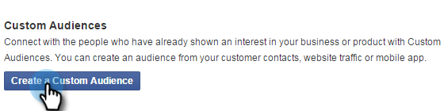

# Remarketing personnalisé dans Facebook {#personalized-remarketing-in-facebook}

Le remarketing personnalisé vous permet de réengager vos utilisateurs à l’aide des données RTP et de la puissance du remarketing Facebook.

>[!PREREQUISITES]
>
>* Terminez la configuration [Reciblage avec les données Web Personalization](/help/marketo/product-docs/web-personalization/website-retargeting/retargeting-with-web-personalization-data.md)
>* Consultez la  [documentation Facebook sur les audiences personnalisées](https://developers.facebook.com/docs/ads-for-websites/website-custom-audiences/getting-started#install-the-pixel) et le remarketing.

## Création d’une audience dans Facebook {#creating-an-audience-in-facebook}

1. Dans Facebook, accédez à votre [onglet Audience](https://www.facebook.com/ads/audience_manager) dans Ads Manager.

1. Cliquez sur **Outils** et sélectionnez **Audiences**.

   

1. Cliquez sur **Créer une audience personnalisée**.

   

1. Sélectionnez **Trafic du site Web**.

   

1. Dans la liste Trafic du site Web, sélectionnez **Combinaison personnalisée**.

   

1. Dans la liste Inclure, sélectionnez **Event**.

   

1. Dans la liste Event, sélectionnez **RTP Remarketing** et sélectionnez un paramètre.

   

1. Pour cet exemple, sélectionnez Secteur industriel pour contenir **Éducation**. Saisissez **Education** et modifiez **Dans les** derniers jours pour qu&#39;il dure 180 jours. Saisissez le Nom du public : **Secteur de l’éducation**. Cliquez sur **Créer une audience**.

   

1. Vous avez maintenant créé une audience personnalisée à l’aide des données RTP dans Facebook.

   

## Points de données RTP dans Facebook {#rtp-data-points-in-facebook}

<table> 
 <tbody> 
  <tr> 
   <th>Nom de l'événement</th> 
   <th> </th> 
  </tr> 
  <tr> 
   <td>Remarketing RTP</td> 
   <td> 
    
 
     <table> 
      <tbody> 
       <tr> 
        <th>Paramètre</th> 
        <th>Valeur</th> 
       </tr> 
       <tr> 
        <td>Liste ABM</td> 
        <td>(Nom de la liste basée sur les comptes)</td> 
       </tr> 
       <tr> 
        <td colspan="1">Catégorie</td> 
        <td colspan="1">
Fortune 500

Fortune 1000

Global 2000
</td> 
       </tr> 
       <tr> 
        <td colspan="1">Groupe</td> 
        <td colspan="1">
Entreprise

PME
</td> 
       </tr> 
       <tr> 
        <td>Industrie</td> 
        <td>
Défense

Formation

Services financiers

État

Santé, pharmacie, biotechnologie

Logiciels et Internet

etc.. (conformément aux options du secteur de la technologie de pointe)
</td> 
       </tr> 
       <tr> 
        <td colspan="1">Public segmenté</td> 
        <td colspan="1">(Nom de l’audience segmentée créée dans RTP)</td> 
       </tr> 
      </tbody> 
     </table> 
    
</td> 
  </tr> 
 </tbody> 
</table>

## Ciblage de votre audience avec une publicité {#target-your-audience-with-an-ad}

Pour plus d’informations, voir la [documentation Facebook ](https://developers.facebook.com/docs/ads-for-websites/website-custom-audiences/getting-started#target-your-audience).

1. Accédez au Gestionnaire de publicités, cliquez sur **Créer l’annonce**.

   

1. Sélectionnez **Envoyer les personnes à votre site web** comme objectif de votre campagne.

   

1. Saisissez l’URL de votre site web.

   

1. Créez votre visionneuse d’annonces. Sélectionnez une audience personnalisée dans la liste des audiences que vous avez créées, par exemple, le secteur de l’éducation.

   

1. Sélectionnez toutes les autres options de jeux de publicités, définissez votre budget et vos créations publicitaires.

   

1. Vous êtes désormais tous configurés avec une campagne de remarketing personnalisée dans Facebook.

>[!MORELIKETHIS]
>
>* [Reciblage avec des données Personalization Web](/help/marketo/product-docs/web-personalization/website-retargeting/retargeting-with-web-personalization-data.md)
>* [Remarketing personnalisé dans Google](/help/marketo/product-docs/web-personalization/website-retargeting/personalized-remarketing-in-google.md)
