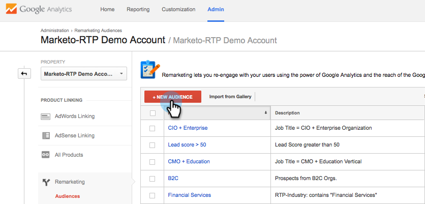
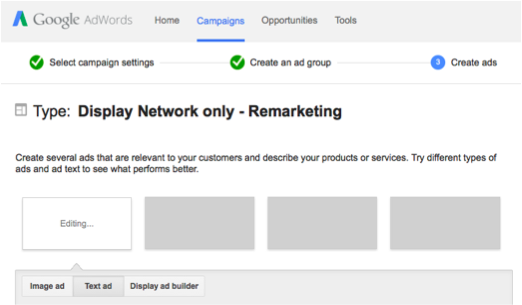

# Remarketing personnalisé dans Google {#personalized-remarketing-in-google}

Le remarketing personnalisé vous permet d’interagir de nouveau avec vos utilisateurs à l’aide de données RTP et de la puissance des Google Analytics grâce à la portée du réseau d’affichage Google.

>[!PREREQUISITES]
>
>* Effectuez la configuration [Reciblage avec les données](retargeting-with-web-personalization-data.md) de personnalisation Web.
>* Révision des [remarques avec la documentation d’aide](https://support.google.com/analytics/topic/2611283?hl=en&amp;ref_topic=3413645) Google Analytics

>

## Création d&#39;une Audience de remarketing dans Google {#creating-a-remarketing-audience-in-google}

1. Connectez-vous à vos Google Analytics. Cliquez sur **Admin**, **Compte**, **Propriété**. Cliquez sur Définitions **des** Audiences et **Audiences**.

   

1. Cliquez sur **+Nouvelle Audience**.

   

1. **Configuration** des liens : Lien vers votre compte Google Adwords
1. **Définir une Audience**: Cliquez sur **Créer**.

   

1. Dans le créateur d’Audiences, cliquez sur **Séquences** et **recherchez les données** RTP sous Dimensions personnalisées, Variables personnalisées, Événements.

>[!TIP]
>
>Comment trouver les données RTP dans Analytics pour créer votre audience ?
>
>En Google Analytics :
>
>* Variables personnalisées : Organisation, industrie
>* Catégorie événement : Segment, Insightera-CTA, RTP-Remarketing
>* Étiquette de événement : Nom du segment, nom de la Campaign, nom de l’Audience segmentée

>
>
Dans Google Universal Analytics :
>
>* Dimensions personnalisées : Organisation, industrie, Catégorie (Fortune 500 1000, Global 2000), Groupe (Entreprise, PME), Liste ABM (Liste de compte nommé)
>* Catégorie événement : RTP-Segment, RTP-Campaign RTP-Remarketing
>* Étiquette de événement : Nom du segment, nom de la Campaign, nom de l’Audience segmentée

>

**Exemple d’Audience de remarketing à partir des données d’Audience segmentées RTP**

1. Cliquez sur **Séquences.**
1. Sélectionnez Etiquette de **Événement.**
1. Entrez le **nom de l&#39;Audience** segmentée (tel qu&#39;il apparaît dans RTP).
1. Cliquez sur **Appliquer**.

**Exemple d&#39;Audience à partir des données sur l&#39;industrie RTP**

1. Cliquez sur **Séquences**.
1. Sélectionnez** RTP-Industry**.
1. Entrez le **nom de l&#39;industrie** (p. ex. Services financiers, Education...).
1. Cliquez sur **Appliquer**.
1. Entrez un nom **d&#39;** Audience. Cliquez sur **Enregistrer**.

## Création d’une publicité de remarketing Campaign dans des mots de passe Google {#create-a-remarketing-ad-campaign-in-google-adwords}

1. Connectez-vous à **Google Adwords**. Cliquez sur **Campagnes**, sélectionnez **Afficher le réseau uniquement**.

   

1. Saisissez **Campaign Name**, Sélectionnez **Type Remarketing.**

   

1. Saisissez le nom du groupe **publicitaire,** saisissez le CPC **** amélioré, sélectionnez la Liste **** de remarketing.

   

1. Cliquez sur Enregistrer et continuez.
1. Ajoutez votre image ou annonce textuelle et début votre campagne de remarketing.

   

>[!NOTE]
>
>**Articles connexes**
>
>* [Reciblage avec les données de personnalisation Web](retargeting-with-web-personalization-data.md)
>* [Remarketing personnalisé dans Facebook](personalized-remarketing-in-facebook.md)

