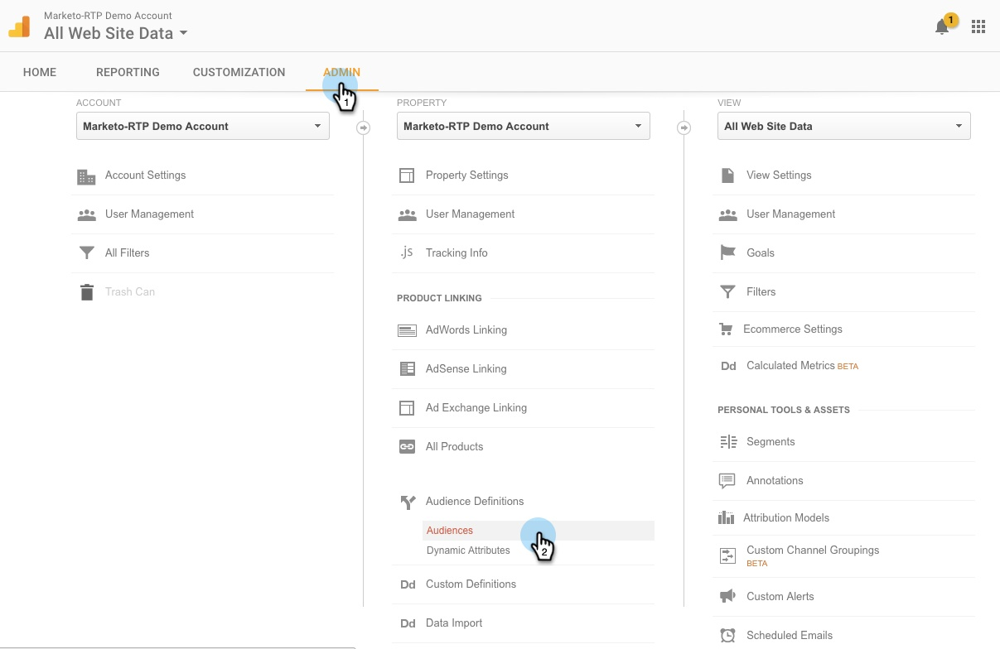

# Remarketing personnalisé dans Google {#personalized-remarketing-in-google}

Le remarketing personnalisé vous permet de réengager vos utilisateurs à l’aide des données RTP et de la puissance de Google Analytics avec la portée du réseau d’affichage Google.

>[!PREREQUISITES]
>
>* Effectuez la configuration [Reciblage avec  [!DNL Web Personalization]  données](/help/marketo/product-docs/web-personalization/website-retargeting/retargeting-with-web-personalization-data.md)
>* Consultez la documentation [Remarketing avec l’aide de Google Analytics](https://support.google.com/analytics/topic/2611283?hl=en&ref_topic=3413645).

## Création d’une audience de remarketing dans Google {#creating-a-remarketing-audience-in-google}

1. Connectez-vous à votre Google Analytics. Cliquez sur **[!UICONTROL Admin]**, **[!UICONTROL Compte]**, **[!UICONTROL Propriété]**. Cliquez sur **[!UICONTROL Définitions d’audience]** et **[!UICONTROL Audiences]**.

   

1. Cliquez sur **[!UICONTROL +Nouvelle audience]**.

   

1. **[!UICONTROL Configuration du lien]** : liez-le à votre compte [!DNL Google Adwords]. **[!UICONTROL Définir L’Audience]** : Cliquez Sur **[!UICONTROL Créer]**.

   

1. Dans le Créateur d’audience, cliquez sur **[!UICONTROL Séquences]** et **[!UICONTROL Rechercher les données RTP]** sous [!UICONTROL Dimensions personnalisées], [!UICONTROL UICONTROL [ !]Variables personnalisées &#x200B;], [!UICONTROL Événements].

>[!TIP]
>
>Comment trouver les données RTP dans Analytics pour créer votre audience ?
>
>Dans Google Analytics :
>
>* Variables Personnalisées : Organisation, Secteur
>* Catégorie d’événement : Segment, Insightera-CTA, RTP-Remarketing
>* Libellé De L’Événement : Nom Du Segment, Nom De La Campagne, Nom De L’Audience Segmentée
>
>Dans Google Universal Analytics :
>
>* Dimensions personnalisées : organisation, secteur, catégorie (Fortune 500 1 000, Global 2000), groupe (entreprise, PME), liste ABM (liste des comptes nommés)
>* Catégorie d’événement : RTP-Segment, RTP-Campaign RTP-Remarketing
>* Libellé De L’Événement : Nom Du Segment, Nom De La Campagne, Nom De L’Audience Segmentée

**Exemple de remarketing d’audience à partir de données d’audience segmentées RTP**

1. Cliquez sur **[!UICONTROL Séquences].**
1. Sélectionnez **[!UICONTROL Libellé de l’événement].**
1. Saisissez **[!UICONTROL Nom de l’audience segmentée]** (tel qu’il apparaît dans le RTP).
1. Cliquez sur **[!UICONTROL Appliquer]**.

**Exemple d’audience à partir de données du secteur RTP**

1. Cliquez sur **[!UICONTROL Séquences]**.
1. Sélectionnez **[!UICONTROL RTP-Industry]**.
1. Entrez **Nom du secteur** (p. ex. [!UICONTROL Services Financiers], [!UICONTROL Éducation]...).
1. Cliquez sur **[!UICONTROL Appliquer]**.
1. Saisissez un **[!UICONTROL Nom de l’audience]**. Cliquez sur **[!UICONTROL Enregistrer]**.

## Création d’une campagne publicitaire de remarketing dans [!DNL Google Adwords] {#create-a-remarketing-ad-campaign-in-google-adwords}

1. Connectez-vous à **[!DNL Google Adwords]**. Cliquez sur **[!UICONTROL Campagnes]**, puis sélectionnez **[!UICONTROL Afficher le réseau uniquement]**.

   

1. Saisissez **[!UICONTROL Nom De La Campagne]**, Puis Sélectionnez **[!UICONTROL Saisir Du Remarketing].**

   

1. Saisissez **[!UICONTROL Nom du groupe publicitaire],** saisissez **[!UICONTROL Coût par clic amélioré]**, puis sélectionnez **[!UICONTROL Liste de remarketing]**.

   

1. Cliquez sur **[!UICONTROL Enregistrer]** et continuez.
1. Ajoutez votre image ou votre texte publicitaire et lancez votre campagne de remarketing.

   

>[!MORELIKETHIS]
>
>* [Reciblage avec  [!DNL Web Personalization]  données](/help/marketo/product-docs/web-personalization/website-retargeting/retargeting-with-web-personalization-data.md)
>* [Remarketing personnalisé dans  [!DNL Facebook]](/help/marketo/product-docs/web-personalization/website-retargeting/personalized-remarketing-in-facebook.md)
