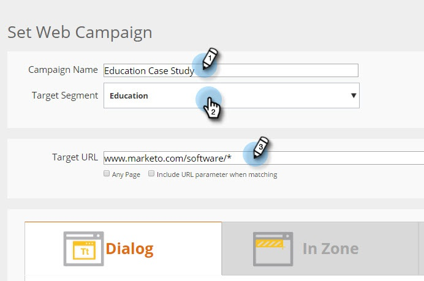
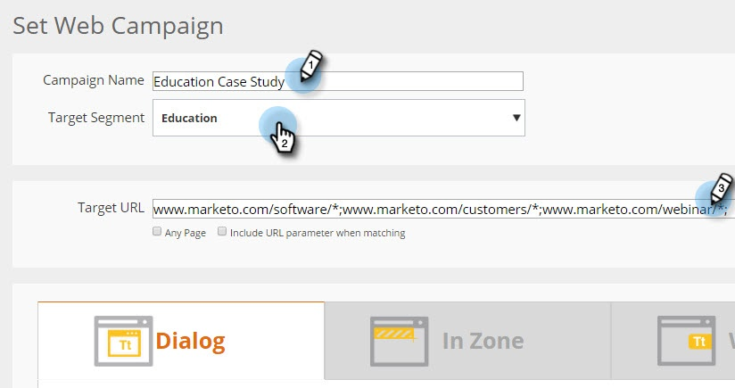

# Ajouter une URL de Cible à un Campaign Web {#adding-a-target-url-to-a-web-campaign}

Une URL de Cible se trouve sous la page Définir Campaign et définit l’URL spécifique ou les URL sur lesquelles une campagne Web apparaîtra.

## Ajouter une URL de Cible pour les campagnes Web de boîtes de dialogue ou de widgets {#adding-a-target-url-for-dialog-or-widget-web-campaigns}

1. Accédez à Campagnes **** Web.

   

1. Sélectionnez **Créer une Campaign** Web.

   

1. Ajoutez un nom **** Campaign. Sélectionnez un segment **de** Cible. Ajouter l’URL **de** Cible.

   

<table> 
 <thead> 
  <tr> 
   <th colspan="1" rowspan="1">Nom</th> 
   <th colspan="1" rowspan="1">Description</th> 
  </tr> 
 </thead> 
 <tbody> 
  <tr> 
   <td colspan="1" rowspan="1"><strong>N’importe quelle page</strong></td> 
   <td colspan="1" rowspan="1">
Permet à la campagne d’apparaître sur n’importe quelle page.
</td> 
  </tr> 
  <tr> 
   <td colspan="1" rowspan="1">
<strong>Inclure le paramètre d’URL lors de la correspondance</strong>
</td> 
   <td colspan="1" rowspan="1">Ajoutez le paramètre d’URL pour qu’il corresponde et affiche la campagne sur les URL, y compris ce paramètre. Par ex. campaign=cpc</td> 
  </tr> 
 </tbody> 
</table>

## Ajouter plusieurs URL à une URL de Cible {#adding-multiple-urls-to-target-url}

Cliquez sur l’icône Plus () pour ouvrir la boîte de dialogue Saisie de plusieurs valeurs afin d’ajouter plusieurs URL. Ajoutez une URL par ligne.

>[!NOTE]
>
>
>* Les campagnes Web de boîtes de dialogue et de widgets peuvent utiliser les options N’importe quelle page et Caractère générique (*).
* Dans les cas d’utilisation avancée, les campagnes Web In Zone peuvent utiliser des caractères génériques à la fin du chemin d’accès à l’URL. Exemple : [www.marketo.com/software/personalization/*](http://www.marketo.com/software/personalization/*)
* L’URL est sensible à la casse

## Ajouter une URL de Cible pour les campagnes Web dans la zone {#adding-a-target-url-for-in-zone-web-campaigns}

1. Accédez à **Web** **Campaigns**.

   

1. Sélectionnez **Créer une Campaign** Web.

   

1. Ajoutez un ** Nom de Campaign***. Sélectionnez un segment **de** Cible. Ajouter l’URL **de** Cible.

   >[!NOTE]
   L’URL de la cible avec les zones d’entrée doit définir une ou plusieurs URL spécifiques. Dans les cas d’utilisation avancée, les campagnes Web In Zone peuvent utiliser des caractères génériques à la fin du chemin d’accès à l’URL. Exemple : [www.marketo.com/software/personalization/*](http://www.marketo.com/software/personalization/*)

   

>[!NOTE]
**Articles connexes**
* [Créer une Campaign Web de boîte de dialogue](create-a-new-dialog-web-campaign.md)
* [Créer une Campaign Web en zone](create-a-new-in-zone-web-campaign.md)
* [Créer un widget Web Campaign](create-a-new-widget-web-campaign.md)

