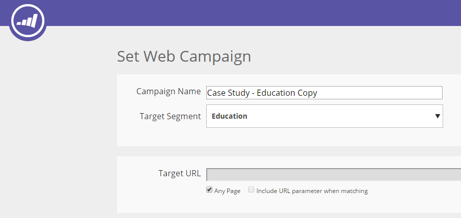

# Cloner une Campaign Web {#clone-a-web-campaign}

Utilisez la fonction de clonage de la page Campagnes Web pour copier les paramètres de la campagne et modifier le contenu en vue d&#39;une optimisation des tests fractionnés, ou cloner une campagne avec le même contenu et la même cible pour un autre segment. Créez des campagnes Web en quelques secondes !

## Création d’une Campaign {#create-a-clone-campaign}

1. Accédez à Campagnes **** Web.

   

   >[!NOTE]
   >
   >Pour faciliter la recherche de la campagne Web de votre choix, utilisez la fonction [de](filter-web-campaigns.md)filtrage.

1. Pour la campagne Web, cliquez sur **Cloner**.

   

1. Le processus de clonage de campagne copie tout le contenu de la campagne Web existante dans la nouvelle campagne clonée. La nouvelle campagne Web clonée est intitulée &quot;Copie du NOM[] CAMPAIGN&quot;.

   

   >[!TIP]
   >
   >Tout le contenu de la campagne Web est copié dans la campagne clonée, à l’exception des tests fractionnés. N’oubliez donc pas d’ajouter un groupe de tests fractionné à la campagne clonée si vous souhaitez le tester par rapport aux autres.

>[!NOTE]
>
>**Articles connexes**
>
>* [Créer une Campaign Web en zone](create-a-new-in-zone-web-campaign.md)
>* [Créer un widget Web Campaign](create-a-new-widget-web-campaign.md)
>* [Créer une Campaign Web de boîte de dialogue](create-a-new-dialog-web-campaign.md)

>

