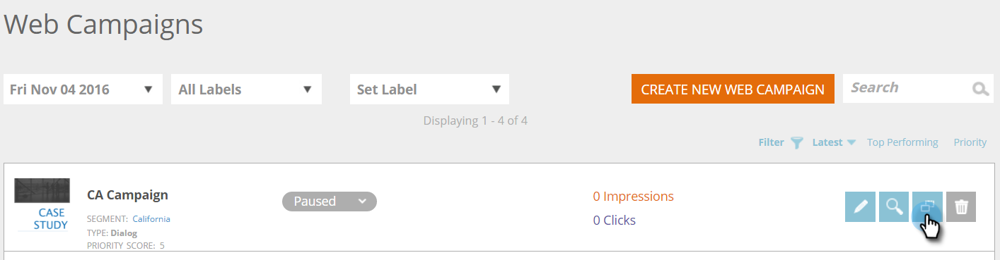

# Cloner une campagne web {#clone-a-web-campaign}

Utilisez la fonction de clonage de la page [!UICONTROL Campagnes web] pour copier les paramètres de la campagne et modifier le contenu pour l’optimisation du test de partage, ou clonez une campagne avec le même contenu et ciblez-la vers un autre segment. Créez des campagnes web en quelques secondes !

## Création d’une campagne de clonage {#create-a-clone-campaign}

1. Accédez à **[!UICONTROL Campagnes web]**.

   

   >[!NOTE]
   >
   >Pour faciliter la recherche de la campagne web souhaitée, utilisez la [fonction de filtre](/help/marketo/product-docs/web-personalization/working-with-web-campaigns/filter-web-campaigns.md).

1. Pour la campagne web, cliquez sur **Cloner**.

   

1. Le processus de clonage de la campagne copie tout le contenu de la campagne web existante dans la nouvelle campagne clonée. La nouvelle campagne web clonée est intitulée « [NOM DE LA CAMPAGNE] Copier ».

   

   >[!TIP]
   >
   >Tout le contenu de la campagne web est copié dans la campagne clonée, à l’exception des tests partagés. N’oubliez donc pas d’ajouter un groupe de test partagé à la campagne clonée si vous souhaitez la tester par rapport à d’autres.

>[!MORELIKETHIS]
>
>* [Créer une campagne de dialogue](/help/marketo/product-docs/web-personalization/working-with-web-campaigns/create-a-new-dialog-web-campaign.md)
>* [Créer un RTP dans Zone Campaign](/help/marketo/product-docs/web-personalization/working-with-web-campaigns/create-a-new-in-zone-web-campaign.md)
>* [Créer une campagne de widget RTP](/help/marketo/product-docs/web-personalization/working-with-web-campaigns/create-a-new-widget-web-campaign.md)
