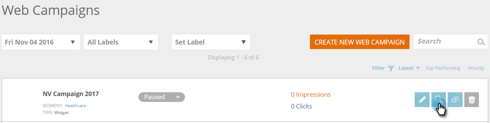

# Créer un widget Web Campaign {#create-a-new-widget-web-campaign}

Une campagne Web est une réaction personnalisée associée à un segment spécifique et peut être une [boîte de dialogue](create-a-new-dialog-web-campaign.md) sur votre site Web, un [remplacement de zone](create-a-new-in-zone-web-campaign.md), une fonction de widget ou une alerte par courrier électronique. La campagne Web de widgets est un texte ou une bannière qui s’affiche sur le côté vertical de votre page Web et permet de la développer et de la contracter, tout en restant fixe sur la page du site Web tout au long de la visite.

## Créer un widget Web Campaign {#create-a-widget-web-campaign}

1. Accédez à **Campagnes Web**.

   

1. Sélectionnez **Créer une Campaign Web**.

   

1. Sélectionnez le type de campagne **Widget**.

   

1. Utilisez les options multiples pour personnaliser votre widget.

   

1. Cliquez sur **Prévisualisation **pour voir comment la campagne Web va réagir sur votre site.

<table> 
 <thead> 
  <tr> 
   <th colspan="1" rowspan="1">Nom</th> 
   <th colspan="1" rowspan="1">Description</th> 
  </tr> 
 </thead> 
 <tbody> 
  <tr> 
   <td colspan="1"><strong>Modèles</strong></td> 
   <td colspan="1">Faites votre choix parmi plusieurs modèles préfabriqués.</td> 
  </tr> 
  <tr> 
   <td colspan="1"><strong>Afficher le</strong></td> 
   <td colspan="1">Permet de <a href="http://docs.marketo.com/display/DOCS/Set+How+Your+Web+Campaign+Displays" rel="nofollow">personnaliser quand et comment</a> s’affiche votre campagne Web.</td> 
  </tr> 
  <tr> 
   <td colspan="1"><strong>Animer les entrées/sorties</strong></td> 
   <td colspan="1">Défini sur l'entrée et/ou la sortie de la boîte de dialogue. Sélectionnez l’effet (goutte, aveugle, diapositive, fondu, aucun effet), la durée (en secondes) et la direction (vers le haut, le bas, la gauche, la droite).</td> 
  </tr> 
  <tr> 
   <td colspan="1"><strong>Position</strong></td> 
   <td colspan="1">Sélectionnez l’une des quatre options pour la position du widget sur la page : Droite, Gauche, Haut, Bas. Le pourcentage de position correspond au pourcentage de positionnement du widget dans la page du navigateur (par exemple, "50 % inférieur" fera apparaître le widget à mi-chemin du bas de la page, "10 % gauche" fera apparaître le widget en haut à gauche de la page, etc.). </td> 
  </tr> 
  <tr> 
   <td colspan="1" rowspan="1"><strong>Couleur du widget</strong></td> 
   <td colspan="1" rowspan="1">
Sélectionnez la couleur du widget dans un graphique de couleurs ou saisissez-la comme code de couleur RVB. Vous pouvez également sélectionner le niveau de transparence de l'arrière-plan du widget en déplaçant la barre du bas dans l'une des directions.
</td> 
  </tr> 
  <tr> 
   <td colspan="1" rowspan="1">
<strong>Bouton Widget</strong> 
</td> 
   <td colspan="1" rowspan="1">Personnalisez le bouton du widget lui-même. Flèche : Vous permet de choisir parmi plusieurs icônes différentes dans le menu déroulant de droite. La liste déroulante de gauche détermine sa couleur. Personnalisé : Insérez l’URL de toute image hébergée. Types de fichiers acceptés : .JPEG, .GIF (y compris animé), .PNG, .APNG, .SVG, .BMP. Texte : Le widget peut être du texte : personnalisez sa couleur, sa taille et sa police.</td> 
  </tr> 
  <tr> 
   <td colspan="1"><strong>Attractif</strong></td> 
   <td colspan="1">Si vous sélectionnez cette option, le widget s’affichera sur toutes les pages Web pendant toute la session du visiteur.</td> 
  </tr> 
  <tr> 
   <td colspan="1"><strong>Minimiser le widget sur l’affichage Campaign</strong></td> 
   <td colspan="1">Insère le widget mais le conserve réduit, ce qui oblige l’utilisateur à cliquer dessus pour l’agrandir.</td> 
  </tr> 
  <tr> 
   <td colspan="1"><strong>Restaurer les paramètres par défaut </strong></td> 
   <td colspan="1">Restaure le paramètre par défaut d’origine du widget en définissant la couleur du widget sur l’option grise transparent par défaut.</td> 
  </tr> 
  <tr> 
   <td colspan="1"><strong>Prévisualisation sur site </strong></td> 
   <td colspan="1">Campagnes de prévisualisation avant leur lancement.  
    <ul> 
     <li>URL : saisissez un exemple d'URL où la campagne s'exécuterait pour afficher un exemple prévisualisation de l'aspect de la campagne.</li> 
     <li>Prévisualisation - Cliquez sur <strong>Prévisualisation </strong>pour ouvrir une nouvelle fenêtre de l'exemple d'URL afin de voir comment réagit la campagne (Ajoutez l'<a href="https://chrome.google.com/extensions/detail/ldiddonjplchallbngbccbfdfeldohkj?hl=en" rel="nofollow">extension Chrome</a> pour la meilleure expérience de prévisualisation Web Campaign.) </li> 
     <li>Partager - Utilisez le bouton Partager pour envoyer un courriel à un collègue avec un lien afin d'afficher la campagne proxy.</li> 
    </ul></td> 
  </tr> 
 </tbody> 
</table>

>[!NOTE]
>
>**Vous souhaitez tester vos campagnes Web de manière A/B ?** Une ou plusieurs campagnes Web peuvent être testées  [A/B pour des résultats](ab-test-your-web-campaign.md) optimaux. Grâce à la fonction d’ajustement automatique, la plate-forme reconnaît automatiquement les campagnes les plus performantes, poursuit les campagnes ayant le plus fort taux de conversion et interrompt les autres campagnes.

## Modifier une Campaign Web {#edit-a-web-campaign}

Dans la page Campagnes Web, cliquez sur **Modifier** dans le Campaign.

>[!NOTE]
>
>Pour faciliter la recherche de la campagne souhaitée, utilisez la fonction de filtre .

## Cloner une Campaign Web {#clone-a-web-campaign}

Voir [Cloner une Campaign Web](clone-a-web-campaign.md).

## Prévisualisation d’un Campaign Web {#preview-a-web-campaign}

Dans la page Campagnes Web, cliquez sur **Prévisualisation** dans la campagne Web que vous souhaitez prévisualisation.

## Supprimer une Campaign Web {#delete-a-web-campaign}

1. Dans la page Campagnes Web, cliquez sur **Supprimer **sur la campagne Web que vous souhaitez supprimer.

   

1. Un message de confirmation s’affiche pour confirmer si vous souhaitez supprimer la campagne Web.

>[!MORELIKETHIS]
>
>* [Créer une Campaign Web en zone](create-a-new-in-zone-web-campaign.md)
>* [Créer une Campaign Web de boîte de dialogue](create-a-new-dialog-web-campaign.md)

