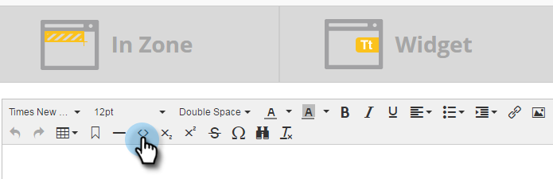

# Incorporer un formulaire dans une campagne web {#embed-a-form-into-a-web-campaign}

Découvrez comment incorporer un formulaire Marketo dans une campagne web (boîte de dialogue, zone ou widget).

1. Effectuez un clic droit sur un formulaire approuvé. Sélectionnez **[!UICONTROL Code incorporé]**.

   

1. Copiez le code.

   

1. Dans [!DNL Web Personalization], accédez à **[!UICONTROL Campagnes web]**.

   

1. Cliquez sur **[!UICONTROL Créer une campagne]**.

   

1. Dans l’éditeur de texte enrichi, cliquez sur l’icône HTML .

   

1. Collez le code incorporé du formulaire dans l’[!UICONTROL Éditeur HTML Source]. Cliquez sur **[!UICONTROL Mettre à jour]**.

   

1. Le formulaire ne s’affichera pas en mode Éditeur, mais vous pouvez le prévisualiser pour voir comment il s’affichera dans une campagne.

1. Cliquez sur **[!UICONTROL Lancer]** pour démarrer la campagne.

   >[!NOTE]
   >
   >Toute modification apportée aux champs du formulaire doit être effectuée dans les Activités marketing de Marketo dans Modifier le brouillon du formulaire.

## Trois méthodes pour ajouter une image d’arrière-plan à un formulaire {#three-ways-to-add-a-background-image-to-a-form}

Pour ajouter une image d’arrière-plan à votre formulaire, vous pouvez :

* Modifier le CSS d’un thème de formulaire
* Modifier les couleurs de la boîte de dialogue ou du widget dans Définir la campagne
* Ajoutez le code CSS au script

Pour modifier le CSS d’un thème de formulaire, consultez [cet article](/help/marketo/product-docs/demand-generation/forms/form-design/edit-the-css-of-a-form-theme.md).

Pour modifier les couleurs de la boîte de dialogue ou du widget dans Définir la campagne :

1. Dans l’éditeur de texte enrichi, sélectionnez un type de campagne Boîte de dialogue et un style de boîte de dialogue, une couleur d’en-tête et une couleur d’arrière-plan pour personnaliser les couleurs d’arrière-plan du formulaire. Cliquez sur **[!UICONTROL Enregistrer]**

   

1. Voici un exemple illustrant à quoi ressemble un style de boîte de dialogue Rognage moderne avec un en-tête violet clair et une couleur d’arrière-plan.

   

Pour ajouter du code CSS au script :

1. Dans l’éditeur de texte enrichi, cliquez sur l’icône HTML .

   

1. Collez le code incorporé du formulaire avec le code de style d’arrière-plan dans l’[!UICONTROL Éditeur HTML Source]. Cliquez sur **[!UICONTROL Mettre à jour]**.

   

1. Cliquez sur **[!UICONTROL Aperçu]** pour voir comment il sera rendu dans une campagne (le formulaire ne s’affichera pas dans la vue de l’éditeur). Voici un exemple de rendu du code de formulaire ci-dessus dans une campagne avec une image d’arrière-plan.

   

>[!MORELIKETHIS]
>
>* [Modifier le CSS d’un thème de formulaire](/help/marketo/product-docs/demand-generation/forms/form-design/edit-the-css-of-a-form-theme.md)
>* [Afficher un message de remerciement sans page de destination de relance](https://developers.marketo.com/blog/show-thank-you-message-without-a-follow-up-landing-page/)
>* [Formulaires 2.0](https://experienceleague.adobe.com/en/docs/marketo-developer/marketo/javascriptapi/forms-api-reference)
