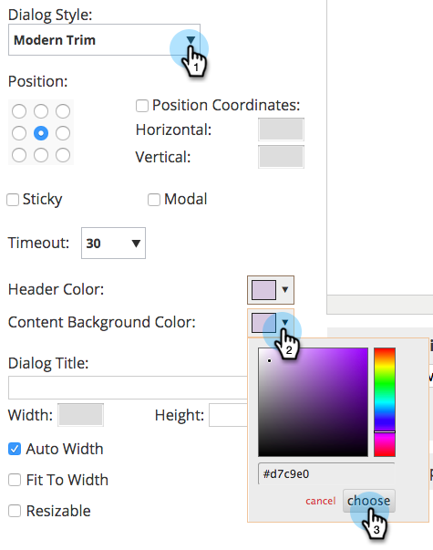

# Incorporer un formulaire dans une Campaign Web {#embed-a-form-into-a-web-campaign}

Découvrez comment incorporer un formulaire Marketo dans une campagne Web (boîte de dialogue, zone ou widget).

1. Cliquez avec le bouton droit sur un formulaire approuvé. Sélectionnez Code **incorporé**.

   ** 

   **

1. Copiez le code.

   

1. Dans Personnalisation Web, accédez à Campagnes **** Web.

   

1. Cliquez sur **Créer une campagne**.

   ** 

   **

1. Dans l’éditeur de texte enrichi, cliquez sur l’icône HTML.

   

1. Collez le code incorporé du formulaire dans l’éditeur de source HTML. Cliquez sur **Mettre à jour**.

   

1. Le formulaire ne s’affiche pas dans la vue d’éditeur, mais vous pouvez le prévisualisation pour voir comment il s’affichera dans une campagne.
1. Cliquez sur **Lancer** pour début de la campagne.

   >[!NOTE]
   >
   >Toute modification des champs du formulaire doit être effectuée dans les Activités marketing de Marketo dans Modifier le brouillon du formulaire.

## Trois manières d’Ajouter une image d’arrière-plan à un formulaire {#three-ways-to-add-a-background-image-to-a-form}

Pour ajouter une image d’arrière-plan à votre formulaire, vous pouvez :

* Modification de la page CSS d’un thème de formulaire
* Modification des couleurs de la boîte de dialogue ou du widget dans Set Campaign
* Ajouter le code CSS au script

Pour modifier la page CSS d’un thème de formulaire, reportez-vous à [cet article](../../../product-docs/demand-generation/forms/form-design/edit-the-css-of-a-form-theme.md).

Pour modifier les couleurs de la boîte de dialogue ou du widget dans Set Campaign :

1. Dans l’éditeur de texte enrichi, sélectionnez un type de campagne de boîte de dialogue et un style de boîte de dialogue, une couleur d’en-tête et une couleur d’arrière-plan pour personnaliser les couleurs d’arrière-plan du formulaire. Cliquez sur **Enregistrer**.

   

1. Voici un exemple de l’aspect d’un style de boîte de dialogue Rognage moderne avec un en-tête et une couleur d’arrière-plan violets clairs.

   

Pour ajouter du code CSS au script :

1. Dans l’éditeur de texte enrichi, cliquez sur l’icône HTML.

   

1. Collez le code incorporé du formulaire avec le code de style d’arrière-plan dans l’éditeur de source HTML. Cliquez sur **Mettre à jour**.

   

1. Cliquez sur **Prévisualisation** pour afficher le rendu d’une campagne (le formulaire ne s’affichera pas dans la vue de l’éditeur). Voici un exemple de rendu du code de formulaire ci-dessus dans une campagne avec une image d’arrière-plan.

   

>[!NOTE]
>
>**Articles connexes**
>
>* [Modification de la page CSS d’un thème de formulaire](https://docs.marketo.com/display/public/DOCS/Edit+the+CSS+of+a+Form+Theme)
>* [Afficher le message de remerciement sans Landing page de suivi](http://developers.marketo.com/blog/show-thank-you-message-without-a-follow-up-landing-page/)
>* [Forms 2.0](http://developers.marketo.com/documentation/websites/forms-2-0/)

>

