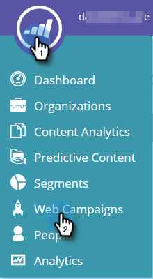

# Exporter les données Campaign Web {#export-web-campaign-data}

Pour exporter vos données de campagne Web, procédez comme suit.

1. Accédez à **Campagnes Web**.

   

1. Dans l’angle supérieur droit de la page, cliquez sur l’icône Exporter CSV.

   

1. Ouvrez ou enregistrez votre fichier.

   

1. Vue votre fichier pour consulter des statistiques utiles.

   

