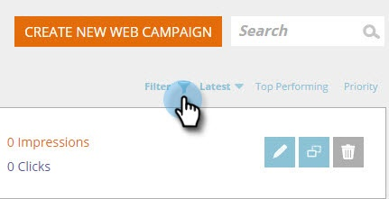

# Filtrage des campagnes Web {#filter-web-campaigns}

Après avoir créé des centaines de campagnes de personnalisation Web, il est vraiment utile de pouvoir utiliser des filtres pour ne vue que ceux qui vous intéressent.

1. Accédez à Campagnes **Web.**

   

1. Sur la page Campagnes Web, cliquez sur **Filtrer**.

   

1. Cochez la case relative à l’état et/ou au type de campagne à filtrer, par exemple, **En pause** ou **Boîte de dialogue**. Cliquez sur **Appliquer**.

   

   >[!TIP]
   >
   >Cochez la case **Sélectionner tout** pour sélectionner tout ou le lien **Effacer** pour effacer toutes les cases.

1. Désormais, seules les campagnes qui correspondent à votre filtre sont affichées.

   

   Un morceau de gâteau !

