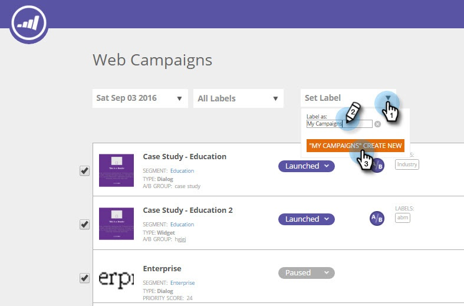

# Étiqueter vos campagnes web {#label-your-web-campaigns}

Avez-vous tellement de campagnes que le défilement devient encombrant ? Utilisez des étiquettes pour baliser vos campagnes afin de pouvoir les trier et les retrouver rapidement.

## Ajouter un libellé à une campagne web {#add-a-label-to-a-web-campaign}

1. Connectez-vous à Web Personalization et accédez à la zone Campagnes Web .

   

   >[!NOTE]
   >
   >Pour faciliter la recherche de la campagne de votre choix, utilisez la [fonction de filtrage](/help/marketo/product-docs/web-personalization/working-with-web-campaigns/filter-web-campaigns.md).

1. Sélectionnez les campagnes que vous souhaitez baliser avec un libellé.

   

1. Saisissez le nom de l’étiquette de votre choix, puis cliquez sur Créer.

   >[!TIP]
   >
   >Si le libellé existe déjà, sélectionnez-le et ne créez pas de nouveau.

   

Super ! Vous savez maintenant comment créer des libellés et les affecter à des campagnes.

## Filtrage par étiquettes existantes {#filter-by-existing-labels}

1. Dans la liste déroulante Libellés , sélectionnez le libellé à utiliser comme filtre.

   

1. Désormais, seules les campagnes associées au libellé sélectionné sont affichées.

   

>[!MORELIKETHIS]
>
>[Étiqueter un segment](/help/marketo/product-docs/web-personalization/using-web-segments/label-your-segment.md)
