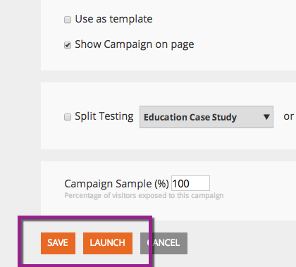

# Lancement/mise en pause d&#39;une Campaign Web {#launch-pause-a-web-campaign}

Une campagne Web est une réaction personnalisée associée à un segment spécifique et peut être une boîte de [dialogue](create-a-new-dialog-web-campaign.md) sur votre site Web, un remplacement de zone, une fonction de widget ou une alerte par courrier électronique.

Vous pouvez lancer ou suspendre une campagne Web de deux manières à partir de la page Campagnes Web ou de la page Définir des campagnes Web.

1. Cliquez sur Personnalisation **** Web.

   

1. Accédez à Campagnes **** Web.

   

1. Si la campagne est lancée, cliquez sur **Lancé** pour modifier l’état de la campagne sur **En pause, **pour interrompre la campagne.

   

1. Si la campagne est suspendue, cliquez sur **En pause** pour modifier l’état de la campagne en **Lancement**. Cette action activera et lancera la campagne.

   

   >[!NOTE]
   >
   >Vous pouvez également modifier l’état de la campagne dans la page Définir Campaign.

1. Dans la campagne, cliquez sur **Modifier**.

   

1. Cliquez sur **Enregistrer** pour enregistrer et suspendre la campagne. Cliquez sur **Lancer** pour lancer et activer la campagne.

   

>[!NOTE]
>
>**Articles connexes**
>
>* [Créer une Campaign Web de boîte de dialogue](create-a-new-dialog-web-campaign.md)
>* [Créer une Campaign Web en zone](create-a-new-in-zone-web-campaign.md)
>* [Créer un widget Web Campaign](create-a-new-widget-web-campaign.md)

>

