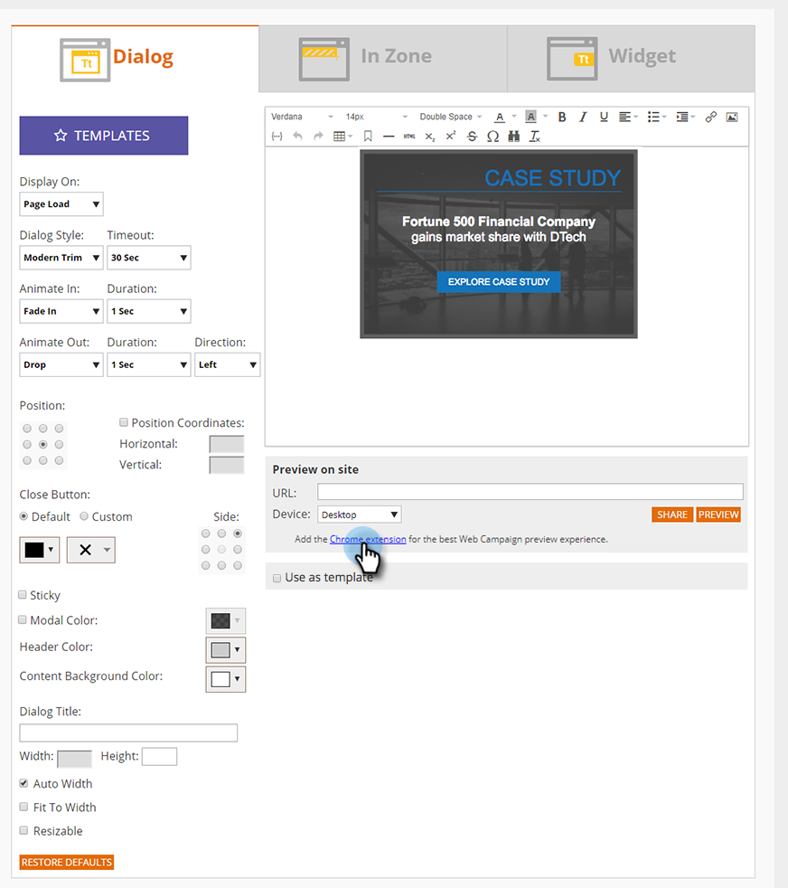
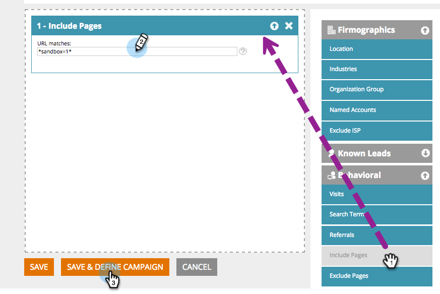

# Prévisualisation et test d&#39;un Campaign Web {#preview-and-test-a-web-campaign}

Cet article vous montre différentes manières de prévisualisation d’une campagne Web, ainsi que comment la tester à l’aide d’un segment de sandbox en direct sur votre site Web.

## Prévisualisation d&#39;un Campaign Web sur la page de création {#preview-a-web-campaign-on-the-creation-page}

1. Accédez à **Web** **Campaigns**.

   

1. Cliquez sur** Créer une nouvelle Campaign Web**** ** ou sur l&#39;icône pour modifier une campagne existante.

   

1. Dans Prévisualisation sur le site, ajoutez l’URL de la page et cliquez sur **Prévisualisation**. Une nouvelle fenêtre/onglet s&#39;ouvre et affiche la prévisualisation de la campagne.

   

   >[!TIP]
   >
   >Cliquez sur **Partager** pour ouvrir un courriel contenant une URL fixe de la prévisualisation de campagne.

   >[!NOTE]
   >
   >Vous avez également la possibilité d’installer un module externe de navigateur ( [Chrome](https://chrome.google.com/webstore/detail/marketo-web-personalizati/ldiddonjplchallbngbccbfdfeldohkj) ou [Firefox](http://docs.marketo.com/display/docs/assets/mwp-0.0.0.8.xpi)) pour bénéficier d’un aperçu optimal de votre campagne. Consultez la section ci-dessous.

## Prévisualisation d&#39;un Campaign Web sur la page de création à l&#39;aide du module externe de navigateur {#preview-a-web-campaign-on-the-creation-page-using-the-browser-plug-in}

1. Suivez les étapes 1 et 2 du `section above`.
1. Cliquez sur le lien vers le module externe du navigateur (dans ce cas, nous utilisons Chrome).

   

1. Une nouvelle fenêtre/onglet s’ouvre. Cliquez sur **Ajouter à Chrome**.

   

1. Cliquez sur **Ajouter l’extension**.

   

1. Retournez à Marketo. Ajoutez l’URL de la page, puis cliquez sur **Prévisualisation**.

   

1. Une nouvelle fenêtre/onglet s’ouvre, vous permettant de prévisualisation l’aspect de votre campagne sur un ordinateur de bureau, un téléphone ou une tablette.

   

## Prévisualisation d&#39;un Campaign Web sur la page Campagnes Web {#preview-a-web-campaign-on-the-web-campaigns-page}

1. Lorsque vous consultez la liste de vos campagnes Web, il vous suffit de choisir une campagne et de cliquer sur l’icône **Prévisualisation** .

   

   Facile !

## Prévisualisation d’un Campaign Web sur votre site Web {#preview-a-web-campaign-on-your-website}

Créez un segment sandbox et une campagne.

1. Accédez à **Segments**.

   

1. Cliquez sur **Créer**.

   

1. Nommez le segment.
1. Sous Comportement, faites glisser Inclure des pages sur la trame. Ajoutez la valeur *sandbox=1*. Cliquez sur Enregistrer et définir Campaign.

   

1. Sur la page Définir le Campaign Web, modifiez le segment de Cible en segment de sandbox en le sélectionnant dans la liste.

   

1. Terminez la création de la campagne et cliquez sur **Lancer**.\
   

1. Accédez à votre site Web, ajoutez le paramètre d’URL &quot;?sandbox=1&quot; à la fin de l’URL. Exemple : [www.marketo.com?sandbox=1](http://www.marketo.com/?sandbox=1)
1. Consultez les réactions à la campagne sur votre site Web.

>[!NOTE]
>
>Les campagnes ne réagissent qu’une seule fois au cours d’une session de visiteur. Pour afficher à nouveau la campagne, effacez les cookies de votre navigateur.

>[!NOTE]
>
>Impossible de prévisualiser les campagnes de redirection. Le seul moyen de les tester est d’utiliser un segment de sandbox (qui cible par pages spécifiques - *sandbox=redirect*)

