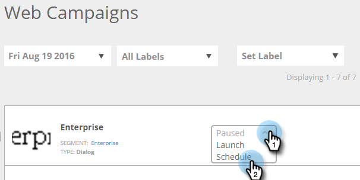

# Planification d’une Campaign Web {#schedule-a-web-campaign}

Si vous savez quand exécuter votre campagne Web, vous pouvez la planifier à l’avance. Il est facile de configurer des dates de début et d&#39;arrêt, des répétitions et plusieurs jours.

Vous pouvez planifier la campagne Web en fonction de l’heure du visiteur Web ou d’un fuseau horaire sélectionné.

>[!NOTE]
>
>**Exemple**
>
>La planification des dates de début et d’arrêt est idéale pour un événement planifié, tel qu’un webinaire, qui s’exécute pendant une période spécifique. Les répétitions sont parfaites pour une offre spéciale qui ne fonctionne que chaque semaine un jour donné.

1. Accédez à **Campagnes Web**.

   

   >[!NOTE]
   >
   >Pour faciliter la recherche de la campagne souhaitée, utilisez la fonction de filtre .

1. Ouvrez le menu État du Campaign et sélectionnez **Planification**.

   

1. Dans la boîte de dialogue Planifier la répétition, sélectionnez le fuseau horaire de la campagne.

   

   >[!TIP]
   >
   >Le paramètre par défaut exécute les campagnes dans la zone de temps du visiteur Web.

1. Sélectionnez une date et une heure de début, ainsi qu’une date et une heure de fin.

   

   >[!NOTE]
   >
   >Vous pouvez sélectionner la date et l’heure dans le menu déroulant et le calendrier ou les saisir manuellement. Les horaires sont à 12 heures du matin et du soir.

1. Par défaut, la campagne s’exécute tous les jours entre le début et la date de fin. Si vous souhaitez exécuter la campagne uniquement sur des jours spécifiques ou à des moments spécifiques, utilisez les paramètres **Répéter**. Sélectionnez le jour, le début et l’heure de fin pour afficher la campagne. Utilisez le signe plus + pour ajouter des jours supplémentaires.

   

1. Cliquez sur **Planification**.

   

1. L’état de la campagne sur la page Campagnes devient **Programmé **et l’icône horloge/calendrier s’affiche. Cliquez sur cette icône pour modifier la planification de la campagne.

   

   >[!NOTE]
   >
   >L’état de la campagne reste **Planifiée** même si la campagne s’exécute pendant les heures planifiées sélectionnées. Lorsqu’une date de fin planifiée est passée, l’état de la campagne devient **En pause**.

