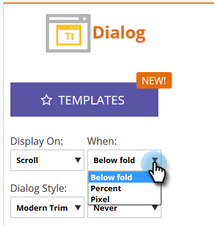
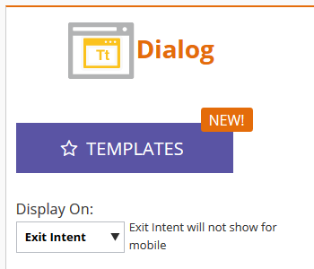

# Définir l&#39;affichage de votre Campaign Web {#set-how-your-web-campaign-displays}

Il existe plusieurs méthodes à utiliser pour déterminer quand s’affiche votre campagne Web.

## Chargement de page {#page-load}

Sélectionné par défaut, ce choix affiche simplement la campagne au chargement de la page.

## Délai {#delay}

Indiquez une temporisation (en secondes au total) de réaction des campagnes Web sur votre site Web.

1. Cliquez sur la liste déroulante **Afficher le** et sélectionnez **Délai**.

   

1. Cliquez sur la liste déroulante **Attendre** et sélectionnez la durée souhaitée.

   

## Défilement {#scroll}

1. Cliquez sur la liste déroulante **Afficher sur** et sélectionnez **Défilement**.

   

1. Cliquez sur la liste déroulante **Quand** et sélectionnez quand afficher votre campagne Web.

   

<table> 
 <tbody> 
  <tr> 
   <td><strong>Ci-dessous</strong></td> 
   <td>Affiche la campagne lorsque le visiteur défile sous le pli. Campaign disparaît lorsque le visiteur fait défiler vers le bas au-dessus du pli.</td> 
  </tr> 
  <tr> 
   <td><strong>Pourcentage</strong></td> 
   <td>Affiche la campagne lorsque le visiteur fait défiler la page pour atteindre un pourcentage prédéterminé de la page.</td> 
  </tr> 
  <tr> 
   <td><strong>Pixel</strong></td> 
   <td>
Affiche la campagne lorsque le visiteur fait défiler la page vers le pixel supérieur prédésigné.
</td> 
  </tr> 
 </tbody> 
</table>

## Mode de sortie {#exit-intent}

Le mode de sortie affiche la campagne Web lorsque le curseur de la souris quitte le navigateur.

1. Cliquez sur la liste déroulante **Afficher le** et sélectionnez **Mode de sortie**.

   

1. Un message s’affiche pour vous rappeler que le mode de sortie n’est pas compatible avec le mobile.

   

>[!TIP]
>
>Vous voulez voir comment vos effets choisis se présenteront à l&#39;avance ? Consultez-les via une [Prévisualisation Web Campaign](preview-and-test-a-web-campaign.md).

