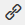

# Utilisation de l’éditeur de texte enrichi de Web Personalization {#using-the-web-personalization-rich-text-editor}

L’éditeur de texte enrichi de Web Personalization, qui se trouve sur la page Définir des campagnes , permet le formatage de texte, la liaison et l’insertion d’images. Il comprend des options de mise en forme similaires aux traitements de texte standard.

Les icônes importantes de l’éditeur de texte enrichi sont les suivantes :

<table> 
 <tbody> 
  <tr> 
   <td colspan="1"></td> 
   <td colspan="1"><strong>Modifier la source HTML</strong></td> 
   <td colspan="1">Permet d’afficher le code source de l’HTML</td> 
  </tr> 
  <tr> 
   <td colspan="1"></td> 
   <td colspan="1">
<strong>Insérer/Modifier l’image</strong> 
</td> 
   <td colspan="1">Insère une URL d’image pour que les images graphiques apparaissent dans l’éditeur.</td> 
  </tr> 
  <tr> 
   <td colspan="1"></td> 
   <td colspan="1"><strong>Insérer une image à partir de Design Studio</strong></td> 
   <td colspan="1"><em> Après avoir cliqué sur l’icône <strong>Insérer/Modifier l’image</strong>, utilisez cette option pour sélectionner des images dans Marketo Design Studio</em></td> 
  </tr> 
  <tr> 
   <td colspan="1"></td> 
   <td colspan="1">
<strong>Insérer/Modifier le lien</strong> 
</td> 
   <td colspan="1">Utilisation pour ajouter des liens hypertextes à du texte ou des images</td> 
  </tr> 
  <tr> 
   <td colspan="1"></td> 
   <td colspan="1"><strong>Insérer / Modifier jeton</strong></td> 
   <td colspan="1">Utilisation de jetons de société ou de personne pour personnaliser votre campagne web</td> 
  </tr> 
 </tbody> 
</table>

>[!NOTE]
>
>Les jetons web utilisent [les données de personnes](/help/marketo/product-docs/web-personalization/using-web-segments/manage-person-data.md) de votre base de données Marketo qui est gérée dans Web Personalization sous Paramètres du compte > Base de données. Si le jeton web est un nouveau champ de base de données qui n’est pas encore sous Paramètres du compte > Base de données, il sera automatiquement ajouté et peut prendre jusqu’à 24 heures pour être activé.

>[!MORELIKETHIS]
>
>[Utilisation de l’éditeur de texte enrichi](/help/marketo/product-docs/email-marketing/general/understanding-the-email-editor/using-the-rich-text-editor.md)
