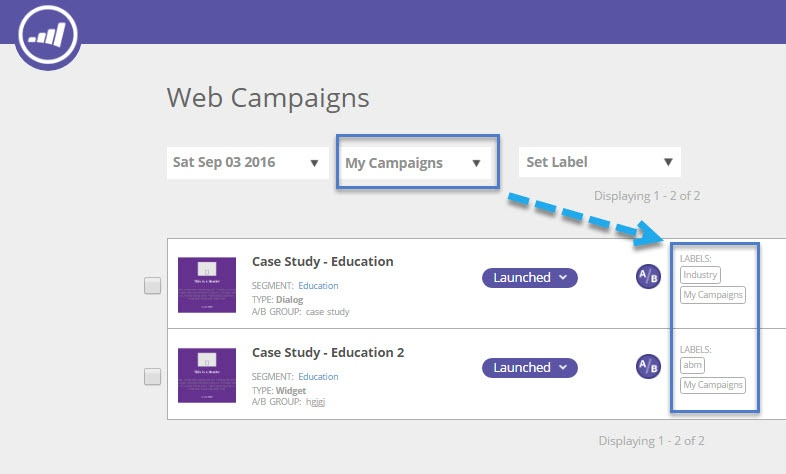

# Vue de campagnes Web à partir d&#39;une étiquette spécifique {#view-web-campaigns-from-a-specific-label}

Vous souhaitez vue et filtrer vos campagnes selon une étiquette spécifique ?

## Filtrage par étiquettes existantes {#filter-by-existing-labels}

1. Accédez à **Web** **Campaigns**.

   

1. Dans la liste déroulante des étiquettes, sélectionnez l’étiquette de votre choix.

   

1. Remarquez maintenant que nous ne vous montrons que les campagnes associées à l&#39;étiquette sélectionnée ?

   

>[!NOTE]
>
>**Articles connexes**
>
>* [Étiqueter vos campagnes Web](label-your-web-campaigns.md)
>* [Segments de vue à partir d&#39;une étiquette spécifique](../../../product-docs/web-personalization/using-web-segments/view-segments-from-a-specific-label.md)
>* [Étiqueter vos segments](../../../product-docs/web-personalization/using-web-segments/label-your-segment.md)

>

