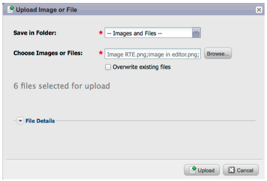
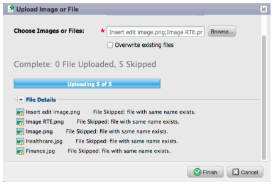

# Notes de mise à jour : Avril 2012 {#release-notes-april}

## Filtres et déclencheurs de segmentation {#segmentation-filters-and-triggers}

>[!NOTE]
>
>**Plongée profonde**
>
>Pour les autres versions, consultez la section plongée approfondie des Notes [de](http://docs.marketo.com/display/docs/release+notes) mise à jour.

Cibles-tu le même groupe de pistes de manière cohérente ? Si tel est le cas, utilisez la segmentation dans vos listes intelligentes pour le ciblage des pistes. Avec la segmentation, la base de données de pistes entière est toujours segmentée et peut être réutilisée sur vos programmes pour assurer la cohérence. Les résultats de la segmentation sont extraits rapidement car ils ne nécessitent pas l’exécution de la liste dynamique au moment de la demande.

## Insertion de valeurs externes dans le contenu du courrier électronique et autres étapes de flux, par le biais de fonctionnalités d’API étendues {#insert-external-values-into-email-content-and-other-flow-steps-through-expanded-api-capabilities}

* L’API Request Campaign vous permet désormais d’envoyer des valeurs pour My Tokens pour cette exécution particulière de la campagne. Cette API est particulièrement utile pour renseigner le contenu des courriers électroniques via l’API.
* Les nouvelles API de téléchargement vers la Liste et de planification de Campaign prennent en charge les listes de pistes et de campagnes par lots ci-dessus.

## Courriels de confirmation plus faciles pour GoToWebinar et WebEx (Adobe Connect et ON24 bientôt disponibles !) {#easier-confirmation-emails-for-gotowebinar-and-webex-adobe-connect-and-on-coming-soon}

Nous avons simplifié l&#39;URL de confirmation en créant un jeton membre qui affiche l&#39;URL unique de confirmation d&#39;inscription pour chaque piste. Vous n’aurez plus à créer cette URL à l’aide de jetons différents. Actuellement disponible pour les clients GoToWebinar et WebEx, il sera disponible pour Adobe Connect et ON24 dans notre prochaine version.

## Téléchargez plusieurs images et fichiers en un seul clic ! {#upload-multiple-images-and-files-with-a-single-click}

Gagnez du temps et gagnez en efficacité lors de l’importation d’images et de fichiers dans Marketo ! Si vous utilisez Firefox ou Google Chrome, vous pouvez sélectionner plusieurs fichiers et les télécharger simultanément. Bien qu’il n’y ait aucune limite au nombre de fichiers que vous pouvez télécharger, la taille maximale par fichier est de 50 Mo.

Remarque : Actuellement, cette fonctionnalité n’est pas prise en charge dans Internet Explorer, en raison des limitations du navigateur.

## Déplacer du texte dans un courrier électronique {#move-text-in-an-email}

Vous pouvez réorganiser les blocs de texte dans un courrier électronique. Dans l’éditeur de texte, sélectionnez un bloc de texte ; lorsque vous cliquez sur l&#39;icône Modifier, vous voyez l&#39;option permettant de déplacer le bloc vers le haut ou vers le bas.

## Références Salesforce supprimées pour les utilisateurs non-Salesforce {#salesforce-references-removed-for-non-salesforce-users}

Si vous ne synchronisez pas votre abonnement avec Salesforce, vous remarquerez que tous les dossiers et actions de flux référençant Salesforce sont supprimés.

## Analyses du cycle de recettes marketing {#marketo-revenue-cycle-analytics}

**Étapes de portes améliorées dans le module de modélisation du cycle de production**

Permet aux utilisateurs de définir un ordre pour leurs règles de transition.

