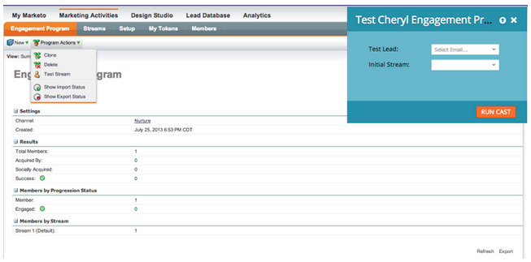

# Notes de mise à jour : Août 2013 {#release-notes-august}

Les fonctionnalités suivantes sont incluses dans la version d’août 2013. Veuillez vérifier la disponibilité de vos fonctionnalités dans [Marketo Edition](http://docs.marketo.com/display/docs/assets/pricing-1.php) .

Après la publication, n&#39;oubliez pas de consulter l&#39;onglet [Nouvelle version](release-notes-december-2013.md) de la Communauté pour obtenir des articles détaillés de la Base de connaissances pour chaque nouvelle fonctionnalité !

Courriers électroniques Texte uniquement

Vous pouvez maintenant envoyer [uniquement la version](../../product-docs/email-marketing/general/creating-an-email/create-a-text-only-email.md) textuelle d&#39;un courriel. N’oubliez pas que les liens ne seront pas décorés lors de l’utilisation de cette option.

## Améliorations du moteur d’engagement des clients {#customer-engagement-engine-enhancements}

### Ignorer le contenu extrait {#ignore-exhausted-content}

Configurez le programme d’engagement pour [ignorer l’épuisement](../../product-docs/email-marketing/drip-nurturing/using-engagement-programs/disable-and-enable-exhausted-content-notifications.md), y compris la suppression de toute notification.

## Test du flux d’engagement {#engagement-stream-testing}

Utilisez la [nouvelle fonction](../../product-docs/email-marketing/drip-nurturing/engagement-program-streams/test-an-engagement-stream.md) de test pour simuler une diffusion et tester le contenu récemment ajouté dans un flux en direct.

## Test d’envoi personnalisé {#personalized-send-test}

Lorsque vous envoyez un test par courrier électronique, vous pouvez sélectionner le nom d&#39;une piste pour personnaliser le courrier électronique de test.

## Jetons système &quot;Vue Email as Web Page&quot; et &quot;Désabonner&quot; {#view-email-as-web-page-and-unsubscribe-system-tokens}

Utilisez ces [nouveaux jetons](../../product-docs/email-marketing/general/using-tokens/system-tokens-glossary.md) pour mieux contrôler leur emplacement dans les courriels.

## Nettoyage Campaign de déclencheur automatique {#automatic-trigger-campaign-cleanup}

Désormais, Marketo vous avertit régulièrement et désactive [automatiquement les campagnes](../../product-docs/core-marketo-concepts/smart-campaigns/using-smart-campaigns/automatic-trigger-campaign-cleanup.md) de déclenchement qui ne se sont pas exécutées au cours des six derniers mois.

## Amélioration de la gestion financière du marketing {#marketo-financial-management-enhancement}

### Mise à jour des coûts du programme  {#program-cost-update}

La synchronisation des coûts de programme permet le suivi des coûts de programme sur plusieurs plateformes.

### Interface utilisateur de Cobalt {#cobalt-user-interface}

Nous poursuivons le déploiement de notre nouvelle interface Cobalt. Ce projet rendra tout dans Marketo super rapide ! La mise à niveau se poursuivra jusqu’à la fin de l’année.
