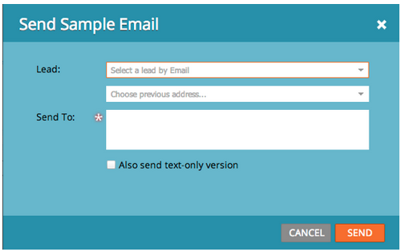
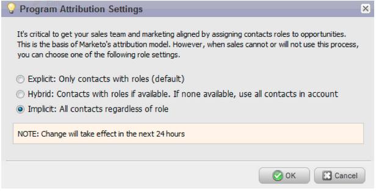

# Notes de mise à jour : Septembre 2013 {#release-notes-september}

Les fonctionnalités suivantes sont incluses dans la version de septembre.

## URL courtes {#shorter-urls}

Les URL des e-mails sont désormais plus courtes et plus agréables pour le destinataire, mais elles conservent leur fonctionnalité de suivi.

>[!CAUTION]
>
>Au fur et à mesure que nous passons aux URL courtes, les liens dans les courriers électroniques envoyés avant la version de septembre expirent 90 jours après cette version.

Utilisez les données provenant d’objets personnalisés Marketo ou ajoutez une logique conditionnelle à votre contenu de courrier électronique à l’aide du langage de modèle Velocity.

## Modifier Envoyer le test pour envoyer l&#39;exemple {#change-send-test-to-send-sample}

Nous avons renommé l&#39;action Envoyer le test pour envoyer l&#39;exemple

## Exemple d’e-mail d’envoi personnalisé {#personalized-send-sample-email}

Lorsque vous envoyez un exemple de courrier électronique, vous pouvez sélectionner le nom d&#39;un prospect pour personnaliser l&#39;exemple de courrier électronique.

## Nouveau champ de synchronisation pour GoToWebinar {#additional-field-sync-for-gotowebinar}

Vous pouvez synchroniser le nom de la Société et le titre de la tâche depuis votre formulaire Marketo vers GoToWebinar. Pour activer ces champs supplémentaires, accédez à Partenaires de Événement et cochez la case &quot;Activer les champs supplémentaires&quot;.

## Restreindre la connexion utilisateur à l’authentification unique {#restrict-user-login-to-sso-only}

Configurez les abonnements de manière à autoriser uniquement les utilisateurs de Marketo à se connecter via SSO et non via l’écran de connexion normal.

## Recherche des virus dans les fichiers téléchargés {#virus-scan-of-uploaded-files}

Les fichiers téléchargés dans Design Studio sont automatiquement scannés et bloqués s&#39;ils contiennent des virus.

## Exporter l&#39;analyseur d&#39;influence sur l&#39;opportunité {#export-opportunity-influence-analyzer}

Vous pouvez désormais exporter les données dans l’Analyseur d’influence d’opportunité vers Excel. Chaque fichier Excel exporté contient toutes les interactions marketing pour toutes les pistes (y compris celles qui n&#39;ont pas de rôle dans l&#39;opportunité) ainsi que toutes les opportunités sous le compte sélectionné dans l&#39;analyseur. Les lignes d&#39;opportunité sont mises en surbrillance en vert. Vous pouvez utiliser les fonctionnalités natives de filtrage des données d&#39;Excel si vous devez vous concentrer sur des pistes ou des activités marketing spécifiques.

## Paramètres d&#39;attribution du programme {#program-attribution-settings}

Vous pouvez modifier la manière dont Marketo associe les contacts et les opportunités pour les mesures d’attribution Première touche et Multipoint, y compris la possibilité d’effectuer une attribution basée sur le compte. Ces paramètres auront un impact sur les mesures d&#39;attribution dans les rapports de l&#39;Explorateur de recettes sous la zone Analyse d&#39;opportunités de Programme et la zone Analyse d&#39;opportunités. Cela aura également une incidence sur les mesures d’attribution dans Programme Analyzer.

Vous pouvez modifier les paramètres d’attribution du programme en l’un des trois choix possibles. La modification de ce paramètre ne modifie aucune donnée Marketo ou CRM ; il modifie simplement l&#39;exécution de vos rapports et peut être annulé à tout moment.

Le paramètre Explicite examine uniquement les contacts avec les rôles (comportement actuel). Implicit examine tous les contacts associés au compte, quel que soit le rôle. Si possible, nous vous recommandons fortement d&#39;utiliser le mode Explicite. L&#39;utilisation d&#39;Implicit peut créer de faux positifs, des personnes qui ont du crédit pour une opportunité bien qu&#39;elles n&#39;aient aucune réelle influence sur l&#39;opportunité.

## Sales Insight disponible en français et en allemand (Salesforce uniquement) {#sales-insight-available-in-french-and-german-salesforce-only}

Téléchargez la dernière version de Marketo Lead Management et de Marketo Sales Insight depuis l&#39;AppExchange afin que vos vendeurs français et allemands puissent consulter le contenu de Sales Insight dans leur langue préférée.

## Interface utilisateur cobalt {#cobalt-user-interface}

Au cours des prochains mois, un nouveau thème sera mis en oeuvre dans différentes parties de l&#39;application. Ce mois-ci, vous remarquerez peut-être de nouvelles fenêtres modales bleues.
