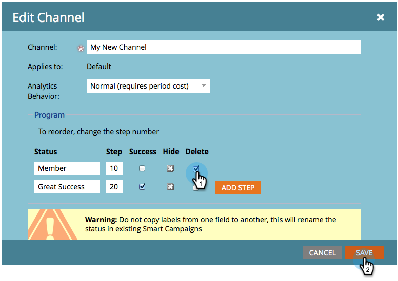
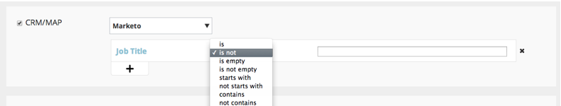

# Notes de mise à jour : Août 2014 {#release-notes-august}

Les fonctionnalités suivantes sont incluses dans la version d’août 2014. Vérifiez la disponibilité des fonctionnalités de votre édition Marketing. Revenez après la publication pour obtenir des liens vers la documentation détaillée sur les fonctionnalités.

## Licences du calendrier marketing {#marketing-calendar-licenses}

Après le 5 septembre 2014, seuls 5 utilisateurs peuvent accéder gratuitement au calendrier marketing. Veillez à [émettre/révoquer une licence](../../product-docs/core-marketo-concepts/marketing-calendar/understanding-the-calendar/issue-revoke-a-marketing-calendar-license.md) de calendrier marketing à l’intention des utilisateurs de votre choix avant cette date pour un accès sans interruption.

## Nouvelles autorisations d’utilisateur {#new-user-permissions}

Les nouvelles autorisations d’utilisateur suivantes ont été ajoutées :

| Autorisation | Description |
|---|---|
| Accéder à l&#39;Explorateur des recettes | Si vous avez acheté une RCA, vous avez désormais le contrôle sur qui peut y accéder. |
| Liste d’importation | Restreindre les utilisateurs à importer des listes dans la base de données de piste. |
| Importation liste | Limitez les utilisateurs à importer des listes par l’intermédiaire d’un programme sous activités marketing. |
| Activer le déclencheur Campaign | Contrôler qui peut et ne peut pas activer les campagnes de déclenchement. |
| Planification de la Campaign par lot | Permet de contrôler qui peut et ne peut pas planifier les exécutions de campagne par lot. |

## Exporter les utilisateurs et les rôles depuis l’administration {#export-users-and-roles-from-admin}

Vous pouvez désormais [exporter une Liste d’utilisateurs et de rôles](../../product-docs/administration/users-and-roles/export-a-list-of-users-and-roles.md) à partir de Marketing Cloud. Vous pouvez également inclure un horodatage &quot;Dernière connexion&quot; dans l’exportation.

## Suppression de Canaux et de balises {#delete-channels-and-tags}

Vous pouvez désormais supprimer tous les canaux et états inutilisés. Comme toujours, vous ne pouvez masquer qu’une seule version actuellement utilisée.

## DKIM automatisé {#automated-dkim}

Pour une meilleure délivrabilité, tous les e-mails sortants seront signés DKIM (DomainKeys Identified Mail). Par défaut, les courriels utilisent la signature DKIM partagée de Marketo. Vous aurez la possibilité de personnaliser cette signature.

>[!NOTE]
>
>DKIM sera déployé lentement, vous ne le verrez peut-être pas pendant quelques semaines.

## Mises à jour de la personnalisation en temps réel {#real-time-personalization-updates}

Nous avons ajouté des étiquettes à la page de la campagne afin que vous puissiez marquer le contenu de vos coeurs.

## Ciblage mobile {#mobile-targeting}

Vous avez demandé à la communauté et nous avons livré ! Vous pouvez désormais inclure, exclure ou définir un appel à l’action spécifique pour les utilisateurs de dispositifs portables et de tablettes.

## Amélioration de la segmentation et du ciblage 1:1 {#enhanced-segmentation-and-targeting}

Vous pouvez désormais utiliser des opérateurs de filtres avancés pour cibler des visiteurs connus.

## Partage Campaign {#campaign-sharing}

Vous pouvez désormais partager rapidement et facilement un lien de prévisualisation de campagne RTP.

## Rapport Moteur de recommandation de contenu {#content-recommendation-engine-report}

Nous avons ajouté un nouveau rapport de moteur de recommandations de contenu pour que vous puissiez voir un bon résumé.

## Administration utilisateur améliorée {#enhanced-user-administration}

Les administrateurs peuvent désormais verrouiller les utilisateurs en raison de plusieurs tentatives de connexion ayant échoué. Vous pouvez également déverrouiller ces utilisateurs, si vous le souhaitez.

## Contrôle de suivi {#tracking-control}

Vous pouvez désormais exclure des adresses IP spécifiques de tous les rapports et de tous les suivis dans la personnalisation en temps réel.

