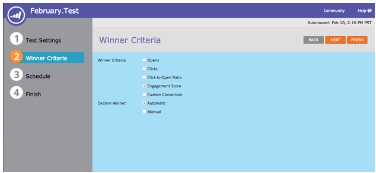

# Notes de mise à jour : Février 2014 {#release-notes-february}

Les fonctionnalités suivantes sont incluses dans la version de février 2014. Veuillez vérifier la disponibilité des fonctionnalités de votre édition Marketing. Après la publication, n&#39;oubliez pas de revenir pour trouver des liens vers les articles détaillés de la Base de connaissances pour chaque fonctionnalité !

## Score d’engagement en tant que critères gagnants {#engagement-score-as-winning-criteria}

[Utilisez le ](../../product-docs/email-marketing/email-programs/email-program-actions/email-test-a-b-test/define-the-a-b-test-winner-criteria.md) score d&#39;engagement pour déterminer la variante gagnante dans votre test de division A/B ou le test Champion/Challenger. Le test doit s’exécuter pendant au moins 24 heures, afin d’obtenir un score d’engagement adéquat.

## Onglet Résultats du Programme de courriel {#email-program-results-tab}

[Vue des ](../../product-docs/email-marketing/email-programs/email-program-data/view-email-program-results.md) résultats et activités consignés pour le programme de courriel.

## Personnes/Pistes bloquées de la messagerie {#people-leads-blocked-from-mailing}

[Cliquez sur les personnes/pistes bloquées du numéro de ](../../product-docs/email-marketing/email-programs/managing-people-in-email-programs/define-an-audience-with-a-smart-list.md) messagerie pour voir qui ne recevra pas le courriel en raison de son désabonnement, de la liste noire, d&#39;une adresse électronique non valide ou vide ou de la suspension de son marketing.

## Exporter les données du Programme de courriel {#export-email-program-data}

[Exportez les mesures de courrier électronique vers Excel](../../product-docs/email-marketing/email-programs/email-program-data/export-email-program-dashboard-to-excel.md), y compris les données de variante de test AB.

## Score d’engagement dans le rapport de performance du flux d’engagement {#engagement-score-in-engagement-stream-performance-report}

Nous avons ajouté la note d’engagement au rapport [Performance du flux d’engagement](../../product-docs/email-marketing/drip-nurturing/reports-and-notifications/engagement-stream-performance-report.md) pour vous aider à déterminer l’efficacité du contenu dans votre programme d’engagement.

## Détails du programme dans l’Analyse de courriel {#program-details-in-email-analysis}

[Vous pouvez maintenant grouper vos mesures de courriel par nom de Programme, Canal et balises](../../product-docs/reporting/revenue-cycle-analytics/email-analysis/build-an-email-analysis-report-that-shows-program-information.md). Le nom du programme est ajouté au champ Nom du courriel lorsque le courriel est un fichier local du Programme. Le nouveau champ Nom du Programme affiche le nom du programme de la campagne dynamique qui a envoyé le courriel. Cela peut être différent du programme dans le champ Nom du courriel si le courriel est un fichier local d’un autre programme.

## Mettre à jour vers les Filtres de liens de clics et déclencher {#update-to-clicks-link-filters-and-trigger}

Les noms de filtre et de déclencheur suivants ont été mis à jour :

* Clics sur Lien vers Clics Lien sur la page Web
* Lien cliqué vers Lien cliqué sur la page Web
* Lien non cliqué vers Lien non cliqué sur la page Web

## Améliorations apportées à Forms 2.0 {#forms-enhancements}

Nous avons fourni à Forms 2.0 plusieurs mises à jour sur la &quot;qualité de vie&quot; avec cette version. Outre l&#39;activation du profilage progressif sur les formulaires incorporés, nous avons apporté des modifications au flux de travail et à l&#39;UX qui faciliteront l&#39;utilisation des fonctionnalités les plus avancées de l&#39;éditeur, [y compris les règles de visibilité](../../product-docs/demand-generation/forms/form-fields/dynamically-toggle-visibility-of-a-form-field.md), les pages de remerciement avancées et les champs masqués.

