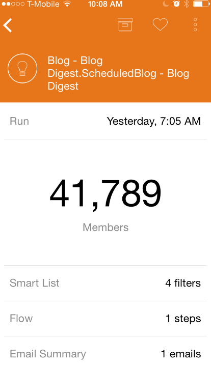
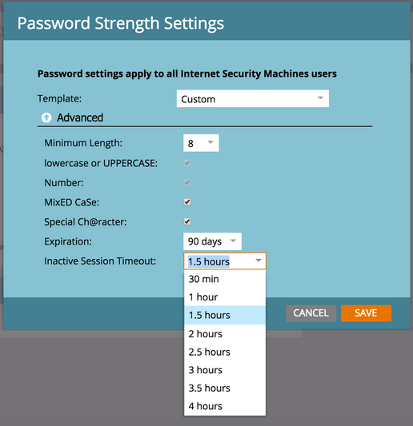

# Notes de mise à jour : Automne 2015 {#release-notes-fall}

Les fonctionnalités suivantes sont incluses dans la version de l’automne 15. Veuillez vérifier la disponibilité des fonctionnalités de Marketo Edition.

## S&#39;abonner à une Liste dynamique {#subscribe-to-a-smart-list}

[S’abonner à une Liste dynamique](/help/marketo/product-docs/reporting/basic-reporting/report-subscriptions/subscribe-to-a-smart-list.md)

S’abonner à la Liste dynamique permet aux marketeurs d’exporter une liste intelligente et de l’envoyer par courriel aux parties prenantes qui n’utilisent pas Marketo, par exemple les équipes de vente ou de télémarketing.

L’exportation peut être planifiée tous les jours, toutes les semaines ou tous les mois, peut avoir une date de diffusion de fin et peut être personnalisée pour partager un nombre limité de colonnes.


Plusieurs abonnements peuvent être créés sur une liste intelligente. Il y a une limite de 100 abonnements avec 100 000 pistes par abonnement, entre les espaces de travail, par instance Marketo.


## Objets personnalisés Marketo {#marketo-custom-objects}

[Objets personnalisés Marketo](/help/marketo/product-docs/administration/marketo-custom-objects/understanding-marketo-custom-objects.md)

Créez facilement des objets personnalisés à partir de l’interface utilisateur d’administration. Actuellement, nous prenons en charge la possibilité de créer un objet personnalisé 1:N dans Marketo et de le connecter à une piste ou une société.

>[!NOTE]
>
>Les objets personnalisés Marketo ne sont pas disponibles pour Spark.


## Marketo Insights pour Google Chrome {#marketo-insights-for-google-chrome}

[Marketo Insights pour Google Chrome](/help/marketo/product-docs/marketo-sales-insight/msi-chrome-plugin/using-marketo-insights-for-google-chrome.md)

Nous sommes heureux d&#39;annoncer la publication d&#39;une mise à jour de notre extension Google Mail Sales Insight ! Vue-le dans le [Chrome Store](https://nation.marketo.com/external-link.jspa?url=https://chrome.google.com/webstore/detail/marketo-insights-for-goog/jjkfbhajlmoeegbjgjipliamplidmbjb).

Cette mise à jour comprend de nombreuses nouvelles fonctionnalités :

* Avant de s&#39;engager, les vendeurs peuvent consulter directement sur Google Mail des informations pertinentes sur leurs prospects, notamment des titres de poste, des profils de twitter, des informations de société, des photos, etc.
* Les vendeurs peuvent voir en temps réel avec quoi les prospects de contenu interagissent entre les canaux, comme les courriers électroniques ouverts ou sur lesquels ils ont cliqué, les événements en ligne ou en personne auxquels ils ont assisté, les pages Web visitées, les livres électroniques téléchargés et bien d&#39;autres choses encore.
* Les courriers électroniques envoyés par Google Mail sont enregistrés dans Marketo et suivis en temps réel. Cela permet aux vendeurs de voir quand les prospects regardent leurs courriels pour pouvoir suivre au bon moment. Marketo Sales Insight for Google Mail permet également aux vendeurs d&#39;exploiter facilement les modèles créés par le marketing afin d&#39;envoyer de belles invitations, offres et autres types de contenu.


## Marketo Mobile Engagement - Tokens, Send Sample et Prévisualisation {#marketo-mobile-engagement-tokens-send-sample-preview}

* [Jetons](/help/marketo/product-docs/mobile-marketing/push-notifications/configure-mobile-push-notification.md)
* [Envoyer un échantillon](/help/marketo/product-docs/mobile-marketing/push-notifications/send-a-push-notification-sample.md)
* [Aperçu](/help/marketo/product-docs/mobile-marketing/push-notifications/preview-a-push-notification.md)

Personnalisez facilement les notifications Push à l&#39;aide de [jetons](/help/marketo/product-docs/mobile-marketing/push-notifications/configure-mobile-push-notification.md).


Vous pouvez également [prévisualisation](/help/marketo/product-docs/mobile-marketing/push-notifications/preview-a-push-notification.md) ou envoyer une [notification Push ](/help/marketo/product-docs/mobile-marketing/push-notifications/send-a-push-notification-sample.md) avant de la déployer sur les clients.


## Campagnes intelligentes dans les moments {#smart-campaigns-in-moments}

[Campagnes intelligentes dans  Moments](/help/marketo/product-docs/core-marketo-concepts/mobile-apps/marketo-moments/understanding-moments/understanding-smart-campaign-cards.md)

Les statistiques sur les courriers électroniques envoyés par le biais des campagnes dynamiques sont désormais disponibles dans Moments. Les autres fonctionnalités de cette mise à niveau sont les suivantes :

* Faire glisser jusqu’à la fin. Avez-vous trop de cartes dans votre flux ? Vous pouvez maintenant les balayer !
* Envoyer un exemple directement à partir de l’écran de prévisualisation
* Ajout des détails de la Liste intelligente aux cartes de Programme électronique
* Prise en charge Ajoutée de l’état Abandonné pour les Programmes électroniques



## RTP - Analyse de contenu et Recommendations {#rtp-content-analytics-and-recommendations}

[Analyse de contenu ](/help/marketo/product-docs/web-personalization/understanding-web-personalization/understanding-content-analytics.md) et Recommendations

L’analyse de contenu RTP vous montre les performances de vos ressources de contenu Web à partir de visites Web régulières, ainsi que des visites générées à partir du moteur de recommandation de contenu RTP.

* Identifier le contenu le plus performant et générer le plus de pistes
* Augmentez votre consommation de contenu en activant le contenu dans le moteur de contenu prédictif de RTP pour recommander automatiquement le meilleur contenu aux visiteurs appropriés
* Parcourez chaque ressource de contenu pour afficher des mesures, des graphiques et des performances plus approfondis.

La page Actifs de RTP est désormais fractionnée en Analyses de contenu et en Recommendations de contenu.

* **Analyse de contenu :** affiche les vues et les pistes directes de tout contenu Web découvert et défini, ce qui vous aide à analyser le contenu le plus performant.
* **Recommendations** de contenu : Affiche les impressions et les clics à partir du contenu recommandé de RTP et l&#39;attribution de piste associée. Vous pouvez également modifier et activer les recommandations de contenu de cette page pour les recommandations [bar](/help/marketo/product-docs/predictive-content/enabling-predictive-content/enable-the-content-recommendation-bar.md) et [média enrichi](/help/marketo/product-docs/predictive-content/enabling-predictive-content/enable-predictive-content-for-web-rich-media.md).

* Toutes les données de piste directe de ces deux pages ont été mises à jour rétrospectivement depuis le début de l&#39;année (1er janvier 2015).

## RTP - Cloner un Campaign RTP {#rtp-clone-an-rtp-campaign}

[RTP - Cloner un Campaign RTP](/help/marketo/product-docs/web-personalization/working-with-web-campaigns/clone-a-web-campaign.md)

Le clonage d’une campagne RTP rend plus rapide et plus efficace la création de campagnes Web plus personnalisées. Utilisez la fonction de clonage de la page de campagne de RTP pour copier les paramètres de la campagne et modifier le contenu en vue d’une optimisation des tests fractionnés, ou cloner une campagne avec le même contenu et la cible vers un autre segment. Créez des campagnes en quelques secondes !


## Améliorations apportées à l’éditeur de texte enrichi {#rich-text-editor-improvements}

Nous apportons plusieurs améliorations à l’éditeur de texte enrichi. Après la publication de l&#39;éditeur mis à jour en juillet, nous avons reçu d&#39;excellents commentaires et avons pu apporter ces modifications à cette mise à niveau. Il y a beaucoup d’autres choses à venir au cours des prochains mois. Voici une liste des nouveautés du 4e trimestre :

* Le langage VML est désormais pris en charge dans votre code HTML :

```
<v:background xmlns:v="urn:schemas-microsoft-com:vml" fill="t">
<v:fill type="tile" src="<a href="https://i.imgur.com/YJOX1PC.png" rel="nofollow">https://i.imgur.com/YJOX1PC.png</a>" color="#7bceeb"/>
</v:background>
```

* Tout peut maintenant être inséré dans un commentaire HTML valide (certaines syntaxes comme ci-dessous ont été précédemment supprimées) :

`<!--[if gte mso 9]> <![endif]-->`

* Ne pas ajouter de remplissage aux cellules de tableau vides avec `&nbsp;`

* Bouton Agrandir/Réduire ajouté à l’éditeur de source HTML
* Les propriétés de tableau préexistantes sont maintenant identifiées et affichées dans la boîte de dialogue Propriétés du tableau.
* Les deux rangées de boutons s’affichent désormais par défaut.
* L’éditeur accepte désormais tout élément (même les éléments obsolètes ou non standard) :

`<myCustomElement>Hello World!</myCustomElement>`

* L’éditeur accepte désormais tout attribut (même les attributs déconseillés ou non standard) :

```
<myCustomElement myCustomAttribute="foo">Hello World!</myCustomElement>
<td background="someImage.png"> 
```

## Microsoft Dynamics - Valider la synchronisation {#microsoft-dynamics-validate-sync}

[Microsoft Dynamics - Valider la synchronisation](/help/marketo/product-docs/crm-sync/microsoft-dynamics-sync/sync-setup/validate-microsoft-dynamics-sync.md)

Ce nouvel outil d’administration exécute une série de vérifications pour vérifier si vos configurations de synchronisation ont été correctement configurées.


## Ajouter les champs à la synchronisation d&#39;objets personnalisés CRM {#add-fields-to-crm-custom-object-sync}

Ajoutez facilement de nouveaux champs aux objets personnalisés synchronisés à partir de Salesforce et Dynamics. Vous pouvez désormais ajouter de nouveaux champs à votre synchronisation d’objets personnalisés sans désactiver ni activer l’ensemble de votre objet personnalisé.

## Modifications des fonctionnalités de sécurité {#changes-to-security-features}

* Les tentatives de mot de passe sont limitées à 5. Après la cinquième tentative, l&#39;utilisateur sera verrouillé.
* Le délai d’expiration de session inactif peut désormais être configuré pour l’abonnement.



## Prise en charge d’IE 11 (et désapprobation de la prise en charge d’IE 9) {#ie-support-and-deprecating-support-for-ie}

Nous prenons désormais officiellement en charge le navigateur Microsoft Internet Explorer 11 et supprimons la prise en charge du navigateur Microsoft Internet Explorer 9.

## Prise en charge de l’interface utilisateur Lightning pour MSI {#lightning-ui-support-for-msi}

Le dernier pack MSI sur l’échange d’applications fonctionne avec les versions Lightning et Legacy de l’interface utilisateur de Salesforce.

## Nouveau module externe Dynamics {#new-dynamics-plug-in}

Ce nouveau module externe exécute diverses actions en mode asynchrone pour améliorer les performances.

## Recherche par URL de Landing page dans Design Studio {#search-by-url-of-landing-page-in-design-studio}

Dans la grille de Landing page de Design Studio, vous pouvez désormais rechercher par URL de page vos landings page. Il est également exportable.
