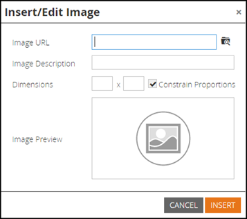
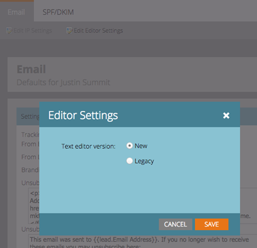

# Notes de mise à jour : Juillet 2015 {#release-notes-july}

## Marketo Moments {#marketo-moments}

Au déjeuner, mais vous devez replanifier un courriel ? L’application Marketo Moments, disponible sur l’App Store ou Google Play, vous permet de voir comment se comportent vos campagnes par événement et par courrier électronique en temps réel, ainsi que ce qui se profile à l’avenir, depuis votre iPhone, votre iPad ou votre téléphone Android.

## Mise à jour de l’éditeur de texte enrichi {#rich-text-editor-update}

Editeur de texte mis à jour avec une apparence moderne, notamment une mise en forme simplifiée du texte, la modification d’images, l’insertion de liens et l’édition HTML. L’éditeur HTML présente désormais une validation minimale, ce qui permet de réduire les modifications de code.
`<iframe width="420" height="315" src="https://www.youtube.com/embed/LmmBN6IQrII" frameborder="0" allowfullscreen></iframe>` Cette mise à jour sera automatiquement déployée quelques jours après la publication de juillet. Ensuite, vous pourrez basculer entre les versions Nouveau et Hérité de l’éditeur à partir de **Admin > Courriel > Modifier les paramètres de l’éditeur**.

Mise à jour des boîtes de dialogue de lien et d’image.

Active/désactive la version de l’éditeur de texte.

## Authentification unique pour la délivrabilité des e-mails {#email-deliverability-single-sign-on}

Lorsque vous cliquez sur la mosaïque de délivrabilité du courrier électronique, vous n’avez plus besoin de fournir vos informations de connexion.

## Hiérarchisation des campagnes {#campaign-prioritization}

Avez-vous configuré plusieurs campagnes RTP personnalisées et remarqué que certaines d&#39;entre elles peuvent se chevaucher ? Continuez et définissez une priorité pour laquelle le RTP des campagnes doit s’afficher sur les autres.

## API de société {#company-api}

**Accès aux objets de société via l’API** REST : L’API REST permet désormais d’accéder à l’objet Marketo Société (alias Compte). Cela signifie que vous pouvez lire, mettre à jour et supprimer des objets de société que vous avez créés dans Marketo et associer des pistes à de telles sociétés à l&#39;aide de l&#39;API de piste mise à jour.

Découvrez [plus](https://developers.marketo.com/documentation/company-api/) dans notre guide de référence pour l&#39;API de Société.

## Accéder à la délivrabilité du courriel {#access-email-deliverability}

**Accéder à l&#39;outil** de délivrabilité des e-mails : Cette nouvelle autorisation permet aux administrateurs d’accorder aux utilisateurs l’accès à l’outil de délivrabilité des courriels.
