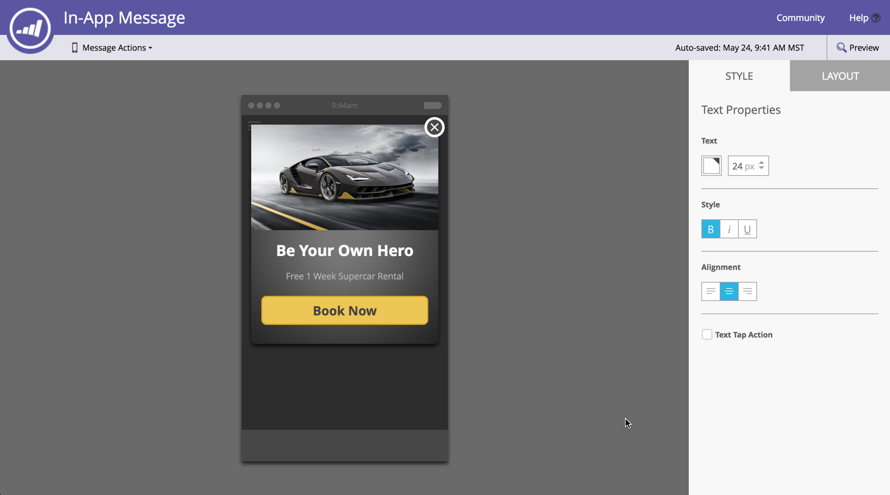
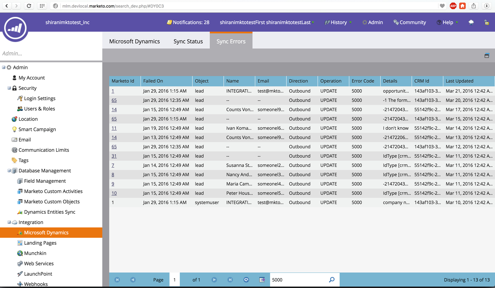

# Notes de mise à jour : Printemps &#39;16 {#release-notes-spring}

Les fonctionnalités suivantes sont incluses dans la version du printemps 16. Veuillez cliquer sur les liens de titre vers les articles détaillés de la vue pour chaque fonction.

## [Informations sur les courriels](http://docs.marketo.com/display/docs/email+insights) {#email-insights}

Email Insights est une toute nouvelle expérience historique d&#39;analyse des e-mails d&#39;agrégat de données — repensée de bout en bout pour des performances d&#39;éclair rapides dans le cadre du projet Orion. Il présente une toute nouvelle interface utilisateur optimisée pour répondre aux besoins et au flux de travail des spécialistes du marketing par courriel.

>[!NOTE]
>
>Nous lançons par lots les statistiques par courriel à nos clients, à compter du 3 juin. Notre objectif est d&#39;y parvenir au cours des prochains mois. Nous vous avertirons par courriel lorsque vous serez activé.

## [Sélecteur de modèles de courrier électronique](/help/marketo/product-docs/email-marketing/general/email-editor-2/email-template-picker-overview.md) {#email-template-picker}

Créez de beaux e-mails à l&#39;aide de nos nouveaux modèles de démarrage ! En outre, localisez rapidement vos modèles à partir de leurs miniatures actives.

>[!NOTE]
>
>La version 2.0 de l’Editeur de messagerie (avec le sélecteur de modèles) sera progressivement introduite à partir du 3 juin. Nous terminerons le déploiement d&#39;ici le 30 juin. Contrairement à Email Insights, vous ne serez pas averti lorsque vous aurez accès. Pour savoir si vous le faites, suivez les étapes décrites dans [cet article](https://docs.marketo.com/pages/viewpage.action?pageId=11373011).

## [Modification des e-mails : repensée](/help/marketo/product-docs/email-marketing/general/email-editor-2/email-editor-v2-0-overview.md) {#email-editing-re-imagined}

C&#39;est exact, un tout nouveau rédacteur en chef de l&#39;e-mail ! Utilisez la fonction légère de glisser-déposer pour ajouter et réorganiser du contenu. Les nouveaux éléments, notamment les images, les vidéos, les variables et les modules, amélioreront votre expérience de modification. Vérifiez également la prise en charge de l’éditeur de code, de l’aperçu et du préen-tête mis à jour.

## [Messages intégrés mobiles](/help/marketo/product-docs/mobile-marketing/in-app-messages/understanding-in-app-messages.md) {#mobile-in-app-messages}

Créez des messages in-app époustouflants pour votre application directement dans Marketing Cloud. Définissez exactement qui doit le voir et quand avec le programme de messages in-app. Contrôlez facilement ses performances avec le tableau de bord de programme.

## [Aucun extrait de code de brouillon](/help/marketo/product-docs/administration/users-and-roles/managing-user-roles-and-permissions/enable-no-draft-for-snippets.md) {#no-draft-snippets}

Les jours où vous devez tout réapprouver chaque fois qu&#39;un fragment est mis à jour sont révolus ! Avec No-Draft, tous les courriels et landings page utilisant un extrait de code recevront les mises à jour du fragment de code et conserveront leurs états antérieurs. Chaque fois que vous approuvez un extrait de code, vous avez le choix entre exécuter No-Draft et tout mettre à jour, ou créer des brouillons. C&#39;est à vous de décider ! Aucun brouillon sera disponible pour tous les clients et contrôlé par une nouvelle autorisation dans Admin.

## [Activités personnalisées](http://docs.marketo.com/display/docs/marketo+custom+activities) {#custom-activities}

Les administrateurs du marketing peuvent désormais définir et gérer leurs types d’activités personnalisées par le biais du modeleur de définition d’Activité personnalisée de marketing. Tout comme le Modeleur d’objet personnalisé Marketo (et conjointement avec lui), les administrateurs peuvent maintenant étendre le modèle de données en fonction de leurs besoins commerciaux exacts. Vous trouverez des informations détaillées sur l&#39;utilisation de cette fonctionnalité sur le [site de documentation du marketing](https://docs.marketo.com/display/public/DOCS/Marketo+Custom+Activities).

## [API de landing page, de modèle de Landing page et de formulaire](http://developers.marketo.com/blog/spring-2016-updates/) {#landing-page-landing-page-template-and-form-apis}

Les API REST de Marketo prennent désormais en charge le contrôle des landings page, modèles de landing page et formulaires de Marketo. Les utilisateurs peuvent désormais créer, mettre à jour du contenu, approuver et supprimer ces ressources directement via l’API REST de Marketing Cloud.

## [LISTE AUTORISÉE IP pour l’accès à l’API](/help/marketo/product-docs/administration/additional-integrations/create-an-allowlist-for-ip-based-api-access.md) {#ip-allowlisting-for-api-access}

Tout comme la fonction d’liste autorisée IP pour les identifiants de connexion utilisateur de Marketing Cloud, les administrateurs de Marketing Cloud peuvent désormais configurer une liste autorisée d’adresses IP qui peuvent accéder aux API SOAP et REST de Marketo, bloquant ainsi l’accès à partir d’adresses IP non autorisées. Ceci fournit une couche de sécurité supplémentaire à votre instance de Marketing Cloud et garantit que l’accès à l’API ne peut survenir qu’à partir du réseau de votre organisation. Vous trouverez des détails sur la manière de configurer cette configuration sur le [site de documentation du marché](https://docs.marketo.com/display/public/DOCS/Create+a+Whitelist+for+IP-Based+API+Access).

## [Nouveau connecteur Microsoft Dynamics Sync haute vitesse](/help/marketo/product-docs/crm-sync/microsoft-dynamics-sync/microsoft-dynamics-sync-details/sync-status.md) {#new-high-speed-microsoft-dynamics-sync-connector}

Construit sur l&#39;architecture Orion, le nouveau connecteur de dynamique à grande vitesse offre des vitesses jusqu&#39;à 20 fois plus rapides pour la synchronisation initiale et jusqu&#39;à 5 fois plus rapides pour la synchronisation incrémentielle. Tous les nouveaux clients embarqueront sur ce connecteur à la date de publication et nous le déploierons progressivement aux clients existants au cours de la période de publication d’été.

**Actualiser les données pour les nouveaux champs** : Vous pouvez maintenant activer de nouveaux champs de synchronisation à tout moment et toutes les valeurs de données de ce champ seront actualisées de Dynamics CRM dans Marketo. Plus d&#39;inquiétudes sur la nécessité de sélectionner tous les champs lors de la configuration initiale. Si vous désactivez un champ de synchronisation existant et que vous le réactivez ultérieurement, toutes les valeurs de données de ce champ seront actualisées de Dynamics CRM dans Marketo.

**Piste de synchronisation en tant que contact** : L&#39;action de flux Piste de synchronisation vers Microsoft propose une nouvelle option de synchronisation en tant que piste ou contact.

**Onglet** d’administration des erreurs de synchronisation : Les pistes de navigation, de recherche ou d&#39;exportation (et d&#39;autres objets) qui n&#39;ont pas pu être synchronisées avec des détails tels que l&#39;opération, la direction, le code d&#39;erreur et le message d&#39;erreur.

**Microsoft Dynamics 2016** : Connector est entièrement certifié pour les versions en ligne et sur site de Dynamics 2016.

**Les mises à jour des modules externes sont maintenant documentées :** Reportez-vous à l’article [ sur les mises à jour des ](/help/marketo/product-docs/crm-sync/microsoft-dynamics-sync/marketo-plugin-releases-for-microsoft-dynamics.md)modules externes.

## [Nom d’instance convivial](/help/marketo/product-docs/administration/settings/edit-subscription-settings.md) {#friendly-instance-name}

Aujourd’hui, il est difficile de différencier les instances de Marketo, par exemple les instances de sandbox et de production. Cette fonctionnalité vous permet de savoir sur quelles instances vous travaillez actuellement.

## [Accès à temps limité pour les Abonnements](/help/marketo/product-docs/administration/users-and-roles/managing-marketo-users.md) {#limited-time-access-for-subscriptions}

Aujourd’hui, les utilisateurs sont invités à l’abonnement Marketo pour une durée indéterminée. Cette fonctionnalité permet aux administrateurs d’inviter des utilisateurs à rejoindre des abonnements pendant une période limitée, par exemple 2 semaines ou 1 mois.

## [Grille des objets personnalisés](/help/marketo/product-docs/administration/marketo-custom-objects/understanding-marketo-custom-objects.md) {#custom-objects-grid}

Vous pouvez désormais vue le nombre d’enregistrements et de champs pour tous les objets personnalisés publiés.

