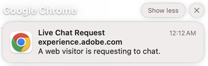

# Notes de mise à jour de Dynamic Chat {#dynamic-chat-release}

Les mises à jour d’Adobe Dynamic Chat fonctionnent sur un modèle de diffusion continue qui permet une approche plus évolutive du déploiement des fonctionnalités. Il arrive qu’il y ait plusieurs versions par mois. N’hésitez pas à vérifier régulièrement pour obtenir les informations les plus récentes.

La page Notes de mise à jour standard de Marketo Engage [peut être consultée ici](/help/marketo/release-notes/current.md){target="_blank"}.

## Version de juin 2025 {#june-2025-release}

**Date de publication : 30 juin 2025**

### Réorganisation de la logique de transmission {#routing-logic-revamp}

Nous avons réorganisé la logique de transmission de la conversation en direct dans Dynamic Chat pour garantir un comportement d’engagement plus intelligent et plus prévisible pour tous les types de transmission (compte, personnalisé, équipe et round-robin). La nouvelle logique simplifie les flux de transmission et améliore la gestion de secours lorsque des agentes et agents ne sont pas disponibles.

#### Améliorations clés du comportement de la transmission

* **Jusqu’à deux tentatives d’engagement par session**

   * Le système tente de se connecter à un maximum de deux agentes et agents (au plus), mais strictement dans la règle de transmission principale.

   * Si un agent ou une agente est disponible mais ne répond pas (par exemple, refuse ou manque la conversation), le système tente de se connecter à un autre agent ou une autre agente du même pool.

   * La logique de secours (round-robin, par exemple) n’est activée que si aucune personne éligible n’est trouvée parmi les agentes et agents lors de la résolution initiale, et non pour réessayer après un échec de l’engagement.

* **Comportement spécifique à la règle de transmission**

##### —Transmission du compte—

Si le domaine d’e-mail d’un visiteur ou d’une visiteuse est mappé à un compte connu, l’agent mappé ou l’agente mappée conserve toujours la priorité.

Si l’agent ou l’agente est disponible, la conversation lui est directement adressée.

Si l’agent ou l’agente n’est pas disponible, le système :

* ne tente pas d’utiliser un autre agent ou une autre agente, même si le round-robin est activé comme solution de secours.

* Au lieu de cela, il :

   * affiche le calendrier de réunion de l’agent mappé ou de l’agente mappée (si activé),
ou
   * renvoie à un message par défaut (dans le pire des cas).

équipe ou personnalisé, par exemple

##### —Transmission personnalisée/d’équipe—

Ces règles peuvent renvoyer plusieurs agentes et agents éligibles.

Si la première personne disponible ne s’engage pas, le système essaie un autre agent ou une autre agente de la même liste.

La solution de secours round-robin n’est pas déclenchée parce qu’un agent ou une agente ne répond pas.

Si aucun agent ni aucune agente ne s’engage :

* le système affiche le calendrier de la première personne tentée (si activé),
ou
* affiche le message de secours par défaut.

##### —Transmission round-robin—

Lorsqu’il est utilisé comme règle de transmission principale, le système :

* tente d’engager le premier agent ou la première agente disponible du pool du round-robin.

* Si le premier agent ou la première agente ne répond pas, il réessaye avec le meilleur choix éligible suivant.

Si le round-robin est utilisé comme solution de secours, il n’est activé que si aucun agent ni aucune agente ne ressort à partir de la règle principale.

##### Flux d’expérience du visiteur ou de la visiteuse

Le système vérifie si la transmission du compte est applicable.

* Si oui, et si l’agent ou l’agente est disponible, il se connecte immédiatement.

* Si l’agent ou l’agente n’est pas éligible ou n’est pas disponible, il passe à la règle de transmission au niveau de la carte.

La règle de transmission au niveau de la carte (personnalisée, équipe, round-robin) est évaluée.

* La disponibilité (autorisations, statut) des agentes et agents éligibles est vérifiée.

* Le système engage un agent ou une agente et, si nécessaire, tente un deuxième agent ou une deuxième agente à partir de la même règle.

* Si aucun engagement ne réussit, une logique de secours est appliquée :

   * calendrier de secours (si activé),
ou
   * message par défaut.

La solution de secours du round-robin n’est prise en compte que lorsqu’aucun agent ni aucune agente éligible n’est disponible dans la règle de transmission principale, et non lorsque des agentes et agents individuels ne répondent pas.

##### Cas d’utilisation

_**Transmission du compte**_

<table><thead>
  <tr>
    <th>Type</th>
    <th>Exemple</th>
    <th>Résultat</th>
  </tr></thead>
<tbody>
  <tr>
    <td>Idéal</td>
    <td>Le domaine du visiteur ou de la visiteuse est mappé à un compte ; la conversation en direct est activée pour l’agent mappé ou l’agente mappée, qui est disponible.</td>
    <td>La conversation se connecte directement à l’agent mappé ou à l’agente mappée.</td>
  </tr>
  <tr>
    <td>Solution de secours (type round-robin)</td>
    <td>L’agent mappé ou l’agente mappée n’est pas disponible, la solution de secours de type round-robin est activée.</td>
    <td>Le système sélectionne un agent ou une agente disponible via le round-robin et établit le contact. </td>
  </tr>
  <tr>
    <td>Aucun agent ni aucune agente de secours</td>
    <td>L’agent mappé ou l’agente mappée n’est pas disponible, pas de solution de secours round-robin ; la réservation de réunion est activée.</td>
    <td>Le système affiche le calendrier de l’agent mappé ou de l’agente mappée ou affiche le message de secours par défaut.</td>
  </tr>
</tbody></table>

_**Transmission personnalisée**_

<table><thead>
  <tr>
    <th>Type</th>
    <th>Exemple</th>
    <th>Résultat</th>
  </tr></thead>
<tbody>
  <tr>
    <td>Idéal</td>
    <td>La logique personnalisée résout une liste d’agentes et d’agents ; le premier agent ou la première agente est disponible et accepte la conversation.</td>
    <td>La conversation se connecte au premier agent ou à la première agente.</td>
  </tr>
  <tr>
    <td>Solution de secours (type round-robin)</td>
    <td>La règle personnalisée ne résout aucun agent ni aucune agente, la solution de secours round-robin est activée.</td>
    <td>Le système sélectionne un agent ou une agente disponible via le round-robin et établit le contact.</td>
  </tr>
  <tr>
    <td>Aucun agent ni aucune agente de secours</td>
    <td>Deux agentes et agents ont été résolus ; aucun n’accepte la conversation, la solution de secours est définie sur le calendrier de réunion.</td>
    <td>Le calendrier du premier agent tenté ou de la première agente tentée ou le message de secours par défaut s’affiche.</td>
  </tr>
</tbody></table>

_**Transmission d’équipe**_

<table><thead>
  <tr>
    <th>Type</th>
    <th>Exemple</th>
    <th>Résultat</th>
  </tr></thead>
<tbody>
  <tr>
    <td>Idéal</td>
    <td>L’équipe comprend des agentes et agents qui utilisent la conversation en direct ; le premier agent ou la première agente disponible accepte la conversation.</td>
    <td>La conversation se connecte à cet agent ou à cette agente.</td>
  </tr>
  <tr>
    <td>Solution de secours (type round-robin)</td>
    <td>Aucun agent ni aucune agente d’équipe n’est disponible et la solution de secours round-robin est activée.</td>
    <td>Le système sélectionne et se connecte à un agent ou à une agente de la sélection du round-robin.</td>
  </tr>
  <tr>
    <td>Aucun agent ni aucune agente de secours</td>
    <td>Deux agentes et agents disponibles, mais pas de contact établi ; le calendrier de secours est activé.</td>
    <td>Le calendrier de l’agent tenté ou de l’agente tentée d’abord s’affiche ou le message de secours est déclenché.</td>
  </tr>
</tbody></table>

_**Transmission du round-robin**_

<table><thead>
  <tr>
    <th>Type</th>
    <th>Exemple</th>
    <th>Résultat</th>
  </tr></thead>
<tbody>
  <tr>
    <td>Idéal</td>
    <td>La sélection du round-robin possède plusieurs agentes et agents ; le second agent ou la seconde agente accepte la conversation si le premier agent ou la première agente ne l’accepte pas.</td>
    <td>La conversation se connecte au second agent ou à la seconde agente.</td>
  </tr>
  <tr>
    <td>Solution de secours (type round-robin)</td>
    <td>Aucun agent ni aucune agente disponible dans la sélection du round-robin ; le calendrier des réunions est activé.</td>
    <td>Le calendrier s’affiche pour le premier agent ou la première agente de la liste (le cas échéant) ou un message de secours s’affiche.</td>
  </tr>
  <tr>
    <td>Aucun agent ni aucune agente de secours</td>
    <td>Aucun agent ni aucune agente disponible ; la solution de secours est désactivée.</td>
    <td>Un message de secours statique s’affiche pour le visiteur ou la visiteuse.</td>
  </tr>
</tbody></table>

### Notification Pulse {#pulse-notification}

Chaque fois qu’un visiteur ou une visiteuse demande à se connecter à un agent ou une agente, nous envoyons une notification in-app et via le navigateur à l’agent ou à l’agente. Mais parfois, les agentes et agents ne voient pas ces conversations.

Avec cette version, l’agent ou l’agente en direct peut recevoir une notification e-mail, Slack, in-app ou dans son navigateur lorsqu’un nouveau visiteur ou une nouvelle visiteuse souhaite discuter.

1. Sur la page d’accueil d’Adobe Experience Cloud, cliquez sur l’icône Compte et sélectionnez **Préférences**.

   

1. Faites défiler jusqu’à _Notifications_ et sélectionnez les options Dynamic Chat souhaitées.

   

>[!NOTE]
>
>Le contenu d’une notification Pulse peut être le même que celui que nous utilisons pour les notifications in-app ou de navigateur.

## Version d’avril/mai 2025 {#apr-may-25-release}

### Son de notification des messages {#message-notification-sound}

Vous avez désormais la possibilité d’activer un son pour le visiteur ou la visiteuse à chaque fois que le chatbot est déclenché au cours d’une session. Vous avez le choix entre plusieurs sons.

### Activer les messages poke sur mobile {#enable-poke-messages-on-mobile}

Le « Poke », qui affiche la question d’origine à côté de l’icône de la conversation sans que le visiteur ou la visiteuse ait à cliquer dessus pour la voir, est désormais une option pouvant être activée pour les visiteurs et visiteuses qui utilisent un appareil mobile.

### Mise à jour de la solution de secours par défaut {#default-fallback-update}

Pour toute règle personnalisée ou équipe dans une vignette de conversation en direct : si aucun agent ni aucune agente n’est disponible (ou si la conversation ne peut pas se connecter), le système utilise le round-robin pour sélectionner les agentes et agents disponibles (tous ceux disponibles à cet instant, quelle que soit la logique/règle de transmission définie dans le flux).

### Intégration de DemandBase {#demandbase-integration}

Les utilisateurs et les utilisatrices Demandbase peuvent utiliser les attributs de personne Demandbase pour le ciblage du dialogue, le branding conditionnel et la transmission personnalisée dans Dynamic Chat.

## Version de septembre/octobre 2024 {#sep-oct-release}

### Analyses améliorées de la conversation en direct {#enhanced-live-chat-analytics}

Plusieurs améliorations ont été apportées au tableau de bord Analytics, notamment :

* Nombre total de conversations en direct demandées : nombre de visiteurs et visiteuses qui ont demandé une « conversation avec un agent ou une agente »

* Total de conversations en direct connectées : nombre de visiteurs et visiteuses connectés par rapport au total des demandes de « conversation avec un agent ou une agente »

* Nombre total de demandes de conversation en direct manquées : nombre de visiteurs et visiteuses sans assistance par rapport au total des demandes d’une « conversation avec un agent ou une agente »

* Durée moyenne de conversation en minutes : analysez la « durée moyenne de conversation » entre les visiteurs et visiteuses et vos agentes et agents.

* Temps de réponse moyen de l’agent ou de l’agente en secondes : analysez le « temps moyen nécessaire » aux agentes et agents pour répondre aux questions et réponses de leur conversation en direct.

* Tableau de bord quotidien : demandes de conversation en direct ayant abouti à une connexion, demandes de conversation en direct manquées, trier et filtrer les activités récentes des conversations en direct

### Score de conversation {#conversation-scoring}

Quantifiez vos leads en fonction de la qualité de leur interaction dans la conversation et utilisez cette mesure comme déclencheur/filtre dans les campagnes intelligentes Marketo Engage. Utilisez le nouvel attribut _score de conversation_ sur les activités suivantes :

* A interagi avec un dialogue
* A interagi avec un flux de conversation
* A interagi avec un agent ou une agente

**Points à noter :**

* La valeur du score peut être de 0, 1, 2 et 3 (la valeur par défaut est null).

* Une fois la conversation terminée ou supprimée, la valeur du score ne peut plus être modifiée.

* Définition d’un score :

   * Dans la boîte de réception de l’agent ou de l’agente, au cours d’une conversation en direct, l’agent ou l’agente peut mettre à jour ou définir un score pour la conversation, qui est stocké dans l’activité de conversation.

   * Dans le concepteur de flux, dans la vignette d’objectif, l’utilisateur ou l’utilisatrice peut mettre à jour ou définir un score pour la conversation.

### Nouvelle logique de création de leads {#new-lead-creation-logic}

Si un lead remplit un formulaire avec l’adresse e-mail `abc@test.com` et utilise le cookie xyz, puis remplit le même formulaire avec l’adresse e-mail `def@test.com`, un nouvel enregistrement de personne est créé, mais le cookie xyz est alors associé à la nouvelle personne et est supprimé de la personne correspondant à l’adresse `abc@test.com`.

Ainsi, lorsqu’un visiteur ou une visiteuse avec le cookie abc arrive sur une page et fournit un identifiant e-mail tel que `abc@test.com` :

<table><thead>
  <tr>
    <th>Visiteur ou visiteuse</th>
    <th>Cookie</th>
    <th>E-mail fourni</th>
    <th>Comportement attendu</th>
  </tr></thead>
<tbody>
  <tr>
    <td>Anonyme</td>
    <td>abc</td>
    <td>N’existe pas dans la base de données.</td>
    <td>Créer une personne</td>
  </tr>
  <tr>
    <td>Anonyme</td>
    <td>abc</td>
    <td>Existe dans la base de données.</td>
    <td>Fusionner la personne</td>
  </tr>
  <tr>
    <td>Anonyme</td>
    <td>xyz</td>
    <td>Existe dans la base de données.</td>
    <td>Fusionner la personne</td>
  </tr>
  <tr>
    <td>Individu connu</td>
    <td>abc</td>
    <td>Identique à la personne existante</td>
    <td>Mettre à jour la personne</td>
  </tr>
  <tr>
    <td>Individu connu</td>
    <td>abc</td>
    <td>Différent de la personne existante</td>
    <td>S’il existe déjà un individu connu, transférez le cookie et résolvez ce profil. Si cet e-mail ne comporte aucune personne, créez un enregistrement de personne et transférez le cookie.</td>
  </tr>
  <tr>
    <td>Individu connu</td>
    <td>xyz</td>
    <td>Identique à la personne existante</td>
    <td>Ajouter un nouveau cookie à la même personne</td>
  </tr>
  <tr>
    <td>Individu connu</td>
    <td>xyz</td>
    <td>Différent de la personne existante</td>
    <td>Ce scénario n’est pas possible, car par défaut, un nouveau cookie est considéré comme un nouveau profil anonyme.</td>
  </tr>
</tbody></table>

### Option d’héritage de la police {#option-to-inherit-font}

Vous pouvez désormais permettre au chatbot d’hériter directement de la police de la page web sur laquelle il est hébergé, au lieu de gérer la police de la marque dans Dynamic Chat. Lorsque vous activez cette option, le chatbot utilise la police définie dans la balise `<body>` de la page.

### Intégration de Demandbase à Dynamic Chat {#demandbase-integration-with-dynamic-chat}

Les utilisateurs et utilisatrices de Demandbase peuvent apporter leur propre licence Demandbase et activer l’intégration. Utilisez les attributs de personne Demandbase pour le ciblage de dialogue, le branding conditionnel et la transmission personnalisée.

La résolution de ces valeurs d’attribut sur une personne est effectuée en temps réel et est stockée dans le profil de la personne concernée.

### Optimisation du temps de chargement du flux conversationnel {#optimized-conversation-flow-load-time}

Pour améliorer l’expérience d’utilisation, un chargeur « Shimmer » s’affiche désormais au lieu d’un espace vide pendant le chargement du flux conversationnel.

**Avant**

**Après**

## Version d’août 2024 {#august-release}

**Date de publication : 23 août 2024**

### Personnaliser le format de vos messages de conversation {#custom-format-conversation-messages}

Les concepteurs de flux prennent désormais en charge [l’insertion d’HTML](/help/marketo/product-docs/demand-generation/dynamic-chat/automated-chat/stream-designer.md#create-a-stream){target="_blank"} pour personnaliser l’aspect de vos conversations.

### Défilement du chat bot vers le bas {#chatbot-scroll-to-bottom}

Une icône a été ajoutée au chatbot pour permettre aux visiteurs et visiteuses web d’accéder directement au dernier message. Cela permet aux visiteurs et visiteuses de faire défiler le texte pour revenir rapidement à la conversation.

### Notifications Core Pulse {#core-pulse-notifications}

Les utilisateurs et utilisatrices reçoivent désormais une [notification par e-mail](/help/marketo/product-docs/demand-generation/dynamic-chat/live-chat/live-chat-overview.md#failed-action-notifications){target="_blank"} lorsqu’une réservation de réunion ou une discussion en direct échoue.

### Prise en charge de plusieurs conversations {#support-for-multiple-conversations}

Le chatbot prend désormais en charge plusieurs conversations. Les visiteurs et visiteuses du site web peuvent engager différentes conversations sur différentes pages en même temps, avec la possibilité de passer d’une conversation à l’autre.

### Tri par défaut du contenu {#default-sorting-for-content}

Par défaut, vos journaux de conversation, vos questions sans réponse et vos tableaux de génération de questions sont triés par date de création (du plus récent au plus ancien).

### Résolution des leads en temps réel {#real-time-lead-resolution}

Lors d’une conversation avec un lead anonyme et avec un ID d’e-mail fourni, nous déterminons si un enregistrement de lead connu existe avec cet ID d’e-mail et utilisons cet enregistrement pour la personnalisation en temps réel. Si nous trouvons plusieurs enregistrements, nous les fusionnons en temps réel. Ce comportement est implémenté pour les boîtes de dialogue et les flux conversationnels.

### Synchronisation des leads sans cookie depuis Marketo Engage {#syncing-leads-without-cookies}

Auparavant, lorsque la synchronisation Marketo Engage était activée, Dynamic Chat synchronisait uniquement les leads connus avec un ou plusieurs ID de cookie provenant de Marketo Engage. Désormais, tous les leads connus (ID de cookie présent ou non) seront synchronisés dans Dynamic Chat et pourront être utilisés pour la personnalisation des conversations.

### Transmettre des données de visiteur ou de visiteuse supplémentaires aux flux de conversation {#pass-additional-visitor-data}

Si vous collectez des informations sur les visiteurs et visiteuses par d’autres canaux, tels que les formulaires ou la connexion, vous pouvez désormais transmettre ces informations directement à Dynamic Chat.

### Données déduites actualisées {#refreshed-inferred-data}

La majorité des conversations sur un site web ont lieu avec des visiteurs et visiteuses anonymes.1 Vous pouvez toujours les cibler par le biais de données déduites, qui reposent sur les adresses IP des visiteurs et visiteuses. Nous avons mis à jour notre base de données d’adresses IP et les données déduites correspondantes, qui prend désormais en charge quatre fois plus d’adresses IP.

### Son ajouté à la notification du navigateur de l’agent ou de l’agente {#sound-added-to-agent-browser-notification}

Lorsqu’une conversation en direct est affectée à un agent ou une agente, cette personne reçoit une notification du navigateur. Mais parfois, elle ne la voit pas. Nous avons ajouté un [son de notification](/help/marketo/product-docs/demand-generation/dynamic-chat/live-chat/live-chat-overview.md#when-a-live-chat-is-routed-to-an-agent){target="_blank"} pour éviter de manquer des notifications à l’avenir.

### Possibilité de mettre à jour le profil du lead pendant la conversation en direct {#update-lead-profile-during-live-chat}

Au cours d’une conversation en direct, les agentes et agents souhaitent collecter des informations sur le visiteur ou la visiteuse et mettre à jour le profil correspondant. Il existe désormais une option pour mettre à jour les valeurs d’attribut des objets lead et entreprise.

## Version de juin 2024 {#june-release}

**Date de publication : 6 juin 2024**

### Carte Flux conversationnel {#conversational-flow-card}

Simplifiez plusieurs étapes d’un flux dans vos dialogues à l’aide de la carte Flux conversationnel.

Exemple : si votre objectif est de générer les inscriptions à votre webinaire par le biais de plusieurs dialogues, vous devrez recréer le même flux dans tous les dialogues qui ont cet objectif. Et si vous devez mettre à jour un détail, vous devez modifier chaque dialogue un par un. Ce n’est plus le cas, grâce à la carte Flux conversationnel.

En plus de réutiliser des flux sur plusieurs dialogues, vous pouvez utiliser le même flux de transition à déclencher via d’autres canaux, tels que les formulaires et les pages de destination.

### Limites d’utilisation {#usage-limits}

La page Limites d’utilisation vous présente des informations importantes, telles que les détails du package et le statut de votre limite d’utilisation.

## Version de mai 2024 {#may-release}

**Date de mise à jour : 15 mai 2024**

### Bibliothèque de réponses préapprouvées {#pre-approved-response-library}

[Créez une bibliothèque approuvée par le service marketing](/help/marketo/product-docs/demand-generation/dynamic-chat/generative-ai/response-library.md){target="_blank"} de questions et réponses générées par l’IA pour aider à configurer une conversation générée par l’IA en quelques minutes.

### Questions sans réponse {#unanswered-questions}

[Utilisez un référentiel de questions sans réponse](/help/marketo/product-docs/demand-generation/dynamic-chat/generative-ai/unanswered-questions.md){target="_blank"} issues de conversations précédentes pour générer de nouvelles réponses préapprouvées, en tenant à jour une bibliothèque de réponses avec les informations les plus récentes.

### Résumés de la conversation {#conversation-summaries}

[Donnez aux agentes et agents commerciaux un résumé des conversations](/help/marketo/product-docs/demand-generation/dynamic-chat/live-chat/agent-inbox.md#conversation-summary){target="_blank"}, y compris des idées sur les principaux sujets de discussion avant les réunions afin de réduire le temps de préparation et de mieux armer les agentes et agents commerciaux avec les dernières informations.

### Raccourcis de vente GenAI {#genai-sales-shortcuts}

[Fournissez aux agentes et agents de conversation en direct des moyens plus rapides](/help/marketo/product-docs/demand-generation/dynamic-chat/live-chat/agent-inbox.md#shortcuts){target="_blank"} pour accéder aux réponses générées par l’IA, modifier les réponses générées existantes et rechercher du contenu supplémentaire à envoyer aux acheteurs et acheteuses lors de la conversation.

### Aide à la conversation {#conversation-assist}

Aidez les agentes et agents commerciaux à répondre avec précision lors de conversations en direct en utilisant des réponses préapprouvées par votre équipe marketing.

### Coups de pouce dans la conversation {#conversation-nudges}

Incitez les visiteurs et visiteuses web à utiliser un appel à l’action pour mener les conversations à leur terme.

## Version d’avril 2024 {#april-release}

**Date de publication : 23 avril 2024**

### Flux conversationnel désormais disponibles pour tous les utilisateurs et utilisatrices {#conversational-flows-available-to-all-users}

Rendez vos formulaires et vos pages de destination plus conversationnels et raccourcissez l’entonnoir de vente en permettant aux leads qualifiés de réserver une réunion ou une conversation avec le service des ventes immédiatement après un envoi de formulaire avec Conversational Forms, désormais entièrement disponible&#42; pour tous les utilisateurs et utilisatrices de Dynamic Chat.

_&#42;Précédemment disponible en version d’essai avec 100 engagements à vie. Les engagements de flux conversationnel sont désormais comptabilisés dans la limite mensuelle de 250 conversations engagées pour les utilisateurs et utilisatrices du package Select._

### Fonctions de rappel {#callback-functions}

Les [fonctions de rappel](/help/marketo/product-docs/demand-generation/dynamic-chat/setup-and-configuration/callback-functions.md){target="_blank"} vous permettent de collecter des événements d’analyse Dynamic Chat dans des systèmes externes, tels qu’Adobe Analytics ou Google Analytics, lorsque des visiteurs et visiteuses s’engagent dans des conversations Dynamic Chat. Vous activez les événements d’analyse Dynamic Chat en enregistrant un rappel avec l’API pour écouter les événements. Vous disposez ainsi d’une vue plus holistique de votre engagement Dynamic Chat par rapport à d’autres données essentielles, telles que le trafic web.

### Conditions de disponibilité des agentes et agents en direct ajoutées au branchement conditionnel {#live-agent-availability-conditional-branching}

Outre les champs Marketo Engage natifs et personnalisés, vous pouvez désormais utiliser le branchement conditionnel pour créer des branches en fonction de la disponibilité de l’agent ou de l’agente. Cela s’avère utile si vous souhaitez uniquement offrir aux visiteurs et visiteuses la possibilité de parler à un agent ou une agente en direct lorsque des agentes et agents en direct sont disponibles.

### Condition de liste intelligente ajoutée au branchement conditionnel {#smart-list-condition}

Grâce à l’ajout de la nouvelle condition de liste intelligente Marketo Engage au branchement conditionnel, vous pouvez créer des branches basées sur des audiences préexistantes que vous avez déjà créées dans Marketo Engage plutôt que de définir des conditions de branchement d’audience dans Dynamic Chat.

### Branchement conditionnel pour les flux conversationnels {#conditional-branching-for-conversational-flows}

Nous avons introduit le branchement conditionnel pour les dialogues plus tôt cette année. Vous pouvez désormais tirer parti du branchement conditionnel dans les flux conversationnels également. Le branchement conditionnel vous permet de créer des branches dans votre flux en fonction de différentes conditions.

### Conversation en direct pour les flux conversationnels {#live-chat-for-conversational-flows}

Nous avons introduit la fonctionnalité de conversation en direct pour les dialogues en 2023. Vous pouvez désormais ajouter des engagements de conversation en direct à vos flux conversationnels également. Si vous utilisez des flux conversationnels avec vos formulaires Marketo Engage, vous pouvez désormais permettre aux visiteurs et visiteuses qualifiés de discuter avec un agent ou une agente en direct immédiatement après l’envoi du formulaire.

### Activités Marketo Engage récentes dans la boîte de réception de l’agent ou de l’agente {#recent-marketo-engage-activities-in-agent-inbox}

Nous avons ajouté des activités Marketo Engage récentes à la section Activités récentes de la boîte de réception de l’agent ou de l’agente. Ainsi, lorsqu’un visiteur ou une visiteuse de site demande à discuter avec un agent ou une agente, l’agent ou l’agente peut rapidement voir si le visiteur ou la visiteuse a récemment interagi dans l’une des activités Marketo Engage suivantes (25 dernières activités) :

* E-mail ouvert
* Page web visitée
* Formulaire rempli
* A vécu un moment intéressant.

### Statut de connexion au calendrier dans la gestion des agentes et agents {#calendar-connection-status-in-agent-management}

Les administrateurs et administratrices peuvent désormais facilement identifier les agentes et agents disposant d’autorisations de réservation de réunion qui ont connecté leurs calendriers dans Dynamic Chat. Vous pouvez ainsi vous assurer que toute votre équipe commerciale est connectée et prête à accepter les demandes de réunion de Dynamic Chat.

### Paramètre de préavis minimal dans la configuration du calendrier de l’agent ou de l’agente {#minimum-notice-setting-in-agent-calendar-configuration}

Les utilisateurs et utilisatrices ont signalé que les visiteurs et visiteuses web réservaient des réunions dans leur calendrier avec un préavis de 10 minutes seulement. Nous avons donc introduit un paramètre de préavis minimal dans la configuration du calendrier de l’agent ou de l’agente et défini le délai par défaut à 24 heures.

### Ajouter/supprimer le comportement de l’utilisateur ou de l’utilisatrice mis à jour {#add-remove-user-behavior-updated}

Certains utilisateurs et utilisatrices ont indiqué rencontrer des problèmes avec l’ajout et la suppression d’agentes et d’agents dans Dynamic Chat. Nous avons donc apporté quelques modifications pour résoudre ces problèmes.

Lorsqu’une personne est ajoutée à Admin Console avec une autorisation de conversation en direct ou de réservation de réunion, elle s’affiche immédiatement dans la liste Gestion des agentes et agents et peut être ajoutée à des dialogues, des flux conversationnels, des règles de transmission et des équipes.

Lorsqu’une personne disposant d’autorisations de réservation de réunion ou de conversation en direct est supprimée d’Admin Console, elle est immédiatement supprimée de Dynamic Chat, ne sera plus disponible pour la conversation en direct ou la transmission de réunion et ne sera plus comptabilisée dans les limites de licence.

### Amélioration des performances des rapports au niveau de la conversation {#improved-conversation-level-report-performance}

Les rapports individuels au niveau Dialogue et Flux conversationnel sont désormais plus performants et plus précis. Auparavant, le chargement des rapports de dialogue pouvait prendre plusieurs secondes et les données pouvaient parfois être incohérentes par rapport aux rapports de performances globaux. Désormais, vos rapports de dialogue individuels se chargent instantanément et les données sont toujours alignées avec les données de rapports globales.

### Mises à jour des autorisations {#permission-updates}

Nous avons simplifié la structure et la dénomination des autorisations dans Adobe Admin Console pour rendre la gestion des autorisations plus intuitive.

* La catégorie « Gestion des conversations » s’appelle désormais « Conversations ».
* La catégorie « Réunions » s’appelle désormais « Activités ».
* La catégorie « Paramètres d’agent ou d’agente » s’appelle désormais « Agentes et agents ».
* La catégorie « Paramètres d’administration » s’appelle désormais « Configuration ».
* La catégorie « Conversation en direct » a été supprimée et toutes les autorisations de conversation en direct ont été déplacées vers la catégorie Agentes et agents.

### Prise en charge des liens hypertexte dans la boîte de réception de l’agent ou de l’agente {#support-for-hyperlinks-in-agent-inbox}

Désormais, lorsque les agentes et agents de conversation en direct partagent des URL avec les visiteurs et visiteuses de la conversation, ces URL sont liées par un lien hypertexte afin que les visiteurs et visiteuses puissent simplement cliquer dessus pour accéder à la page, plutôt que de devoir copier et coller l’URL dans leur navigateur.

### Comportement de la touche Entrée mis à jour dans la boîte de réception de l’agent ou de l’agente {#enter-key-behavior-updated-in-agent-inbox}

Nous avons changé le comportement de la touche de retour dans la boîte de réception de l’agent ou de l’agente. Par conséquent, appuyez sur la touche Retour ou Entrée pour envoyer votre message et sur Maj+Entrée pour insérer un saut de ligne.

### Page du round-robin supprimée {#round-robin-page-removed}

Ne vous inquiétez pas. La transmission du round-robin est toujours pleinement fonctionnelle et fonctionne comme elle l’a toujours fait. Nous venons de supprimer la page qui affichait une liste souvent inexacte d’agentes et agents et de leur ordre dans la file d’attente de transmission du round-robin.

Lorsque nous avons publié Dynamic Chat en 2022, il n’y avait aucune prise en charge de la conversation en direct, seulement de la réservation de réunion, et la page de transmission du round-robin a été conçue en tenant compte uniquement de la réservation de réunion. Avec l’introduction de la conversation en direct l’année dernière, la page du round-robin est devenue obsolète, car elle ne reflétait pas précisément la nature plus complexe de la transmission du round-robin entre les agentes et agents avec des autorisations de réservation de réunion et de conversation en direct. Nous avons exploré quelques options différentes pour résoudre ce problème, mais nous avons finalement décidé que la supprimer complètement était la meilleure option pour minimiser la confusion.

## Version de février 2024 {#february-release}

**Date de mise à jour : 22 février 2024**

### Page Conversations {#conversations-page}

La nouvelle page Conversations vous offre un guichet unique pour afficher les transcriptions de toutes les conversations (automatisées et en direct) qui ont eu lieu pour votre instance, à partir de leads connus et anonymes, ce qui vous permet de mieux connaître la manière dont vos clientes et clients interagissent avec vos dialogues, flux conversationnels et agentes et agents en direct.

### La période dans le tableau de bord global est passée de 90 jours à 24 mois. {#date-range-in-global-dashboard}

Vous l’avez demandé et nous l’avons fait. Vous pouvez désormais afficher les données d’engagement Dynamic Chat pendant un maximum de deux ans dans tous les tableaux de bord Analytics.

### Branchement conditionnel dans les dialogues {#conditional-branching-in-dialogues}

Le branchement conditionnel vous permet de créer des branches dans vos flux de dialogue en fonction de différentes conditions. Désormais, vous pouvez présenter différents contenus à différentes personnes dans le même dialogue en fonction des attributs du lead et de la société dans Marketo Engage.

## Version de janvier 2024 {#january-release}

**Date de publication : 24 janvier 2024**

### Paramètre de limite des conversations en direct simultanées dans la gestion des agentes et agents {#Concurrent-live-chat-limit-setting}

Par défaut, chaque agent ou agente de conversation en direct de votre instance peut s’engager dans un maximum de 5 sessions de conversation en direct à la fois. Nous avons introduit un nouveau paramètre dans la gestion des agentes et agents qui vous permet d’ajuster cette limite de 1 à 10.

