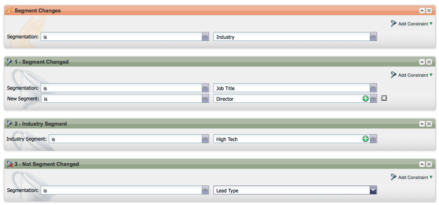

# Notes De Mise À Jour : Avril 2012 {#release-notes-april}

## Filtres et triggers de segmentation {#segmentation-filters-and-triggers}

Ciblez-vous systématiquement le même groupe de prospects ? Si tel est le cas, utilisez la segmentation dans vos listes intelligentes pour cibler les prospects. Grâce à la segmentation, l’ensemble de la base de données de prospects est toujours segmenté et peut être réutilisé dans l’ensemble de vos programmes par souci de cohérence. Les résultats de la segmentation sont extraits rapidement, car ils ne nécessitent pas que la liste dynamique s’exécute au moment de la requête.

## Insertion de valeurs externes dans le contenu de l’e-mail et d’autres étapes de flux, via les fonctionnalités étendues d’API {#insert-external-values-into-email-content-and-other-flow-steps-through-expanded-api-capabilities}

* L’API Request Campaign vous permet désormais d’envoyer des valeurs pour mes jetons pour cette exécution particulière de la campagne. Cela s’avère particulièrement utile pour renseigner le contenu d’e-mail via l’API
* Les nouvelles API Upload To List et Schedule Campaign prennent en charge les éléments ci-dessus pour les listes de leads et les campagnes par lots.

## Des e-mails de confirmation plus faciles pour [!DNL GoToWebinar] et [!DNL WebEx] (Adobe Connect et [!DNL ON24] bientôt disponibles !) {#easier-confirmation-emails-for-gotowebinar-and-webex-adobe-connect-and-on-coming-soon}

Nous avons simplifié l’URL de confirmation en créant un jeton de membre qui affiche l’URL de confirmation d’enregistrement unique pour chaque prospect. Vous n’aurez plus à créer cette URL à l’aide de jetons différents. Cette version est actuellement disponible pour les clients [!DNL GoToWebinar] et [!DNL WebEx]. Elle sera disponible pour Adobe Connect et [!DNL ON24] dans notre prochaine version.

## Téléchargez plusieurs images et fichiers en un seul clic ! {#upload-multiple-images-and-files-with-a-single-click}

Gagnez du temps et soyez plus efficace lors de l&#39;import d&#39;images et de fichiers dans Marketo ! Si vous utilisez [!DNL Firefox] ou [!DNL Google Chrome], vous pouvez sélectionner plusieurs fichiers et les charger tous en même temps. Bien qu’il n’y ait pas de limite au nombre de fichiers que vous pouvez charger, la taille individuelle maximale par fichier est de 50 Mo.

Remarque : pour le moment, cette fonctionnalité n’est pas prise en charge sur [!DNL Internet Explorer], en raison des limitations du navigateur.

## Déplacer le texte dans un e-mail {#move-text-in-an-email}

Vous pouvez réorganiser les blocs de texte dans un e-mail. Dans l’éditeur de texte, sélectionnez un bloc de texte ; lorsque vous cliquez sur l’icône d’édition, l’option permettant de déplacer le bloc vers le haut ou vers le bas s’affiche.

## [!DNL Salesforce] les références supprimées pour les utilisateurs non [!DNL Salesforce] {#salesforce-references-removed-for-non-salesforce-users}

Si vous ne synchronisez pas votre abonnement avec [!DNL Salesforce], vous remarquerez que tous les dossiers et actions de flux qui font référence à [!DNL Salesforce] sont supprimés.

## Marketo Revenue Cycle Analytics {#marketo-revenue-cycle-analytics}

**Étapes de point de contrôle améliorées dans le Modeler du cycle de revenus**

Permet aux utilisateurs de définir un ordre pour leurs règles de transition.

