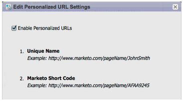

# Notes De Mise À Jour : Janvier/Février 2012 {#release-notes-jan-feb}

Les fonctionnalités suivantes sont incluses dans la version de janvier/février. Vérifiez la disponibilité des fonctionnalités dans votre édition Marketo. Revenez après la publication pour obtenir des liens vers la documentation détaillée sur les fonctionnalités.

## Contenu dynamique avancé {#advanced-dynamic-content}

_Disponible pour les versions Pro et Enterprise_

Grâce au contenu dynamique avancé, vous pouvez créer des communications par e-mail et des pages de destination attrayantes et pertinentes pour votre audience, sans avoir à créer plusieurs ressources pour le même message. Les prévisualiseurs mis à niveau vous permettent d’afficher chaque version unique en un seul écran.

## Segmentation  {#segmentation}

_Disponible pour les versions Pro et Enterprise_

La segmentation est un groupe de segments, qui sont un groupe ciblé d’individus auxquels vous commercialisez des produits. Les segments sont définis par des règles pilotées par des critères de filtre similaires aux listes dynamiques. Vos segments peuvent être basés sur des données démographiques, telles que la fonction ou le secteur, ou sur des comportements tels que les pages web visitées ou les liens ayant fait l’objet d’un clic.

## Extraits {#snippets}

_Disponible pour les versions Pro et Enterprise_

Stockez le contenu riche qui peut être utilisé à plusieurs reprises pour créer des e-mails et des pages de destination statiques ou dynamiques.

## PURLs {#purls}

_Disponible pour les versions Pro et Enterprise_

Grâce aux URL personnalisées (PURL), les marketeurs peuvent désormais créer des URL spécifiques aux contacts, afin de générer des réponses de personnalisation, de mesurabilité et d’effet élévateur dans les programmes marketing multi-touch pour les campagnes par publipostage direct et par e-mail.

## Compatibilité avec la directive UE sur la confidentialité {#eu-privacy-directive-support}

Les nouvelles fonctionnalités permettant de respecter les paramètres « Do Not Track » du navigateur incluent la possibilité de désactiver le suivi des leads anonymes ; cela facilite la mise en conformité avec les réglementations plus strictes de l&#39;UE en matière de suivi de la confidentialité.

## Signature unique {#single-sign-on}

Les entreprises ont désormais la possibilité de prendre en charge une connexion transparente à l’application Marketo à l’aide de SAML 2.0 pour l’authentification unique à partir d’un portail d’entreprise.

## Mise à jour des éditeurs d’e-mail et de page de destination {#updated-email-and-landing-page-editors}

Les éditeurs d’e-mail et de page de destination ont été repensés avec une interface plus attrayante, une navigation intuitive et une expérience utilisateur considérablement améliorée, notamment :

HTML côte à côte et vue de texte

Le Nom de l’expéditeur, l’E-mail de l’expéditeur, la Réponse (NOUVELLE) et l’Objet s’affichent dans l’éditeur. Tous les autres paramètres sont accessibles via le bouton Modifier les paramètres .

## Prise en charge des navigateurs {#browser-support}

* [!DNL Mozilla Firefox] 9.0
* 16 [!DNL Google Chrome]
* [!DNL Microsoft Internet Explorer] 8 et 9
* **Remarque** : nous ne prenons plus en charge le [!DNL Internet Explorer] 7

## Gestion des programmes {#program-management}

La gestion simplifiée des programmes améliore la convivialité avec la suppression des jetons et la suppression plus facile des programmes.

## Se désabonner du rapport d’abonnement {#unsubscribe-from-subscription-report}

Vous pouvez maintenant vous désabonner de l’abonnement directement à partir du rapport !

## Mises à jour de Munchkin {#munchkin-updates}

Les nouveaux appels Munchkin réduisent les temps de chargement des pages web et offrent des performances plus cohérentes pour les événements de lien de clic.

## Analyse des opportunités du programme (RCA uniquement) {#program-opportunity-analysis-rca-only}

Comprendre la contribution marketing au chiffre d’affaires des opportunités individuelles

## Analyse des étapes du chiffre d’affaires du programme {#program-revenue-stage-analysis}

Intégrez insight à la vitesse d’avance des programmes en identifiant les programmes qui ont acquis les éléments rapides

