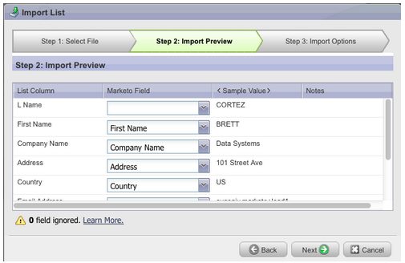
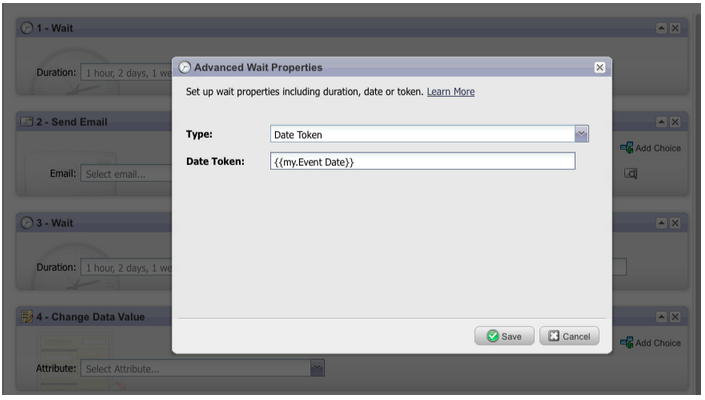

# Notes de mise à jour : juin 2012 {#release-notes-june}

## Améliorations de la gestion des leads Marketo {#marketo-lead-management-enhancements}

### Renommer {#rename}

Vous pouvez renommer vos listes dynamiques, listes statiques et campagnes. Si vous utilisez ces ressources dans des filtres, des déclencheurs ou des flux, le nom y sera automatiquement mis à jour. Vous avez toujours été en mesure de renommer vos emails, formulaires et dossiers.

En outre, nous avons amélioré la saisie et l’affichage du texte de description des ressources.

## Importer l&#39;appariement des champs {#import-field-mapping}

Nous avons facilité l&#39;import d&#39;une liste dans Marketo ! Au cours du processus d&#39;import, vous pouvez associer le nom du champ Marketo au nom de l&#39;en-tête de colonne dans le fichier d&#39;import. En outre, dans Admin, vous pouvez configurer des noms d’alias mappés au nom du champ dans Marketo, en vous assurant que vos utilisateurs sélectionnent le champ approprié à chaque fois.

Au fur et à mesure que vous continuez à importer et mapper des champs, Marketo mémorisera et affichera les mappages lors de l’importation, afin de faciliter leur utilisation. Et pour simplifier la vie, vous pouvez cliquer sur l’en-tête Exemple de valeur pour afficher les différentes valeurs qui seront renseignées dans le champ. Cela vous permet de vous assurer que vous mappez le champ approprié à chaque fois.

## Page Résumé des listes dynamiques et des listes statiques {#summary-page-for-smart-lists-and-static-lists}

Vous êtes-vous déjà demandé où étaient utilisées vos listes ? Ou qui a créé la liste, ou l&#39;a modifiée pour la dernière fois ? La nouvelle page de résumé disponible sur les listes dynamiques et statiques vous fournira ces détails importants.

Sur les pages de résumé du programme et de la campagne existantes, nous avons ajouté les informations Date/utilisateur de création et Date/utilisateur de dernière modification .

## Utilisé par pour Assets {#used-by-for-assets}

Nous avons ajouté un nouvel onglet à nos pages récapitulatives de ressources, appelé Utilisé par .

Exemple : utilisé par pour les listes statiques

## Grilles de page d’entrée {#landing-page-gridlines}

L’ajout de grilles de page d’entrée facilite l’alignement du texte, des graphiques et des formulaires sur votre page d’entrée. Activez-la et désactivez-la pour une landing page donnée, et ajustez également la largeur entre les lignes !

## Pistes bloquées des envois {#leads-blocked-from-mailings}

Lors de la planification d’une campagne, vous pouvez cliquer sur le lien pour afficher la liste des pistes qui sont bloquées dans votre diffusion.

## Étape d’attente - Jeton de piste et mon jeton {#wait-step-lead-token-and-my-token}

Dans notre version de mai, nous avons ajouté des options avancées à l’étape du flux d’attente. Grâce à ces modifications, vous pouvez définir un jour ouvré, une date et une heure. Dans cette version, nous avons ajouté la possibilité d’utiliser un jeton à l’étape d’attente. Par exemple, vous pouvez utiliser `{{lead.Birthday}}` pour envoyer un courrier électronique le jour de l’anniversaire ou `{{my.Event Date}}` pour envoyer un rappel de webinaire final.

## Afficher sous forme de miniatures dans Design Studio {#view-as-thumbnails-in-design-studio}

Basculez votre vue d’une liste d’images vers une vue miniature !

Remarque : À compter de cette version, le tri précédent sur les grilles de liste dynamique ne s’appliquera pas à la prochaine liste dynamique que vous affichez. Par exemple, si vous triez une liste dynamique par nom de société, nous ne trierons pas automatiquement la prochaine liste dynamique affichée par ce même champ.

Rappel : la mise à niveau du rapport Performances des emails est en cours !

## Améliorations apportées à Marketo Revenue Cycle Analytics {#marketo-revenue-cycle-analytics-enhancements}

### Nouvelles mesures dans l’analyse des opportunités de programme  {#new-metrics-in-program-opportunity-analysis}

Vous pouvez désormais obtenir des informations sur le nombre moyen de modifications marketing avant la création ou la fermeture d’opportunités, ainsi que sur la valeur moyenne d’une touche marketing.

## Affichage de plusieurs tableaux {#displaying-multi-charts}

La fonctionnalité à plusieurs graphiques vous permet d’afficher plusieurs graphiques dans un seul rapport de l’Explorateur du cycle du revenu. Vous pouvez, par exemple, utiliser cette fonction lorsque vous souhaitez afficher les mêmes données sur différents mois. Cette fonctionnalité vous évite également d’avoir à créer des filtres et des rapports distincts.

## Type de graphique à grille thermique  {#heat-grid-chart-type}

Les grilles de chaleur vous permettent de visualiser des données afin que vous puissiez identifier les schémas de performances marketing. Ce type de visualisation va coder vos résultats par couleur afin que vous puissiez afficher une analyse d’entreprise complexe dans une visualisation facile à comprendre.

## Type de graphique de dispersion  {#scatter-chart-type}

Les graphiques de dispersion vous aident à visualiser les données sur plusieurs dimensions dans un seul graphique. Ce type de visualisation trace une bulle sur un graphique en fonction des attributs utilisés. Vous pouvez ensuite utiliser une mesure pour coder par couleur la bulle et/ou utiliser une mesure pour spécifier la taille de la bulle.

