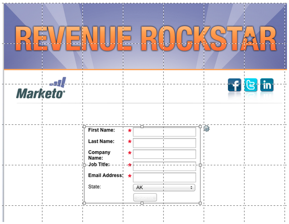
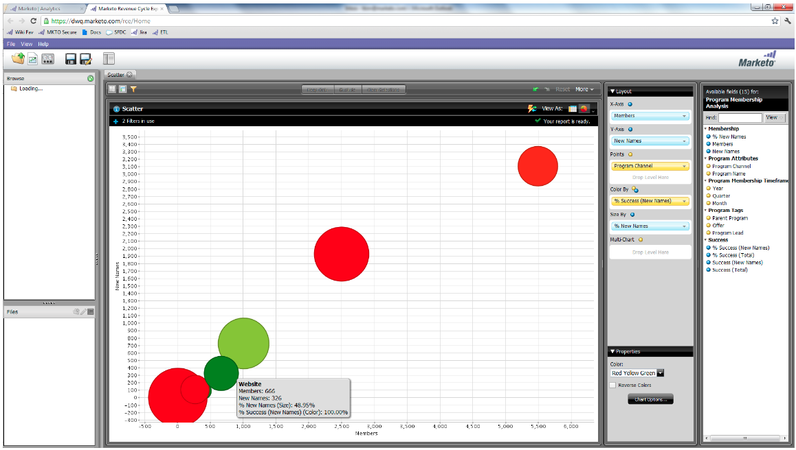

# Notes de mise à jour : juin 2012 {#release-notes-june}

## Améliorations de la gestion des leads Marketo {#marketo-lead-management-enhancements}

### Renommer {#rename}

Vous pouvez renommer vos listes dynamiques, listes statiques et campagnes. Si vous utilisez ces ressources dans des filtres, des déclencheurs ou des flux, le nom y sera automatiquement mis à jour également. Vous avez toujours été en mesure de renommer vos e-mails, formulaires et dossiers.

En outre, nous avons amélioré la saisie et l’affichage du texte de description des ressources.

## Importer l&#39;appariement des champs {#import-field-mapping}

Nous avons rendu l’importation d’une liste dans Marketo beaucoup plus facile ! Au cours du processus d’importation, vous pouvez mapper le nom du champ Marketo au nom de l’en-tête de colonne dans le fichier d’importation. De plus, dans [!UICONTROL Admin] vous pouvez configurer des noms d’alias associés au nom du champ dans Marketo, en vous assurant que vos utilisateurs sélectionnent le champ correct à chaque fois.

Pendant que vous continuez à importer et à mapper des champs, Marketo mémorise et affiche les mappages pendant l’importation, pour plus de facilité d’utilisation. Et pour rendre la vie encore plus facile, vous pouvez cliquer sur l’en-tête Exemple de valeur pour afficher les différentes valeurs qui seraient renseignées dans le champ. Cela vous permet de mapper le champ correct à chaque fois.

## Page [!UICONTROL Résumé] pour les listes dynamiques et les listes statiques {#summary-page-for-smart-lists-and-static-lists}

Vous êtes-vous déjà demandé où sont utilisées vos listes ? Ou qui a créé la liste ou l’a modifiée pour la dernière fois ? La nouvelle page de résumé disponible sur les listes dynamiques et les listes statiques vous fournira ces détails importants.

Sur les pages de résumé du programme et de la campagne existantes, nous avons ajouté la date de création/l’utilisateur et les informations de date de dernière modification/l’utilisateur .

## [!UICONTROL Utilisé par] pour Assets {#used-by-for-assets}

Nous avons ajouté un nouvel onglet à notre ressource [!UICONTROL Résumé] Pages, appelé [!UICONTROL Utilisé par].

Exemple : [!UICONTROL utilisé par] pour les listes statiques

## Quadrillage de la page de destination {#landing-page-gridlines}

L’ajout d’un quadrillage de page de destination facilite considérablement l’alignement du texte, des graphiques et des formulaires sur votre page de destination. Activez et désactivez-la pour n’importe quelle page de destination donnée, et ajustez également la largeur entre les lignes.

## Leads bloqués dans les publipostages {#leads-blocked-from-mailings}

Lors de la planification d’une campagne, vous pouvez cliquer sur le lien pour afficher la liste des prospects qui sont bloqués de votre publipostage.

## Étape [!UICONTROL Attente] - Jeton de lead et mon jeton {#wait-step-lead-token-and-my-token}

Dans notre version de mai, nous avons ajouté des options avancées à l’étape de flux [!UICONTROL Attente]. Grâce à ces modifications, vous pouvez spécifier un jour ouvrable, une date et une heure. Dans cette version, nous avons ajouté la possibilité d’utiliser un jeton dans l’étape d’attente. Par exemple, vous pouvez utiliser `{{lead.Birthday}}` pour envoyer un e-mail le jour de leur anniversaire ou `{{my.Event Date}}` pour envoyer un dernier rappel de webinaire.

## [!UICONTROL Afficher] en tant que [!UICONTROL Miniatures] dans Design Studio {#view-as-thumbnails-in-design-studio}

Passez d’une liste d’images à une vue miniature.

Remarque : à compter de cette version, le tri précédent sur les grilles de liste dynamique ne s’appliquera pas à la prochaine liste dynamique que vous affichez. Par exemple, si vous triez une liste dynamique en fonction du nom de société, nous ne trierons pas automatiquement la prochaine liste dynamique affichée par ce même champ.

Rappel : la mise à niveau du rapport sur les performances des e-mails est en cours.

## Améliorations apportées à Marketo Revenue Cycle Analytics {#marketo-revenue-cycle-analytics-enhancements}

### Nouvelles mesures dans l’analyse des opportunités du programme  {#new-metrics-in-program-opportunity-analysis}

Vous pouvez désormais obtenir des informations sur le nombre moyen de contacts marketing avant la création ou la fermeture d’opportunités, ainsi que sur la valeur moyenne d’un contact marketing.

## Affichage de graphiques multiples {#displaying-multi-charts}

La fonction multigraphique permet d’afficher plusieurs graphiques dans un seul rapport de l’Explorateur du cycle du chiffre d’affaires. Vous pouvez, par exemple, utiliser cette fonctionnalité lorsque vous souhaitez afficher les mêmes données sur différents mois. Cette fonctionnalité vous évite également d’avoir à créer des filtres et des rapports distincts.

## Type de graphique de grille thermique  {#heat-grid-chart-type}

Les réseaux de chaleur vous permettent de visualiser les données afin d’identifier les modèles de performances marketing. Ce type de visualisation code les couleurs de vos résultats afin que vous puissiez afficher une analyse commerciale complexe dans une visualisation facile à comprendre.

## Type de graphique de dispersion  {#scatter-chart-type}

Les graphiques en nuages de points vous permettent de visualiser les données de plusieurs dimensions dans un graphique. Ce type de visualisation tracera une bulle sur un graphique en fonction des attributs utilisés. Vous pouvez ensuite utiliser une mesure pour coder la bulle en couleurs et/ou une mesure pour spécifier la taille de la bulle.

