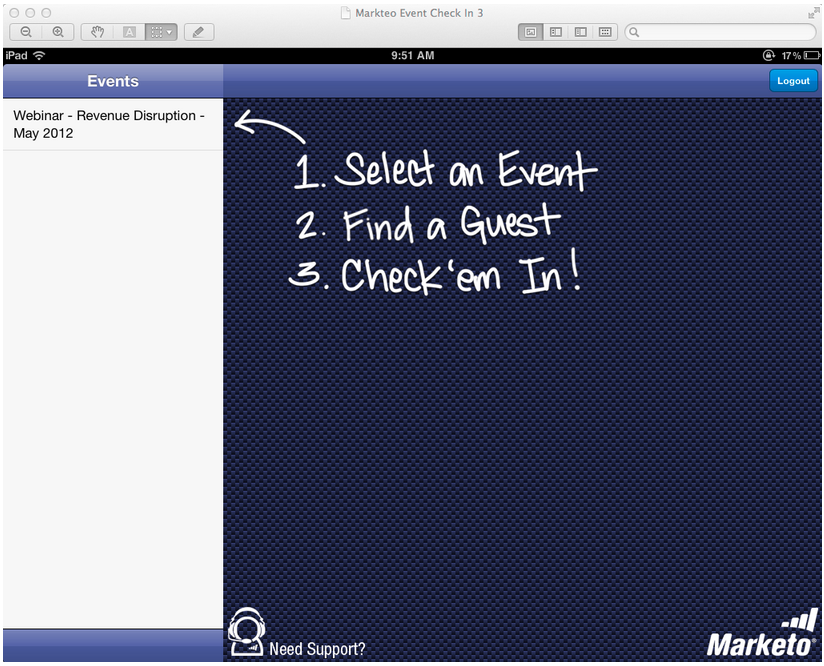
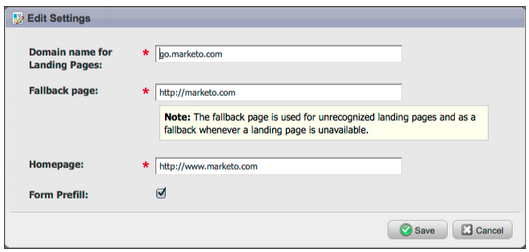

# Notes De Mise À Jour : Mai 2012 {#release-notes-may}

## Reconception du rapport sur les performances des e-mails {#email-performance-report-redesign}

Remarque : le déploiement se fera par étapes, à partir de la version de mai

Nous avons accéléré l’exécution des rapports Performances des e-mails et Performances des e-mails de Campaign . Nous avons également amélioré les définitions de certaines mesures et consolidé les mesures « Messages envoyés » et « Leads envoyés » en une seule mesure, « Envoyés ». Nous avons fusionné « Messages diffusés » et « Leads diffusés » en « Diffusés ».

## Améliorations des étapes d’attente {#wait-step-enhancements}

À l’aide des nouvelles propriétés Avancées d’Attente , vous pouvez configurer l’étape d’attente dans une action de flux de campagne intelligente de sorte qu’elle « attende jusqu’à » un jour spécifique de la semaine, le jour ouvrable suivant, une date ou une heure spécifique. Ces améliorations garantissent que vos e-mails de formation arrivent dans la boîte de réception pendant les heures de bureau.

Image 1. Spécifier l’étape d’attente pour se terminer un jour ouvrable

## Assets archivée masquée {#archived-assets-hidden}

Les ressources archivées sont automatiquement filtrées à partir des suggestions automatiques, des listes déroulantes et des rapports, ce qui facilite la recherche de ce que vous recherchez.

Image 2. Exemple de filtre d’e-mail archivé

## Nouvelle application d’enregistrement d’événement pour iPad {#new-event-check-in-app-for-ipad}

Simplifiez votre processus d’enregistrement d’événement à l’aide de notre nouvelle application iPad ! L’application Enregistrement des événements se synchronise avec votre programme Marketo et vous permet de vérifier facilement les inscrits à un événement, ainsi que d’ajouter de nouveaux prospects à la volée.

Nécessite iOS 5.1 ou une version ultérieure ; iPad uniquement.

Image 3. Page D’Accueil De L’Enregistrement D’Événement

Image 4. Enregistrement de l’événement : sélectionnez votre événement !

Image 5. Archiver

## URL de confirmation de webinaire améliorée {#enhanced-webinar-confirmation-url}

Désormais disponible pour [!DNL ON24] et Adobe Connect ! Insérez un lien unique dans l’e-mail de confirmation pour chaque participant enregistré à l’aide du nouveau jeton `{{member.webinar URL}}`. Les améliorations apportées à Adobe Connect comprennent également la possibilité d’activer/désactiver l’e-mail d’informations de compte Adobe qui inclut l’identifiant de connexion et le mot de passe de l’utilisateur.

Image 6. Faites participer les gens à votre webinaire

## Aperçu du modèle {#template-preview}

Vous recherchez un modèle spécifique lors de la création de votre e-mail ou page de destination, mais vous ne savez pas à quoi il ressemble ? Grâce à la nouvelle fonctionnalité d’aperçu de modèle, vous pouvez vérifier le modèle sélectionné avant d’enregistrer une nouvelle ressource.

Image 7. Prévisualiser le modèle sélectionné

## Préremplissage de formulaire configurable {#configurable-form-prefill}

Contrôlez le pré-remplissage des données de formulaire au niveau de l’abonnement et remplacez-les au niveau de la page de destination. Sans préremplissage, vous pouvez vous assurer que le prospect fournit les informations les plus récentes.

Image 8. Configuration du préremplissage de formulaire dans Admin

Image 9. Modifier le paramètre de préremplissage de formulaire sur une page de destination

## Marketo Treasure Chest {#marketo-treasure-chest}

Accédez aux fonctionnalités expérimentales développées par les ingénieurs Marketo pour améliorer votre expérience utilisateur. Cette version comprend la fonctionnalité d’annulation des e-mails, ainsi que la possibilité de saisir des commentaires et de collaborer avec d’autres utilisateurs sur vos pages de destination.

\

Image 10. Fonctionnalités de Manager Treasure Chest dans Admin

## Intégration CRM [!DNL Microsoft Dynamics]® {#microsoft-dynamics-crm-integration}

Synchronisez les comptes, les contacts et les leads entre Marketo et [!DNL Microsoft Dynamics] CRM en ligne à l’aide de notre nouvelle intégration préconfigurée.

Image 11. configuration [!DNL Microsoft Dynamics]

## Améliorations de Marketo [!DNL Sales Insight] {#marketo-sales-insight-enhancements}

**Désabonner les options de pied de page**

Configurez quand et si le pied de page de désabonnement s’affiche pour les e-mails envoyés via [!DNL Sales Insight].

Image 12. [!DNL Sales Insight] Settings in Admin

## Dossiers pour les modèles de courriers électroniques de vente {#folders-for-sales-email-templates}

Vous pouvez désormais organiser les modèles d’e-mail partagés avec Marketo [!DNL Sales Insight] dans des dossiers spécifiés, ce qui facilite la recherche de l’adresse e-mail appropriée pour vos représentants commerciaux.

Image 13. Choisir un dossier pour vos e-mails

## Accéder à Opportunity Analyzer à partir de l’[!DNL Sales Insight] {#access-opportunity-analyzer-from-sales-insight}

Fournissez à vos représentants commerciaux insight les activités marketing qui stimulent l’engagement en leur permettant d’accéder directement à l’analyseur d’opportunités à partir de l’[!DNL Sales Insight] Marketo. Remarque. Nécessite une licence Revenue Cycle Analytics.

## Champ personnalisé pour le statut du contact {#custom-field-for-contact-status}

Vous pouvez désormais mapper un champ personnalisé dans [!DNL Salesforce] pour renseigner le champ Statut pour les contacts dans les vues Mes meilleurs résultats, Meilleurs résultats de mon équipe et Personnalisé .

Image 14. Mapper un champ personnalisé aux contacts

Voir Pages visitées par des prospects anonymes

Accédez aux pages affichées par un prospect anonyme à partir de la vue [!UICONTROL Activité web anonyme].

Image 15. Voir Activité web anonyme .

## Abonnement de lead et contact amélioré {#enhanced-lead-and-contact-subscribe}

Suivez un prospect ou contactez quelqu’un à tout moment à l’aide du nouveau bouton S’abonner de la page des détails de l’enregistrement.
