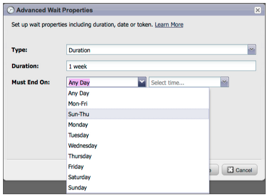

# Notes de mise à jour : mai 2012 {#release-notes-may}

## Refonte du rapport Performance des emails {#email-performance-report-redesign}

Remarque : Il s’agira d’un déploiement intermédiaire, à compter de la version de mai.

Les rapports Performances des emails et Performances des emails de Campaign ont été générés plus rapidement. Nous avons également amélioré les définitions de certaines mesures et consolidé les mesures &quot;Messages envoyés&quot; et &quot;Pistes envoyées&quot; à une mesure unique, &quot;Envoyés&quot;. Nous avons fusionné &quot;Messages délivrés&quot; et &quot;Leads Délivrés&quot; en &quot;Delivered&quot;.

## Améliorations des étapes d’attente {#wait-step-enhancements}

Les nouvelles propriétés d’attente avancées vous permettent de configurer l’étape d’attente dans une action de flux de campagne dynamique de manière à &quot;attendre jusqu’à&quot; un jour spécifique de la semaine, le jour ouvré suivant, une date ou une heure spécifique. Ces améliorations permettent de garantir que vos messages de messagerie instantanés arrivent dans la boîte de réception pendant les heures de bureau.

Figure 1. Définition de l’étape d’attente pour qu’elle se termine un jour ouvré

## Assets archivé masqué {#archived-assets-hidden}

Les ressources archivées sont automatiquement filtrées à partir des suggestions automatiques, des listes déroulantes et des rapports, ce qui facilite la recherche de ce que vous recherchez.

Figure 2. Exemple de filtre d’email archivé

## Nouvelle application d’archivage des événements pour iPad {#new-event-check-in-app-for-ipad}

Simplifiez le processus d’archivage des événements à l’aide de notre nouvelle application iPad ! L’application d’archivage des événements se synchronise avec votre programme Marketo et vous permet d’archiver facilement les inscrits dans un événement, ainsi que d’ajouter de nouvelles pistes à la volée.

Nécessite iOS 5.1 ou version ultérieure ; iPad uniquement.

Figure 3. Page d’accueil de l’enregistrement d’événement

Figure 4. Archivage des événements : sélectionnez votre événement .

Figure 5. Archivez-les

## URL de confirmation améliorée du webinaire {#enhanced-webinar-confirmation-url}

Maintenant disponible pour ON24 et Adobe Connect ! Incluez un lien unique dans l&#39;email de confirmation pour chaque participant enregistré à l&#39;aide du nouveau jeton `{{member.webinar URL}}`. Les améliorations apportées à Adobe Connect incluent également la possibilité d’activer/désactiver l’e-mail d’informations de compte d’Adobe contenant l’ID de connexion et le mot de passe de l’utilisateur.

Figure 6. Atteindre des personnes dans votre webinaire

## Aperçu du modèle {#template-preview}

Vous recherchez un modèle spécifique lors de la création de votre email ou de votre landing page, mais vous ne savez pas à quoi il ressemble ? Grâce à la nouvelle fonctionnalité d’aperçu de modèle, vous pouvez vérifier le modèle sélectionné avant d’enregistrer une nouvelle ressource.

Figure 7. Prévisualiser le modèle de votre choix

## Préremplissage de formulaire configurable {#configurable-form-prefill}

Contrôler la pré-population des données de formulaire au niveau de l&#39;abonnement et les remplacer au niveau de la landing page. Sans prépopulation, vous pouvez vous assurer que l’prospect fournit les informations les plus récentes.

Figure 8. Configuration de préremplissage de formulaire dans Admin

Figure 9. Modifier le paramètre de préremplissage d’un formulaire sur une page d’entrée

## Marketo Treasure Chest {#marketo-treasure-chest}

Accédez aux fonctionnalités expérimentales développées par les ingénieurs Marketo pour améliorer votre expérience utilisateur. Cette version de inclut l’annulation de l’e-mail, ainsi que la possibilité de saisir des commentaires et de collaborer avec d’autres utilisateurs sur vos landing pages.

\

Figure 10. Fonctionnalités de la poitrine au trésor du gestionnaire dans l’administration

## Intégration de Microsoft Dynamics® CRM {#microsoft-dynamics-crm-integration}

Synchroniser les comptes, contacts et pistes entre Marketo et Microsoft Dynamics CRM Online à l’aide de notre nouvelle intégration prédéfinie !

Figure 11. Configuration de Microsoft Dynamics

## Améliorations apportées à Marketo Sales Insight {#marketo-sales-insight-enhancements}

**Désabonner les options de pied de page**

Configurez quand et si le pied de page de désabonnement s’affiche pour les courriers électroniques envoyés par le biais de Sales Insight.

Figure 12. Paramètres d’aperçu des ventes dans Admin

## Dossiers des modèles de courrier électronique de vente {#folders-for-sales-email-templates}

Vous pouvez désormais organiser les modèles d’email partagés avec Marketo Sales Insight dans des dossiers spécifiés, ce qui facilite la recherche des bons emails par vos représentants commerciaux.

Figure 13. Choisir un dossier pour vos emails

## Accès à l’analyseur d’opportunités à partir de Sales Insight {#access-opportunity-analyzer-from-sales-insight}

Fournissez à vos représentants commerciaux des informations sur les activités marketing qui favorisent l’engagement, en utilisant l’accès direct à l’analyseur d’opportunités à partir de Marketo Sales Insight. Remarque : Nécessite une licence Revenue Cycle Analytics.

## Champ personnalisé pour le statut du contact {#custom-field-for-contact-status}

Vous pouvez maintenant mapper un champ personnalisé dans Salesforce pour renseigner le champ État des contacts dans les vues Mes meilleurs paris, Meilleurs paris de mon équipe et Personnalisation.

Figure 14. Mappage d’un champ personnalisé à des contacts

Voir Pages vues par pistes anonymes

Explorez les pages consultées par un prospect anonyme depuis la vue Activité Web anonyme .

Figure 15. Voir Activité web anonyme

## Abonnement Prospect et Contact amélioré {#enhanced-lead-and-contact-subscribe}

Suivez un prospect ou contactez-le à tout moment à l’aide du nouveau bouton S’abonner de la page des détails de l’enregistrement.
