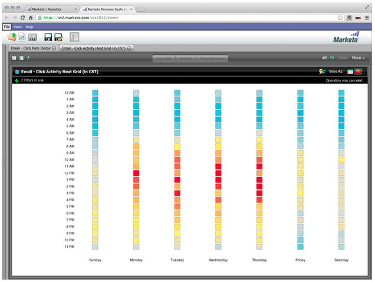

# Notes de mise à jour : avril 2013 {#release-notes-april}

Les fonctionnalités suivantes sont incluses dans la version d’avril.

## Intégration de Box {#box-integration}

Connectez Marketo à votre compte Box pour copier facilement des fichiers dans le studio de conception.

## Module Gmail {#gmail-plugin}

Si vous utilisez Marketo Sales Insight, ainsi que Gmail, vous pouvez installer notre nouveau module externe Gmail via la boutique Chrome. Le plug-in vous permet de consigner des messages avec Marketo, de charger des modèles de courrier électronique Marketo et d’envoyer des messages avec des fonctionnalités de suivi Marketo.

## Analyse de l&#39;e-mail {#email-analysis}

Créez des rapports avancés par e-mail dans l’Explorateur des recettes, tels que le rapport Grille de chaleur de l’activité des clics . Ce rapport donne des informations sur le jour et l’heure où les visiteurs cliquent sur des liens dans vos emails.

L’ensemble de la fonctionnalité d’analyse des emails sera activée par phases en avril et mai, à mesure que nous migrerons vos données de messagerie 2012 et 2013. En d’autres termes, certains clients auront accès à cette fonctionnalité plus tôt que d’autres.

## APIs du programme {#program-apis}

Prise en charge des programmes dans l’appel de l’API SOAP, y compris l’accès en lecture seule aux données du programme, comme : nombre d’adhésions au programme, acquis par, succès, paramètres, canaux, balises, jetons et coûts. Pour plus d’informations, consultez la documentation de l’API SOAP .

## Amélioration de ON24 {#on-enhancement}

Le titre de la tâche et le nom de la société seront synchronisés avec ON24 à partir de votre formulaire d’enregistrement Marketo.
