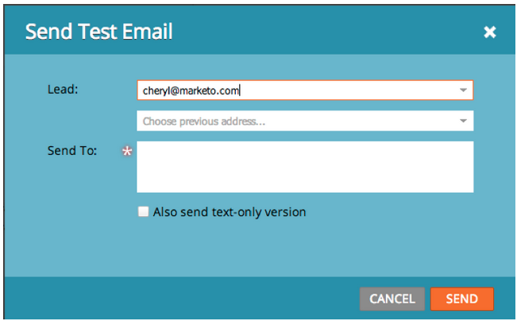

# Notes de mise à jour : août 2013 {#release-notes-august}

Les fonctionnalités suivantes sont incluses dans la version d’août 2013.

**Courriers électroniques textuels uniquement**

Vous pouvez maintenant envoyer [uniquement la version texte](/help/marketo/product-docs/email-marketing/general/creating-an-email/create-a-text-only-email.md) d&#39;un email. Gardez à l’esprit que les liens ne seront pas décorés lors de l’utilisation de cette option.

## Améliorations du moteur d’engagement des clients {#customer-engagement-engine-enhancements}

### Ignorer le contenu extrait {#ignore-exhausted-content}

Configurez le programme d’engagement pour [ignorer l’épuisement](/help/marketo/product-docs/email-marketing/drip-nurturing/using-engagement-programs/disable-and-enable-exhausted-content-notifications.md), y compris la suppression des notifications.

## Test de flux d’engagement {#engagement-stream-testing}

Utilisez la [nouvelle fonctionnalité de test](/help/marketo/product-docs/email-marketing/drip-nurturing/engagement-program-streams/test-an-engagement-stream.md) pour simuler une diffusion et tester le contenu nouvellement ajouté dans un flux en direct.

## Tester un envoi personnalisé {#personalized-send-test}

Lorsque vous envoyez un test d’email, vous pouvez sélectionner le nom d’une piste pour personnaliser l’email de test.

## &quot;Afficher le courrier électronique comme page web&quot; et &quot;Désabonner&quot; jetons système {#view-email-as-web-page-and-unsubscribe-system-tokens}

Utilisez ces [nouveaux jetons](/help/marketo/product-docs/email-marketing/general/using-tokens/system-tokens-glossary.md) pour mieux contrôler leur placement dans les emails.

## Nettoyage des campagnes à déclencheurs automatique {#automatic-trigger-campaign-cleanup}

Marketo vous avertit désormais régulièrement et [désactive automatiquement les campagnes de déclenchement](/help/marketo/product-docs/core-marketo-concepts/smart-campaigns/using-smart-campaigns/automatic-trigger-campaign-cleanup.md) qui ne se sont pas exécutées au cours des six derniers mois.

## Amélioration de la gestion financière de Marketo {#marketo-financial-management-enhancement}

### Mise à jour des coûts du programme  {#program-cost-update}

La synchronisation des coûts du programme permet le suivi des coûts du programme sur plusieurs plateformes.

### Interface utilisateur cobalt {#cobalt-user-interface}

Nous poursuivons le déploiement de notre nouvelle interface Cobalt. Ce projet rendra tout dans Marketo super joli ! La mise à niveau se poursuit tout au long de l’année.
