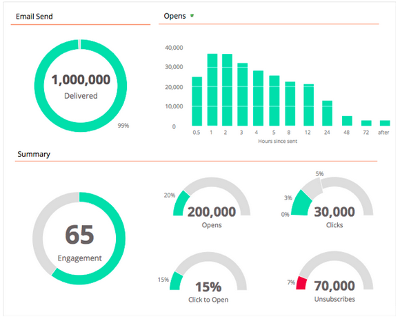

# Notes de mise à jour : décembre 2013 {#release-notes-december}

Les fonctionnalités suivantes sont incluses dans la version de décembre.

Après la publication de cette version, consultez l’onglet Nouvelle version de la communauté pour consulter des articles détaillés de la base de connaissances pour chaque fonctionnalité.

## Programme d’e-mail {#email-program}

L&#39;envoi d&#39;un email n&#39;a jamais été aussi facile. Utilisez le nouveau [programme de messagerie](/help/marketo/product-docs/email-marketing/email-programs/creating-an-email-program/understanding-email-programs.md) pour envoyer un courrier électronique par lot, au lieu du programme par défaut. Définissez la liste dynamique, envoyez un email, planifiez-la, et vous êtes désactivé !

Consultez également le nouveau [tableau de bord des mesures de courriel](/help/marketo/product-docs/email-marketing/email-programs/email-program-data/view-the-email-program-dashboard.md) pour découvrir les performances de votre courriel.

## A/B Testing pour l&#39;email {#email-a-b-testing}

Dans le nouveau programme Email, exécutez un [test A/B](/help/marketo/product-docs/email-marketing/email-programs/email-program-actions/email-test-a-b-test/add-an-a-b-test.md) sur un pourcentage de la population globale d&#39;envoi d&#39;emails. Faites votre choix parmi 4 types de tests différents : Objet, Adresse de l’expéditeur, Date/Heure et Email entier. Vous pouvez même choisir de promouvoir manuellement le gagnant ou de laisser le système le promouvoir en fonction de critères de victoire prédéfinis. Le nouveau programme de messagerie, y compris le test A/B, peut être imbriqué dans les événements et dans le programme par défaut pour rendre l’envoi de courrier électronique si simple !

## Test d&#39;email du champion/du challenger {#email-champion-challenger-testing}

[Test Champion/Challenger](/help/marketo/product-docs/email-marketing/general/functions-in-the-editor/email-tests-champion-challenger/add-an-email-champion-challenger.md) est similaire au test A/B, mais la différence est qu’il est utilisé pour les emails déclenchés et que vous n’envoyez pas automatiquement un gagnant. Ce test vous permet de contester une méthode bien établie, appelée le Champion, et vous pouvez tester si c&#39;est toujours le meilleur en introduisant un Challenger. De plus, les tests de messagerie Champion/Challenger peuvent être utilisés dans les flux de programme Engagement.

## Informations du lead dans l&#39;analyse de l&#39;e-mail {#lead-details-in-email-analysis}

Nous avons introduit des attributs de prospect et de société supplémentaires dans l’analyse des emails. Vous pouvez désormais consulter vos statistiques d’email regroupées par de nouveaux attributs tels que le Source de secteur et de prospect.

## Adaptateur d&#39;événement BrightTALK amélioré {#enhanced-brighttalk-event-adapter}

Vous pouvez désormais extraire les inscrits dans Marketo à partir de votre canal et événement BrightTALK. Vous pouvez utiliser ces informations pour informer d’autres campagnes marketing !
