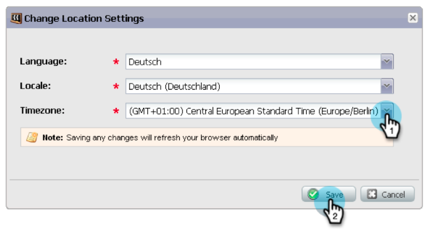

# Notes De Mise À Jour : Janvier 2013 {#release-notes-january}

La version de janvier étend notre offre sociale avec des **offres de référence**. En outre, les utilisateurs [!DNL Marketo Lead Management] peuvent définir leur fuseau horaire, leur langue et leurs préférences locales. Notez que les fonctionnalités marquées d’un &#42; sont disponibles uniquement dans l’édition Select.

## Offres de parrainage {#referral-offers}

Une **Offre de recommandation** incite vos prospects à recommander leurs amis. Créez des objectifs et des récompenses pour les parrainages réussis. Vous pouvez l’utiliser sur des landing pages, votre site web et même Facebook.

## Préférence de fuseau horaire {#time-zone-preference}

Vous pouvez modifier le fuseau horaire par défaut de votre compte Marketo personnel. Par exemple, même si la valeur par défaut de l’abonnement est Heure du Pacifique, vous pouvez la remplacer par Heure de l’Est pour votre propre compte.

## Sélectionner votre langue [!DNL Marketo Lead Management] {#select-your-marketo-lead-management-language}

Vous pouvez modifier la langue par défaut de votre compte utilisateur Marketo. Même si la valeur par défaut de l’abonnement est en anglais, vous pouvez la modifier en allemand ou en français pour votre propre usage.

## Messages d’erreur de formulaire multilingue {#multi-lingual-form-error-messages}

Lorsqu’un prospect remplit un formulaire Marketo, certains messages de validation sont automatiquement intégrés. Vous pouvez sélectionner une autre langue d’affichage pour ces messages d’erreur. Nous prenons maintenant en charge l’anglais, l’allemand et le français.

Exemple de formulaire en français :

## Sélectionnez votre langue [!DNL Sales Insight] ([!DNL Salesforce] uniquement) {#select-your-sales-insight-language-salesforce-only}

Si votre préférence de langue [!DNL Salesforce] est définie sur Français ou Allemand, Marketo [!DNL Sales Insight] respectera cette préférence. Téléchargez le dernier package MSI pour obtenir cette fonctionnalité (disponible la semaine du 14 janvier).

## Nom d’affichage du champ {#field-display-name}

Les noms d’affichage des champs peuvent afficher du texte dans différentes langues (par exemple, les caractères multi-octet sont pris en charge).

## Modifier les données du programme {#change-program-data}

L’étape de flux [!UICONTROL Modifier les données du programme] vous permet de modifier manuellement le statut [!UICONTROL Succès] et la [!UICONTROL Date de succès] d’un membre du programme par le biais d’une campagne. Vous pouvez utiliser cette étape de flux pour corriger une erreur ou pour modifier manuellement un membre qui n&#39;a peut-être pas participé au programme comme prévu.

