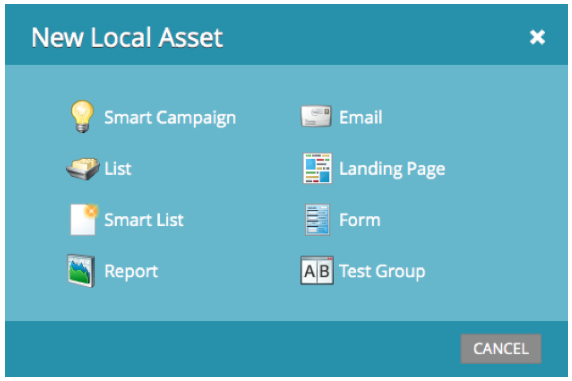

# Notes de mise à jour : juillet 2013 {#release-notes-july}

Les fonctionnalités suivantes sont incluses dans la version de juillet, qui doit être déployée le vendredi 26 juillet.

## Widget de contenu épuisé dans le tableau de bord {#exhausted-content-widget-on-the-dashboard}

Fournit des informations sur le moment où les prospects épuiseront le contenu du flux. Le système vous fournira des informations sur le nombre de leads sur le point d’atteindre le contenu épuisé, ou sur la durée pendant laquelle les leads ont été épuisés.

## Limites de communication {#communication-limits}

Vous voulez arrêter de surenvoyer des leads ? Il est désormais facile de limiter automatiquement la fréquence à chaque individu. Il suffit de définir une limite de communication quotidienne et hebdomadaire, et le système fera le reste. Disponible dans Select, Enterprise et avec le package de module complémentaire pour les clients Standard.

## Interface utilisateur cobalt {#cobalt-user-interface}

Au cours des prochains mois, vous remarquerez que notre nouveau thème sera déployé dans différentes parties de l’application. Aucune fonctionnalité ne sera déplacée ou supprimée.

## Colonne de date du membre du programme {#program-member-date-column}

Affichez et triez la grille des membres en fonction de la date d&#39;ajout du prospect.

## Modifications de la vérification orthographique dans l’éditeur WYSIWYG {#changes-to-spell-check-in-wysiwyg-editor}

Le service utilisé par l’éditeur WYSIWYG pour la vérification orthographique a été arrêté. Nous avons supprimé le bouton Vérification orthographique de l’éditeur jusqu’à ce que nous trouvions un remplacement.
