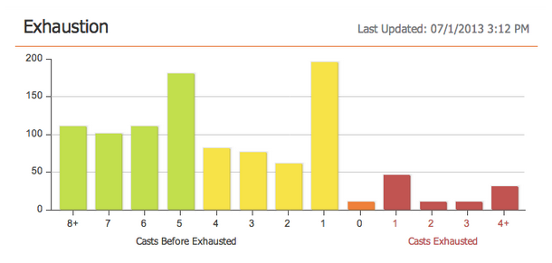

# Notes de mise à jour : juillet 2013 {#release-notes-july}

Les fonctionnalités suivantes sont incluses dans la version de juillet, qui est programmée pour un déploiement le vendredi 26 juillet.

## Widget de contenu extrait sur le tableau de bord {#exhausted-content-widget-on-the-dashboard}

Fournit des informations sur le moment où les pistes épuiseront le contenu dans le flux. Le système vous fournira des informations sur le nombre de pistes sur le point d’atteindre le contenu épuisé ou sur la durée pendant laquelle les pistes ont été épuisées.

## Limites de communication {#communication-limits}

Vous souhaitez arrêter les pistes de sur-courrier électronique ? Il est maintenant facile de limiter automatiquement la fréquence à chaque individu. Il vous suffit de définir une limite de communication quotidienne et hebdomadaire, et le système fera le reste. Disponible dans Select, Enterprise et avec le module complémentaire pour les clients Standard.

## Interface utilisateur cobalt {#cobalt-user-interface}

Au cours des prochains mois, vous remarquerez que notre nouveau thème se déploiera dans différentes parties de l’application. Aucune fonctionnalité ne sera déplacée ou supprimée.

## Colonne Date du membre du programme {#program-member-date-column}

Affichez et triez la grille du membre selon la date d’ajout de la piste.

## Modifications apportées à la vérification orthographique dans l’éditeur WYSIWYG {#changes-to-spell-check-in-wysiwyg-editor}

Le service utilisé par l’éditeur WYSIWYG pour la vérification orthographique a été interrompu. Nous avons supprimé le bouton Vérifier l’orthographe de l’éditeur jusqu’à ce que nous trouvions un remplacement.
